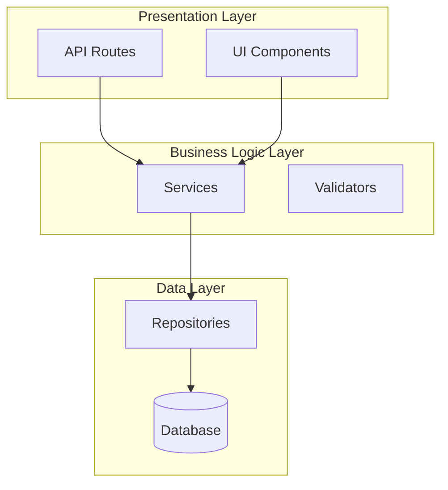

## User Input

```text
$ARGUMENTS
```

You **MUST** consider the user input before proceeding.

The user input can be:
- **File path**: Review a specific file (e.g., `src/services/user.py`)
- **Directory path**: Review all files in a directory (e.g., `src/services/`)
- **Glob pattern**: Review matching files (e.g., `**/*.py` or `src/**/*.ts`)
- **Empty/`.`**: Review the entire codebase

## Outline

Given the user input, perform a comprehensive deep code review:

### Phase 1: Analysis Preparation

1. **Parse and validate input**:
   - If empty, use current working directory
   - Resolve relative paths to absolute paths
   - Validate the path exists
   - If directory, discover all relevant files (.py, .ts, .tsx)

2. **Determine scope**:
   - Count total files to review
   - Group by language (Python vs TypeScript)
   - Calculate estimated complexity metrics

### Phase 2: Multi-Dimensional Analysis

For each file, perform comprehensive analysis across these dimensions:

#### 2.1 Architecture & Design

**Python-specific checks**:
- Package structure follows `src/` layout or standard layout
- Clear separation of concerns (models, services, views, etc.)
- Module organization follows logical grouping
- Dependency injection patterns where appropriate
- Abstract base classes for extensible interfaces

**TypeScript-specific checks**:
- Clear directory structure (e.g., `/src/components`, `/src/services`, `/src/hooks`)
- Separation of UI components, business logic, and data layers
- Proper barrel exports (index.ts files)
- Module boundaries respected
- Context/Redux patterns used appropriately for state

**Common checks**:
- Interface boundaries are well-defined
- Components/modules are loosely coupled
- High cohesion within modules
- Extension points are available
- Configuration is externalized
- Framework abstractions exist (not tightly coupled to implementation)

#### 2.2 Code Quality Metrics

**Apply these principles**:
- **KISS (Keep It Simple, Stupid)**: Code is straightforward, no over-engineering
- **DRY (Don't Repeat Yourself)**: No duplicated logic; extract common functions
- **YAGNI (You Aren't Gonna Need It)**: No unused or premature abstractions
- **SOLID Principles**:
  - **S**ingle Responsibility: Each function/class does one thing well
  - **O**pen/Closed: Open for extension, closed for modification
  - **L**iskov Substitution: Subtypes are substitutable
  - **I**nterface Segregation: Small, focused interfaces
  - **D**ependency Inversion: Depend on abstractions, not concretions

**Function limits**:
- ⚠️ Flag functions exceeding 80 lines
- ❌ Error: Functions exceeding 150 lines
- ⚠️ Flag functions with more than 5 parameters
- ❌ Error: Functions with more than 7 parameters
- Cyclomatic complexity should be ≤ 10

**Class limits**:
- Classes should typically be under 300 lines
- Methods should follow function limits
- Prefer composition over inheritance

#### 2.3 Code Style & Conventions

**Python (PEP 8)**:
- Naming conventions:
  - `snake_case` for functions and variables
  - `PascalCase` for classes
  - `UPPER_SNAKE_CASE` for constants
- Import ordering: standard library → third-party → local
- Docstrings present for all public modules, classes, functions
- Type hints used (required in this codebase - strict mypy)
- Maximum line length: 100 characters
- Spacing around operators and after commas
- No unused imports or variables

**TypeScript**:
- Naming conventions:
  - `camelCase` for functions, variables, and methods
  - `PascalCase` for classes, interfaces, types, components
  - `UPPER_SNAKE_CASE` for constants
  - `kebab-case` for files
- Import organization with proper grouping
- Explicit return types (no implicit any)
- Interface vs Type: prefer `interface` for object shapes, `type` for unions
- No `any` types without justification
- Proper use of `readonly`, `const` assertions
- React hooks rules compliance (for React code)

#### 2.4 Error Handling

**Python error handling**:
- Specific exception types (not bare `except:`)
- Custom exception classes for domain-specific errors
- Resources cleaned up using context managers (`with` statements)
- Logging of errors with appropriate levels
- Exceptions handled at appropriate layer (not swallowed silently)
- Input validation at boundaries

**TypeScript error handling**:
- Proper try/catch with specific error types
- Error boundaries for React components
- API error responses handled gracefully
- Type guards for runtime type checking
- Null/undefined checks (especially with optional chaining)
- Promise rejections handled

**Common checks**:
- All network operations have error handling
- Database operations handle connection failures
- File operations handle I/O errors
- User input is validated
- Error messages are user-friendly
- No silent failures

#### 2.5 Performance Considerations

**Python performance**:
- Database query optimization (N+1 problems, proper indexing)
- Efficient data structures (list vs set vs dict)
- Avoid premature optimization but recognize O(n²) patterns
- Async/await used for I/O-bound operations
- Caching strategies for expensive operations
- Generator expressions for large data processing
- String concatenation using join() not + in loops

**TypeScript performance**:
- React optimization: useMemo, useCallback, React.memo
- Virtualization for long lists
- Code splitting and lazy loading
- Image optimization and lazy loading
- Debouncing/throttling user input
- Avoid unnecessary re-renders
- Efficient state updates (immutable patterns)

**Common patterns**:
- Time complexity analysis for critical paths
- Memory leak detection (unclosed connections, event listeners)
- Pagination for large datasets
- Index usage in database queries
- Caching of expensive computations

#### 2.6 Design Patterns

**Python patterns**:
- Repository pattern for data access
- Factory pattern for object creation
- Strategy pattern for interchangeable algorithms
- Observer pattern for event handling
- Decorator pattern for cross-cutting concerns
- Dependency injection (manual or framework)

**TypeScript/React patterns**:
- Container/Presentational pattern
- Higher-Order Components (HOC) or custom hooks
- Compound components pattern
- Context API for global state
- Provider pattern
- Custom hooks for logic reuse

**Pattern evaluation**:
- Is the pattern appropriate for the problem?
- Is the pattern applied correctly?
- Would a simpler approach work better?
- Is there pattern overuse or misuse?

#### 2.7 Security & Best Practices

**Security checks**:
- SQL injection prevention (parameterized queries)
- XSS prevention in web output
- CSRF protection
- Input sanitization
- Secrets not hardcoded
- Dependency vulnerabilities
- Authentication/authorization checks
- Sensitive data logging prevention

**Python security**:
- Use of `eval()` or `exec()` (should be avoided)
- Shell injection risks in subprocess calls
- Pickle deserialization risks
- Tempfile security

**TypeScript security**:
- `dangerouslySetInnerHTML` usage
- User input in `href` attributes
- Storage of sensitive data in localStorage
- API key exposure in client code

### Phase 3: Issue Categorization

Categorize all findings by severity:

**Critical (🔴)**:
- Security vulnerabilities
- Data loss risks
- Performance disasters
- Breaking architectural violations

**Major (🟠)**:
- SOLID principle violations
- Excessive complexity (functions >150 lines)
- Missing error handling on critical paths
- Performance issues impacting UX

**Minor (🟡)**:
- Style violations
- Functions >80 lines but <150 lines
- Minor DRY violations
- Missing documentation
- Inconsistent naming

**Suggestions (🔵)**:
- Design pattern opportunities
- Refactoring suggestions
- Modernization opportunities
- Test coverage suggestions

### Phase 4: Report Generation

Generate a comprehensive markdown report at `./spec/reviews/<topic>-deep-code-review.md` where `<topic>` is:
- For single file: filename without extension (e.g., `user-service-deep-code-review.md`)
- For directory: directory name (e.g., `services-deep-code-review.md`)
- For full repo: `full-repo-deep-code-review.md`

**Report structure**:

```markdown
# Deep Code Review: [Title]

**Date**: [Current date]
**Scope**: [Number] files ([Python/TS breakdown]
**Reviewed by**: Claude Code
**Repository**: [repo path]

## Executive Summary

[Brief overview of code health: 2-3 paragraphs]
- Overall assessment
- Key strengths
- Primary concerns
- Recommended priorities

## Metrics Overview

| Metric | Value | Status |
|--------|-------|--------|
| Total Files | N | - |
| Total Lines of Code | N | - |
| Functions Reviewed | N | - |
| Functions > 150 lines | N | 🟢/🟠/🔴 |
| Functions > 7 parameters | N | 🟢/🟠/🔴 |
| Cyclomatic Complexity (avg) | N | 🟢/🟠/🔴 |
| Type Coverage | N% | 🟢/🟠/🔴 |
[Add relevant metrics]

## Findings by Severity

### 🔴 Critical Issues ([Count])

[List each critical issue with:
- File and line reference
- Description
- Impact
- Recommended fix
- Code example if helpful]

### 🟠 Major Issues ([Count])

[Same structure as critical]

### 🟡 Minor Issues ([Count])

[Same structure]

### 🔵 Suggestions ([Count])

[Same structure]

## Detailed Analysis by Dimension

### 1. Architecture & Design

[Assessment with specific examples]

#### Architecture Diagram

[Use Mermaid diagram to show:
- Module/package structure
- Key dependencies
- Data flow
- Layer separation]



#### Assessment
- [ ] Clear layer separation
- [ ] Loosely coupled modules
- [ ] Extensible design
- [ ] Proper abstraction levels

### 2. Code Quality

[Assessment with specific examples]

#### SOLID Analysis
- **Single Responsibility**: [Findings]
- **Open/Closed**: [Findings]
- **Liskov Substitution**: [Findings]
- **Interface Segregation**: [Findings]
- **Dependency Inversion**: [Findings]

#### KISS & DRY Assessment
- [ ] Code is simple and straightforward
- [ ] No code duplication
- [ ] No premature abstractions
- [ ] YAGNI principle followed

### 3. Code Style & Conventions

[Language-specific assessment with examples]

#### Naming Convention Analysis
[List any violations or inconsistencies]

#### Documentation Coverage
- [ ] All public functions documented
- [ ] Complex logic has comments
- [ ] README/docs present

### 4. Error Handling

[Assessment with examples]

#### Error Handling Coverage
- [ ] All I/O operations have error handling
- [ ] Database operations handle failures
- [ ] Network calls have timeouts and retry logic
- [ ] User input is validated
- [ ] Error messages are user-friendly

### 5. Performance

[Assessment with specific optimizations]

#### Performance Hotspots
- [Identify bottlenecks with line references]
- [Suggest specific optimizations]

#### Optimization Opportunities
[List opportunities with code examples]

### 6. Design Patterns

[Assessment of pattern usage]

#### Patterns Found
[Document patterns in use with evaluation]

#### Pattern Recommendations
[Suggest patterns where appropriate]

### 7. Security

[Security assessment]

#### Security Checklist
- [ ] SQL injection prevention
- [ ] XSS prevention
- [ ] CSRF protection
- [ ] Input validation
- [ ] Secrets management
- [ ] Dependency security

## File-by-File Analysis

### [File Path]

[Detailed analysis for each file including:
- Purpose
- Key findings
- Line-by-line issues if significant
- Specific code examples with issues]
```

### Phase 5: Prioritized Action Plan

Generate a prioritized list of actions:

```markdown
## Prioritized Action Plan

### Immediate (This Sprint)
1. [Critical issue 1]
2. [Critical issue 2]

### Short-term (Next Sprint)
1. [Major issue 1]
2. [Major issue 2]
3. [Major issue 3]

### Medium-term (Next Quarter)
1. [Minor issue group 1]
2. [Refactoring opportunity 1]

### Long-term (Technical Debt)
1. [Architectural improvement]
2. [Major refactoring]
```

## Execution Guidelines

### File Discovery

- Use `Glob` tool to find files matching patterns
- For Python: `**/*.py`
- For TypeScript: `**/*.ts`, `**/*.tsx`
- Exclude common directories: `node_modules/`, `venv/`, `.venv/`, `__pycache__/`, `dist/`, `build/`

### Analysis Order

1. **Architecture First**: Understand the big picture before details
2. **Entry Points**: Start with main files (main.py, index.tsx, App.tsx)
3. **Dependency Graph**: Follow imports/calls to understand relationships
4. **Critical Paths**: Focus on user-facing and data-critical code

### Reading Strategy

- Use `Read` tool to examine files
- Start with imports to understand dependencies
- Look at exported/public members first
- Pay attention to error handling
- Check for TODO/FIXME comments

### Issue Documentation

For each issue found:
1. **Quote the problematic code** (with file:line reference)
2. **Explain why it's a problem** (reference the principle violated)
3. **Show the impact** (what could go wrong)
4. **Provide a concrete fix** (with code example)
5. **Reference best practices** (with links if applicable)

### Diagram Creation

Use Mermaid diagrams for:
- **System architecture**: Component relationships
- **Data flow**: How data moves through the system
- **Call graphs**: Function call relationships
- **State machines**: State transitions if applicable
- **Sequence diagrams**: Interaction flows

### Quality Thresholds

Set these quality gates:

| Threshold | Good | Warning | Critical |
|-----------|------|---------|----------|
| Function length (lines) | ≤50 | 51-150 | >150 |
| Function parameters | ≤4 | 5-7 | >7 |
| Cyclomatic complexity | ≤5 | 6-10 | >10 |
| Class length (lines) | ≤200 | 201-400 | >400 |
| Duplicate code | <3% | 3-5% | >5% |
| Type coverage | >90% | 70-90% | <70% |

## Output

After completing the review, report:

1. **Review summary**: Number of files reviewed, total issues by severity
2. **Report location**: Full path to generated markdown file
3. **Top 3 priorities**: Most critical issues to address
4. **Overall health score**: Letter grade (A-F) based on findings

## Example Invocation

```bash
# Review entire codebase
/deep-code-review

# Review specific file
/deep-code-review src/services/user.py

# Review directory
/deep-code-review backend/src/services/

# Review all TypeScript files
/deep-code-review frontend/src/**/*.ts
```

## Notes

- Be thorough but pragmatic: Focus on issues that matter
- Provide actionable feedback: Not just "fix this" but "here's how"
- Recognize trade-offs: Sometimes complexity is justified
- Context matters: A 200-line function might be appropriate for data migration
- Be constructive: Frame feedback as improvement opportunities
- Use specific examples: Quote actual code from the codebase
- Prioritize ruthlessly: Not everything needs to be fixed immediately
