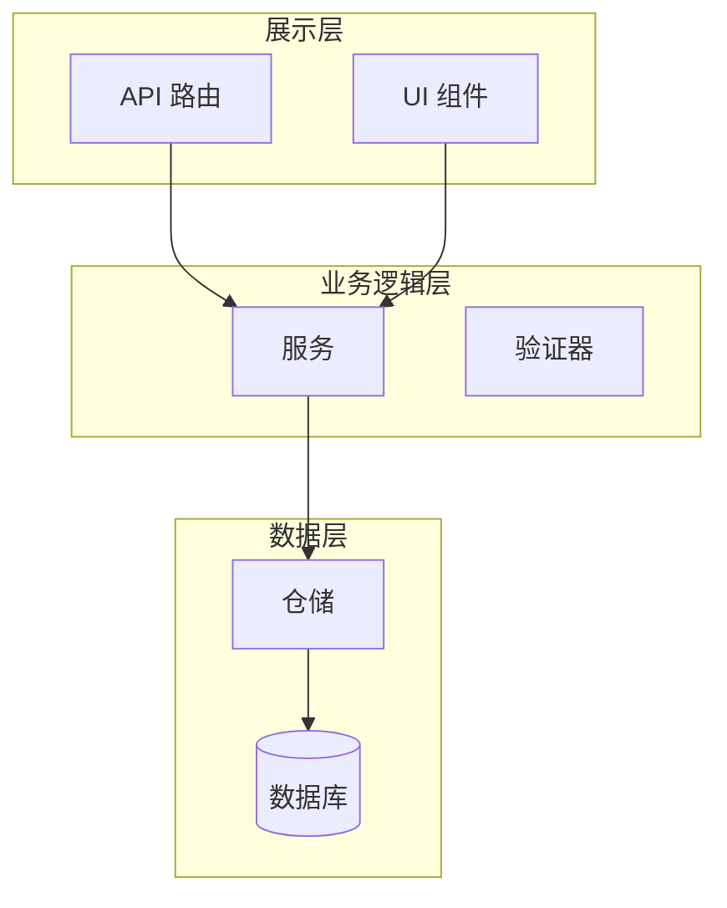

## User Input

```text
$ARGUMENTS
```

You **MUST** consider the user input before proceeding (if not empty).

支持的输入格式：
- **空或 `.`**: 审查整个代码库
- **文件路径**: 审查特定文件（如 `src/services/user.py`）
- **目录路径**: 审查目录下所有文件（如 `src/services/`）
- **Glob 模式**: 审查匹配的文件（如 `**/*.py` 或 `src/**/*.ts`）
- **带 topic 参数**: `topic=<名称>` 指定审查主题，用于生成报告文件名

示例：
- `/deep-code-review` - 审查整个代码库
- `/deep-code-review src/services/` - 审查 services 目录
- `/deep-code-review **/*.py topic=backend` - 审查所有 Python 文件，主题为 backend
- `/deep-code-review src/components/User.tsx topic=user-component` - 审查特定组件

## Outline

### Phase 1: 分析准备

1. **解析和验证输入**：
   - 如果为空，使用当前工作目录
   - 解析相对路径为绝对路径
   - 验证路径是否存在
   - 如果是目录，发现所有相关文件（.py, .ts, .tsx）

2. **确定审查范围**：
   - 统计需要审查的文件总数
   - 按语言分组（Python vs TypeScript）
   - 估算复杂度指标

### Phase 2: 多维度分析

对每个文件执行以下维度的全面分析：

#### 2.1 架构和设计

**Python 特定检查**：
- 包结构是否符合 `src/` 布局或标准布局
- 关注点是否清晰分离（models, services, views 等）
- 模块组织是否符合逻辑分组
- 适当位置使用依赖注入模式
- 可扩展接口的抽象基类

**TypeScript 特定检查**：
- 清晰的目录结构（如 `/src/components`, `/src/services`, `/src/hooks`）
- UI 组件、业务逻辑和数据层的分离
- 适当的 barrel 导出（index.ts 文件）
- 模块边界得到尊重
- Context/Redux 模式适当用于状态管理

**通用检查**：
- 接口边界定义清晰
- 组件/模块松耦合
- 模块内高内聚
- 扩展点可用
- 配置外部化
- 框架抽象存在（不紧耦合到具体实现）

#### 2.2 代码质量指标

**应用这些原则**：
- **KISS (Keep It Simple, Stupid)**: 代码直截了当，没有过度工程
- **DRY (Don't Repeat Yourself)**: 没有重复逻辑；提取公共函数
- **YAGNI (You Aren't Gonna Need It)**: 没有未使用或过早的抽象
- **SOLID 原则**：
  - **S**ingle Responsibility: 每个函数/类做好一件事
  - **O**pen/Closed: 对扩展开放，对修改关闭
  - **L**iskov Substitution: 子类型可替换
  - **I**nterface Segregation: 小而专注的接口
  - **D**ependency Inversion: 依赖抽象，不依赖具体

**函数限制**：
- ⚠️ 标记超过 80 行的函数
- ❌ 错误：超过 150 行的函数
- ⚠️ 标记超过 5 个参数的函数
- ❌ 错误：超过 7 个参数的函数
- 圈复杂度应 ≤ 10

**类限制**：
- 类通常应低于 300 行
- 方法遵循函数限制
- 优先使用组合而非继承

#### 2.3 代码风格和约定

**Python (PEP 8)**：
- 命名约定：
  - 函数和变量使用 `snake_case`
  - 类使用 `PascalCase`
  - 常量使用 `UPPER_SNAKE_CASE`
- 导入顺序：标准库 → 第三方 → 本地
- 所有公共模块、类、函数都有 docstring
- 使用类型提示（此代码库必需 - strict mypy）
- 最大行长度：100 字符
- 运算符和逗号后有空格
- 没有未使用的导入或变量

**TypeScript**：
- 命名约定：
  - 函数、变量和方法使用 `camelCase`
  - 类、接口、类型、组件使用 `PascalCase`
  - 常量使用 `UPPER_SNAKE_CASE`
  - 文件使用 `kebab-case`
- 导入组织和适当分组
- 显式返回类型（没有隐式 any）
- 对象形状优先使用 `interface`，联合使用 `type`
- 没有正当理由不使用 `any` 类型
- 正确使用 `readonly`、`const` 断言
- React hooks 规则合规（对于 React 代码）

#### 2.4 错误处理

**Python 错误处理**：
- 特定异常类型（不是裸 `except:`）
- 域特定错误的自定义异常类
- 使用上下文管理器（`with` 语句）清理资源
- 适当的错误级别日志记录
- 在适当层处理异常（不静默吞没）
- 边界的输入验证

**TypeScript 错误处理**：
- 适当的 try/catch 与特定错误类型
- React 组件的错误边界
- API 错误响应优雅处理
- 运行时类型检查的类型守卫
- Null/undefined 检查（特别是可选链）
- Promise 拒绝处理

**通用检查**：
- 所有网络操作都有错误处理
- 数据库操作处理连接失败
- 文件操作处理 I/O 错误
- 用户输入已验证
- 错误消息用户友好
- 没有静默失败

#### 2.5 性能考虑

**Python 性能**：
- 数据库查询优化（N+1 问题，适当索引）
- 高效数据结构（list vs set vs dict）
- 避免过早优化但识别 O(n²) 模式
- I/O 绑定操作使用 async/await
- 昂贵操作的缓存策略
- 大数据处理的生成器表达式
- 循环中使用 join() 而非 + 进行字符串连接

**TypeScript 性能**：
- React 优化：useMemo, useCallback, React.memo
- 长列表的虚拟化
- 代码分割和懒加载
- 图像优化和懒加载
- 用户输入的防抖/节流
- 避免不必要的重新渲染
- 不可变模式的高效状态更新

**通用模式**：
- 关键路径的时间复杂度分析
- 内存泄漏检测（未关闭的连接、事件监听器）
- 大数据集的分页
- 数据库查询中的索引使用
- 昂贵计算的缓存

#### 2.6 设计模式

**Python 模式**：
- 数据访问的仓储模式
- 对象创建的工厂模式
- 可互换算法的策略模式
- 事件处理的观察者模式
- 横切关注点的装饰器模式
- 依赖注入（手动或框架）

**TypeScript/React 模式**：
- 容器/展示模式
- 高阶组件 (HOC) 或自定义 hooks
- 复合组件模式
- 全局状态的 Context API
- Provider 模式
- 逻辑重用的自定义 hooks

**模式评估**：
- 模式是否适合问题？
- 模式应用是否正确？
- 更简单的方法是否更好？
- 是否存在模式过度使用或误用？

#### 2.7 安全和最佳实践

**安全检查**：
- SQL 注入预防（参数化查询）
- Web 输出的 XSS 预防
- CSRF 保护
- 输入清理
- 秘密不硬编码
- 依赖漏洞
- 身份验证/授权检查
- 敏感数据日志记录预防

**Python 安全**：
- 使用 `eval()` 或 `exec()`（应避免）
- 子进程调用中的 Shell 注入风险
- Pickle 反序列化风险
- Tempfile 安全

**TypeScript 安全**：
- `dangerouslySetInnerHTML` 使用
- `href` 属性中的用户输入
- localStorage 中的敏感数据存储
- 客户端代码中的 API 密钥暴露

### Phase 3: 问题分类

按严重性分类所有发现：

**关键 (🔴)**：
- 安全漏洞
- 数据丢失风险
- 性能灾难
- 破坏性架构违规

**主要 (🟠)**：
- SOLID 原则违规
- 过度复杂（函数 >150 行）
- 关键路径缺少错误处理
- 影响 UX 的性能问题

**次要 (🟡)**：
- 风格违规
- 函数 >80 行但 <150 行
- 轻微 DRY 违规
- 缺少文档
- 命名不一致

**建议 (🔵)**：
- 设计模式机会
- 重构建议
- 现代化机会
- 测试覆盖率建议

### Phase 4: 报告生成

生成位于 `./spec/reviews/<topic>-deep-code-review.md` 的综合 markdown 报告，其中 `<topic>` 是：
- 单个文件：无扩展名的文件名（如 `user-service-deep-code-review.md`）
- 目录：目录名（如 `services-deep-code-review.md`）
- 完整仓库：`full-repo-deep-code-review.md`

**报告结构**：

```markdown
# Deep Code Review: [标题]

**日期**: [当前日期]
**范围**: [数量] 个文件 ([Python/TS 分组])
**审查者**: Claude Code
**仓库**: [仓库路径]

## 执行摘要

[代码健康概述：2-3 段]
- 整体评估
- 主要优势
- 主要关注点
- 推荐优先级

## 指标概述

| 指标 | 值 | 状态 |
|------|-----|------|
| 总文件数 | N | - |
| 总代码行数 | N | - |
| 审查函数数 | N | - |
| 函数 > 150 行 | N | 🟢/🟠/🔴 |
| 函数 > 7 个参数 | N | 🟢/🟠/🔴 |
| 圈复杂度 (平均) | N | 🟢/🟠/🔴 |
| 类型覆盖率 | N% | 🟢/🟠/🔴 |
[添加相关指标]

## 按严重性的发现

### 🔴 关键问题 ([数量])

[列出每个关键问题，包括：
- 文件和行引用
- 描述
- 影响
- 推荐修复
- 如有帮助的代码示例]

### 🟠 主要问题 ([数量])

[与关键问题相同的结构]

### 🟡 次要问题 ([数量])

[与关键问题相同的结构]

### 🔵 建议 ([数量])

[与关键问题相同的结构]

## 按维度的详细分析

### 1. 架构和设计

[具体示例的评估]

#### 架构图

[使用 Mermaid 图表显示：
- 模块/包结构
- 关键依赖
- 数据流
- 层分离]



#### 评估
- [ ] 清晰的层分离
- [ ] 松耦合模块
- [ ] 可扩展设计
- [ ] 适当的抽象级别

### 2. 代码质量

[具体示例的评估]

#### SOLID 分析
- **单一职责**：[发现]
- **开闭原则**：[发现]
- **里氏替换**：[发现]
- **接口隔离**：[发现]
- **依赖倒置**：[发现]

#### KISS & DRY 评估
- [ ] 代码简单直截了当
- [ ] 没有代码重复
- [ ] 没有过早抽象
- [ ] 遵循 YAGNI 原则

### 3. 代码风格和约定

[语言特定评估和示例]

#### 命名约定分析
[列出任何违规或不一致]

#### 文档覆盖率
- [ ] 所有公共函数都有文档
- [ ] 复杂逻辑有注释
- [ ] README/docs 存在

### 4. 错误处理

[示例评估]

#### 错误处理覆盖率
- [ ] 所有 I/O 操作都有错误处理
- [ ] 数据库操作处理失败
- [ ] 网络调用有超时和重试逻辑
- [ ] 用户输入已验证
- [ ] 错误消息用户友好

### 5. 性能

[具体优化评估]

#### 性能热点
- [识别瓶颈及行引用]
- [建议具体优化]

#### 优化机会
[列出机会及代码示例]

### 6. 设计模式

[模式使用评估]

#### 发现的模式
[记录使用的模式及评估]

#### 模式建议
[适当的地方建议模式]

### 7. 安全

[安全评估]

#### 安全检查清单
- [ ] SQL 注入预防
- [ ] XSS 预防
- [ ] CSRF 保护
- [ ] 输入验证
- [ ] 秘密管理
- [ ] 依赖安全

## 逐文件分析

### [文件路径]

[每个文件的详细分析，包括：
- 目的
- 关键发现
- 逐行问题（如果重要）
- 问题的具体代码示例]
```

### Phase 5: 优先级行动计划

生成优先操作列表：

```markdown
## 优先级行动计划

### 立即（本次冲刺）
1. [关键问题 1]
2. [关键问题 2]

### 短期（下次冲刺）
1. [主要问题 1]
2. [主要问题 2]
3. [主要问题 3]

### 中期（下季度）
1. [次要问题组 1]
2. [重构机会 1]

### 长期（技术债务）
1. [架构改进]
2. [主要重构]
```

## 执行指南

### 文件发现

- 使用 `Glob` 工具查找匹配模式的文件
- 对于 Python: `**/*.py`
- 对于 TypeScript: `**/*.ts`, `**/*.tsx`
- 排除常见目录：`node_modules/`, `venv/`, `.venv/`, `__pycache__/`, `dist/`, `build/`

### 分析顺序

1. **架构优先**：在细节之前理解大局
2. **入口点**：从主文件开始（main.py, index.tsx, App.tsx）
3. **依赖图**：跟随导入/调用理解关系
4. **关键路径**：关注面向用户和数据关键的代码

### 阅读策略

- 使用 `Read` 工具检查文件
- 首先从导入开始理解依赖
- 首先查看导出/公共成员
- 注意错误处理
- 检查 TODO/FIXME 注释

### 问题文档

对于发现的每个问题：
1. **引用问题代码**（带 file:line 引用）
2. **解释为什么是问题**（引用违反的原则）
3. **展示影响**（可能出什么错）
4. **提供具体修复**（带代码示例）
5. **引用最佳实践**（如适用提供链接）

### 图表创建

对以下内容使用 Mermaid 图表：
- **系统架构**：组件关系
- **数据流**：数据在系统中如何移动
- **调用图**：函数调用关系
- **状态机**：状态转换（如适用）
- **序列图**：交互流

### 质量阈值

设置这些质量门：

| 阈值 | 好 | 警告 | 关键 |
|------|-----|---------|----------|
| 函数长度（行） | ≤50 | 51-150 | >150 |
| 函数参数 | ≤4 | 5-7 | >7 |
| 圈复杂度 | ≤5 | 6-10 | >10 |
| 类长度（行） | ≤200 | 201-400 | >400 |
| 重复代码 | <3% | 3-5% | >5% |
| 类型覆盖率 | >90% | 70-90% | <70% |

## 输出

完成审查后，报告：

1. **审查摘要**：审查的文件数，按严重性的总问题数
2. **报告位置**：生成的 markdown 文件的完整路径
3. **前 3 优先级**：最需要解决的关键问题
4. **整体健康评分**：基于发现的字母等级（A-F）

## 示例调用

```bash
# 审查整个代码库
/deep-code-review

# 审查特定文件
/deep-code-review src/services/user.py

# 审查目录
/deep-code-review backend/src/services/

# 审查所有 TypeScript 文件
/deep-code-review frontend/src/**/*.ts

# 使用主题审查
/deep-code-review topic=backend-security
```

## 注意事项

- 要彻底但务实：关注重要的问题
- 提供可操作的反馈：不只是"修复这个"，而是"这里是如何修复"
- 认识权衡：有时复杂性是合理的
- 上下文很重要：200 行的函数对于数据迁移可能是合适的
- 建设性：将反馈构建为改进机会
- 使用具体示例：引用代码库中的实际代码
- 无情确定优先级：不是所有事情都需要立即修复
