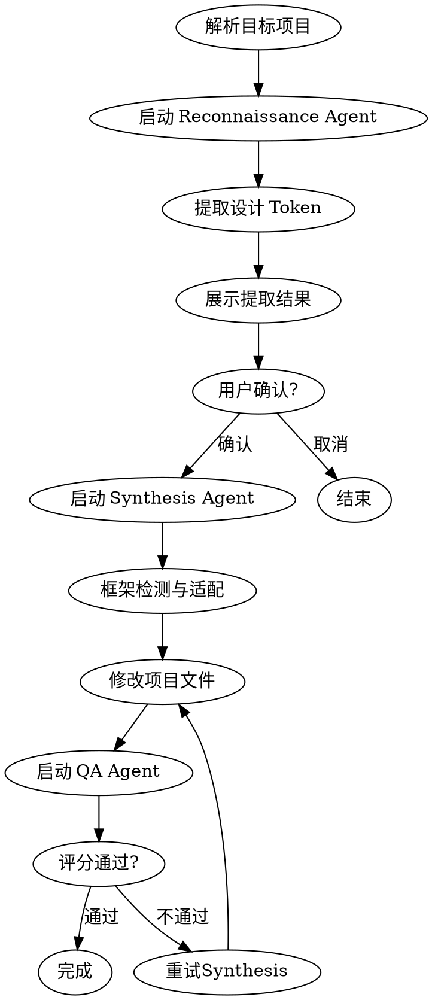

# Theme Clone Skill

从目标网站 URL 提取设计元素，智能适配到当前项目框架，并通过感知评分验证质量。

## 触发条件

用户说：
- `/theme-clone <URL>`
- "克隆这个网站的主题"
- "提取这个网站的设计"
- "把这个网站的样式应用到我的项目"

## 执行流程



## 详细步骤

### 阶段 1: 项目解析

1. 确定目标项目路径：
   - 使用 `@目标项目` 语法指定的路径
   - 或使用当前工作目录

2. 检测项目框架类型：
   - 读取 `config/framework-rules.json`
   - 检查项目中的配置文件（tailwind.config.js, components.json 等）

### 阶段 2: 设计提取（Reconnaissance）

1. 使用 Playwright 访问用户提供的 URL
2. 截取页面截图保存到 `.claude/skills/theme-clone/output/screenshots/`
3. 执行 JavaScript 提取所有计算样式
4. 运行 `tools/extractor.js` 进行聚类和标准化
5. 生成结构化 Design Token

**输出示例：**
```json
{
  "source": { "url": "https://example.com", "screenshot": "..." },
  "tokens": {
    "primaryColor": "#3b82f6",
    "secondaryColor": "#64748b",
    "fontFamily": "Inter, system-ui, sans-serif",
    "borderRadius": ["4px", "8px", "12px"],
    "shadows": ["0 1px 2px rgba(0,0,0,0.05)", "0 4px 6px rgba(0,0,0,0.1)"]
  },
  "confidence": 0.87
}
```

### 阶段 3: 用户确认

**必须展示以下信息：**
- 源 URL 和截图预览
- 提取的主色调、字体、间距等核心 Token
- 将要修改的文件列表
- 建议的框架适配方案

**等待用户输入：**
- `y` / `yes` / `确认` → 继续
- `n` / `no` / `取消` → 终止

### 阶段 4: 框架适配（Synthesis）

1. 读取 `config/framework-rules.json` 获取目标框架规则
2. 运行 `tools/adapter.js` 转换 Token 为目标格式
3. 修改项目文件（使用 Edit 工具）：
   - Tailwind v4 → `globals.css` (@theme 块)
   - Tailwind v3 → `tailwind.config.js`
   - shadcn/ui → `app/globals.css`
   - CSS Modules → 对应的 .module.css 文件

### 阶段 5: 质量校验（QA）

1. 启动开发服务器或打开预览
2. 截取应用后的页面
3. 运行 `tools/scorer.py` 计算评分：
   - **SSIM** ≥ 0.88 → 通过
   - **LPIPS** ≤ 0.15 → 通过
4. 如果评分不通过：
   - 重试 Synthesis（最多 2 次）
   - 2 次后仍失败，报告结果但保留修改

### 阶段 6: 完成

**成功时：**
```
✅ Theme Clone 完成！

**评分结果：**
- SSIM: 0.91 (阈值: 0.88) ✓
- LPIPS: 0.12 (阈值: 0.15) ✓

**修改文件：**
- app/globals.css (+18 行)
- tailwind.config.js (+12 行)

**下一步：**
- 运行 `npm run dev` 查看效果
- 如需回滚，运行 `git checkout -- .`
```

**失败时：**
```
⚠️ Theme Clone 评分未通过

**评分结果：**
- SSIM: 0.82 (阈值: 0.88) ✗
- LPIPS: 0.23 (阈值: 0.15) ✗

修改已保留，请人工检查效果。
```

## 工具依赖

| 工具 | 用途 |
|------|------|
| Playwright MCP | 浏览器自动化 |
| Bash | 运行 Node.js/Python 脚本 |
| Edit | 修改项目文件 |

## 错误处理

| 错误 | 处理方式 |
|------|----------|
| URL 无法访问 | 提示用户检查 URL，终止 |
| 页面加载超时 | 重试 2 次，仍失败则终止 |
| 框架检测失败 | 询问用户选择框架类型 |
| 评分脚本缺失 | 跳过评分，只执行适配 |
| 文件写入失败 | 报告错误，终止 |

## 回滚机制

如果评分连续 2 次不通过：
1. 使用 `git checkout -- <modified-files>` 回滚修改
2. 提示用户："自动回滚已执行，请手动调整后重试"
