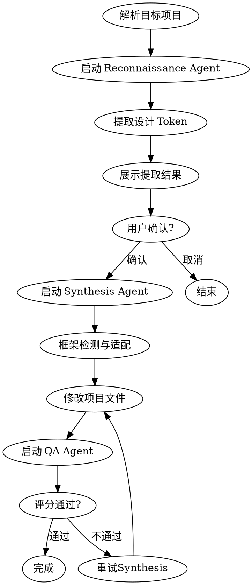

# Theme Clone Skill Implementation Plan

> **For agentic workers:** REQUIRED SUB-SKILL: Use superpowers:subagent-driven-development (recommended) or superpowers:executing-plans to implement this plan task-by-task. Steps use checkbox (`- [ ]`) syntax for tracking.

**Goal:** 创建完整的 theme-clone skill，从 URL 提取设计元素并智能适配到目标项目

**Architecture:** 基于多代理协作架构（Reconnaissance → Synthesis → QA），工具脚本 + Agent 指令分离，支持框架智能检测

**Tech Stack:** JavaScript (Node.js), Python (torchmetrics), Playwright/Puppeteer

---

## 文件结构

```
project/.claude/skills/theme-clone/
├── SKILL.md                      # Skill 入口
├── agents/
│   ├── reconnaissance.md         # 提取代理
│   ├── synthesis.md              # 适配代理
│   └── qa.md                    # 校验代理
├── tools/
│   ├── extractor.js              # 浏览器提取脚本
│   ├── adapter.js                # 框架适配脚本
│   └── scorer.py                 # SSIM/LPIPS 评分脚本
├── prompts/
│   ├── extract-from-url.md       # URL 提取提示词
│   └── adapt-framework.md       # 框架适配提示词
└── config/
    └── framework-rules.json     # 框架适配规则
```

---

## Task 1: 创建目录结构

**Files:**
- Create: `project/.claude/skills/theme-clone/agents/.gitkeep`
- Create: `project/.claude/skills/theme-clone/tools/.gitkeep`
- Create: `project/.claude/skills/theme-clone/prompts/.gitkeep`
- Create: `project/.claude/skills/theme-clone/config/.gitkeep`

- [ ] **Step 1: 创建目录结构**

```bash
mkdir -p project/.claude/skills/theme-clone/{agents,tools,prompts,config}
touch project/.claude/skills/theme-clone/agents/.gitkeep
touch project/.claude/skills/theme-clone/tools/.gitkeep
touch project/.claude/skills/theme-clone/prompts/.gitkeep
touch project/.claude/skills/theme-clone/config/.gitkeep
```

- [ ] **Step 2: Commit**

```bash
git add project/.claude/skills/theme-clone/
git commit -m "feat: create theme-clone skill directory structure"
```

---

## Task 2: 创建框架适配规则配置

**Files:**
- Create: `project/.claude/skills/theme-clone/config/framework-rules.json`

- [ ] **Step 1: 编写框架检测和变量映射规则**

```json
{
  "frameworks": {
    "tailwind_v4": {
      "detectors": ["tailwind.config.js", "@theme in globals.css"],
      "variableFormat": "css-custom-properties",
      "themeDirective": "@theme",
      "colorFormat": "oklch",
      "variableMapping": {
        "primary": "--color-primary",
        "secondary": "--color-secondary",
        "background": "--background",
        "foreground": "--foreground",
        "radius": "--radius"
      }
    },
    "tailwind_v3": {
      "detectors": ["tailwind.config.js", "module.exports"],
      "variableFormat": "tailwind-config",
      "colorFormat": "hex",
      "variableMapping": {
        "primary": "colors.primary",
        "secondary": "colors.secondary",
        "background": "colors.background",
        "foreground": "colors.foreground"
      }
    },
    "shadcn_ui": {
      "detectors": ["components/ui", "globals.css", "lib/utils.ts"],
      "variableFormat": "css-hsl",
      "colorFormat": "hsl",
      "variableMapping": {
        "primary": "--primary",
        "secondary": "--secondary",
        "background": "--background",
        "foreground": "--foreground",
        "border": "--border",
        "ring": "--ring"
      }
    },
    "css_modules": {
      "detectors": ["*.module.css"],
      "variableFormat": "css-custom-properties",
      "colorFormat": "hex",
      "variableMapping": {}
    }
  },
  "tokenTypes": {
    "colors": {
      "priority": 1,
      "extractionMethod": "computedStyle",
      "cssProperty": ["color", "background-color", "border-color", "fill", "stroke"]
    },
    "typography": {
      "priority": 2,
      "extractionMethod": "computedStyle",
      "cssProperty": ["font-family", "font-size", "font-weight", "line-height"]
    },
    "spacing": {
      "priority": 3,
      "extractionMethod": "computedStyle",
      "cssProperty": ["margin", "padding", "gap"]
    },
    "borderRadius": {
      "priority": 4,
      "extractionMethod": "computedStyle",
      "cssProperty": ["border-radius"]
    },
    "shadows": {
      "priority": 5,
      "extractionMethod": "computedStyle",
      "cssProperty": ["box-shadow", "filter"]
    }
  },
  "scoring": {
    "ssimThreshold": 0.88,
    "lpipsThreshold": 0.15,
    "maxRetries": 2
  }
}
```

- [ ] **Step 2: Commit**

```bash
git add project/.claude/skills/theme-clone/config/framework-rules.json
git commit -m "feat: add framework detection and mapping rules"
```

---

## Task 3: 创建评分脚本 scorer.py

**Files:**
- Create: `project/.claude/skills/theme-clone/tools/scorer.py`
- Create: `project/.claude/skills/theme-clone/tools/scorer_test.py`

- [ ] **Step 1: 编写 scorer.py**

```python
#!/usr/bin/env python3
"""
Theme Clone Quality Scorer
Computes SSIM and LPIPS scores to validate theme application quality.
"""

import argparse
import json
import sys
from pathlib import Path

try:
    import torch
    import torchvision
    from torchmetrics.image import StructuralSimilarityIndexMeasure
    from lpips import LPIPS
    HAS_LPIPS = True
except ImportError:
    HAS_LPIPS = False

try:
    from PIL import Image
    import numpy as np
    HAS_PIL = True
except ImportError:
    HAS_PIL = False


def load_image(path: str) -> torch.Tensor:
    """Load image and convert to tensor format for scoring."""
    img = Image.open(path).convert('RGB')
    img = np.array(img).astype(np.float32) / 255.0
    img = torch.from_numpy(img).permute(2, 0, 1).unsqueeze(0)
    return img


def compute_ssim(img1: torch.Tensor, img2: torch.Tensor) -> float:
    """Compute SSIM between two images. Returns value between -1 and 1."""
    ssim = StructuralSimilarityIndexMeasure()
    return float(ssim(img1, img2).item())


def compute_lpips(img1: torch.Tensor, img2: torch.Tensor) -> float:
    """Compute LPIPS perceptual distance. Returns value between 0 and 1."""
    if not HAS_LPIPS:
        raise ImportError("LPIPS not installed. Run: pip install lpips torchmetrics")
    lpips_model = LPIPS()
    # LPIPS expects input in range [-1, 1]
    img1_scaled = img1 * 2 - 1
    img2_scaled = img2 * 2 - 1
    distance = lpips_model(img1_scaled, img2_scaled)
    return float(distance.item())


def score_theme(ref_image: str, test_image: str) -> dict:
    """
    Compute quality scores between reference and test images.

    Args:
        ref_image: Path to reference/original screenshot
        test_image: Path to test/adapted screenshot

    Returns:
        dict with ssim_score, lpips_score, and pass/fail status
    """
    config_path = Path(__file__).parent.parent / "config" / "framework-rules.json"
    with open(config_path) as f:
        config = json.load(f)

    thresholds = config["scoring"]
    ssim_threshold = thresholds["ssimThreshold"]
    lpips_threshold = thresholds["lpipsThreshold"]

    ref_tensor = load_image(ref_image)
    test_tensor = load_image(test_image)

    ssim_score = compute_ssim(ref_tensor, test_tensor)

    result = {
        "ssim": round(ssim_score, 4),
        "lpips": None,
        "passed": False,
        "details": {}
    }

    if HAS_LPIPS:
        lpips_score = compute_lpips(ref_tensor, test_tensor)
        result["lpips"] = round(lpips_score, 4)
        result["passed"] = ssim_score >= ssim_threshold and lpips_score <= lpips_threshold
        result["details"] = {
            "ssim_threshold": ssim_threshold,
            "lpips_threshold": lpips_threshold,
            "ssim_pass": ssim_score >= ssim_threshold,
            "lpips_pass": lpips_score <= lpips_threshold
        }
    else:
        result["passed"] = ssim_score >= ssim_threshold
        result["details"] = {
            "ssim_threshold": ssim_threshold,
            "lpips_threshold": lpips_threshold,
            "ssim_pass": ssim_score >= ssim_threshold,
            "lpips_pass": None,
            "warning": "LPIPS not available, only SSIM validation"
        }

    return result


def main():
    parser = argparse.ArgumentParser(description="Theme Clone Quality Scorer")
    parser.add_argument("--ref", required=True, help="Reference image path")
    parser.add_argument("--test", required=True, help="Test image path")
    parser.add_argument("--output", help="Output JSON path (optional)")

    args = parser.parse_args()

    result = score_theme(args.ref, args.test)

    print(json.dumps(result, indent=2))

    if args.output:
        with open(args.output, "w") as f:
            json.dump(result, f, indent=2)

    sys.exit(0 if result["passed"] else 1)


if __name__ == "__main__":
    main()
```

- [ ] **Step 2: 编写测试 scorer_test.py**

```python
#!/usr/bin/env python3
"""Tests for scorer.py"""

import pytest
import json
from pathlib import Path
import sys

sys.path.insert(0, str(Path(__file__).parent))

from scorer import score_theme


def test_scorer_output_format(tmp_path):
    """Test that scorer returns expected JSON structure with required fields."""
    # Create minimal test images (1x1 pixel PNG)
    from PIL import Image
    import numpy as np

    img1 = Image.new('RGB', (10, 10), color='red')
    img2 = Image.new('RGB', (10, 10), color='red')

    ref_path = tmp_path / "ref.png"
    test_path = tmp_path / "test.png"
    img1.save(ref_path)
    img2.save(test_path)

    # Run scoring
    result = score_theme(str(ref_path), str(test_path))

    # Verify structure
    assert 'ssim' in result
    assert 'lpips' in result
    assert 'passed' in result
    assert 'details' in result
    assert isinstance(result['ssim'], float)
    assert isinstance(result['passed'], bool)

    # Identical images should pass
    assert result['passed'] == True
    assert result['ssim'] == 1.0


def test_config_loading():
    """Test that framework-rules.json loads correctly."""
    config_path = Path(__file__).parent.parent / "config" / "framework-rules.json"
    assert config_path.exists(), "framework-rules.json not found"

    with open(config_path) as f:
        config = json.load(f)

    assert "frameworks" in config
    assert "scoring" in config
    assert "ssimThreshold" in config["scoring"]
    assert "lpipsThreshold" in config["scoring"]
    assert config["scoring"]["ssimThreshold"] == 0.88
    assert config["scoring"]["lpipsThreshold"] == 0.15


if __name__ == "__main__":
    pytest.main([__file__, "-v"])
```

- [ ] **Step 3: Commit**

```bash
git add project/.claude/skills/theme-clone/tools/scorer.py project/.claude/skills/theme-clone/tools/scorer_test.py
git commit -m "feat: add LPIPS/SSIM scorer script"
```

---

## Task 4: 创建提取脚本 extractor.js

**Files:**
- Create: `project/.claude/skills/theme-clone/tools/extractor.js`

- [ ] **Step 1: 编写 extractor.js**

```javascript
#!/usr/bin/env node
/**
 * Theme Clone Extractor
 * Uses Playwright to visit URL and extract computed styles.
 */

const { chromium } = require('playwright');
const fs = require('fs');
const path = require('path');

const EXTRACTION_SCRIPT = `
(function() {
  const results = {
    colors: [],
    typography: [],
    spacing: [],
    borderRadius: [],
    shadows: [],
    metadata: {}
  };

  // Extract all visible elements
  const elements = document.querySelectorAll('*');
  const seenStyles = new Set();

  elements.forEach(el => {
    const style = window.getComputedStyle(el);

    // Colors
    const bgColor = style.backgroundColor;
    const color = style.color;
    const borderColor = style.borderColor;

    [bgColor, color, borderColor].forEach(c => {
      if (c && c !== 'rgba(0, 0, 0, 0)' && c !== 'transparent' && !seenStyles.has(c)) {
        seenStyles.add(c);
        results.colors.push({
          value: c,
          type: c === bgColor ? 'background' : c === color ? 'foreground' : 'border'
        });
      }
    });

    // Typography
    const fontFamily = style.fontFamily;
    const fontSize = style.fontSize;
    const fontWeight = style.fontWeight;
    const lineHeight = style.lineHeight;

    if (fontFamily && !seenStyles.has('font:' + fontFamily)) {
      seenStyles.add('font:' + fontFamily);
      results.typography.push({
        fontFamily,
        fontSize,
        fontWeight,
        lineHeight
      });
    }

    // Spacing
    const margin = style.margin;
    const padding = style.padding;
    const gap = style.gap;

    if (margin && margin !== '0px' && !seenStyles.has('margin:' + margin)) {
      seenStyles.add('margin:' + margin);
      results.spacing.push({ type: 'margin', value: margin });
    }
    if (padding && padding !== '0px' && !seenStyles.has('padding:' + padding)) {
      seenStyles.add('padding:' + padding);
      results.spacing.push({ type: 'padding', value: padding });
    }
    if (gap && gap !== 'normal' && gap !== '0px' && !seenStyles.has('gap:' + gap)) {
      seenStyles.add('gap:' + gap);
      results.spacing.push({ type: 'gap', value: gap });
    }

    // Border Radius
    const borderRadius = style.borderRadius;
    if (borderRadius && borderRadius !== '0px' && !seenStyles.has('br:' + borderRadius)) {
      seenStyles.add('br:' + borderRadius);
      results.borderRadius.push(borderRadius);
    }

    // Shadows
    const boxShadow = style.boxShadow;
    if (boxShadow && boxShadow !== 'none' && !seenStyles.has('shadow:' + boxShadow)) {
      seenStyles.add('shadow:' + boxShadow);
      results.shadows.push(boxShadow);
    }
  });

  // Get viewport info
  results.metadata = {
    url: window.location.href,
    title: document.title,
    viewportWidth: window.innerWidth,
    viewportHeight: window.innerHeight
  };

  return results;
})()
`;

async function extractFromUrl(url, options = {}) {
  const {
    outputPath = './extracted-theme.json',
    fullPage = false,
    timeout = 30000
  } = options;

  const browser = await chromium.launch({ headless: true });
  const context = await browser.newContext({
    viewport: { width: 1280, height: 800 }
  });
  const page = await context.newPage();

  try {
    console.log(`Navigating to ${url}...`);
    await page.goto(url, { waitUntil: 'networkidle', timeout });

    console.log('Extracting computed styles...');
    const results = await page.evaluate(EXTRACTION_SCRIPT);

    // Take screenshot
    const screenshotPath = outputPath.replace('.json', '-screenshot.png');
    await page.screenshot({ path: screenshotPath, fullPage });
    results.screenshotPath = screenshotPath;

    // Cluster and analyze colors
    results.analysis = analyzeExtractedData(results);

    // Save results
    fs.writeFileSync(outputPath, JSON.stringify(results, null, 2));
    console.log(`Extraction complete. Results saved to ${outputPath}`);

    return results;
  } finally {
    await browser.close();
  }
}

function analyzeExtractedData(data) {
  return {
    primaryColor: findMostFrequentColor(data.colors),
    colorPalette: clusterColors(data.colors),
    typography: deduplicateTypography(data.typography),
    spacingSystem: deriveSpacingSystem(data.spacing),
    borderRadiusScale: [...new Set(data.borderRadius)].sort(),
    shadowScale: [...new Set(data.shadows)]
  };
}

function findMostFrequentColor(colors) {
  // Simplified: return the most saturated color that appears as background
  const bgColors = colors.filter(c => c.type === 'background');
  return bgColors.length > 0 ? bgColors[0].value : colors[0]?.value || null;
}

function clusterColors(colors) {
  // Placeholder for color clustering algorithm
  const uniqueColors = [...new Set(colors.map(c => c.value))];
  return uniqueColors.slice(0, 10); // Return top 10 unique colors
}

function deduplicateTypography(typography) {
  const unique = new Map();
  typography.forEach(t => {
    const key = t.fontFamily;
    if (!unique.has(key)) {
      unique.set(key, t);
    }
  });
  return Object.values(unique);
}

function deriveSpacingSystem(spacing) {
  // Extract numeric spacing values and find common pattern
  const values = [...new Set(spacing)];
  return values.slice(0, 8);
}

// CLI
if (require.main === module) {
  const url = process.argv[2];
  const outputPath = process.argv[3] || './extracted-theme.json';

  if (!url) {
    console.error('Usage: node extractor.js <url> [output-path]');
    process.exit(1);
  }

  extractFromUrl(url, { outputPath })
    .then(results => {
      console.log(JSON.stringify(results.analysis, null, 2));
    })
    .catch(err => {
      console.error('Extraction failed:', err);
      process.exit(1);
    });
}

module.exports = { extractFromUrl, analyzeExtractedData };
```

- [ ] **Step 2: Commit**

```bash
git add project/.claude/skills/theme-clone/tools/extractor.js
git commit -m "feat: add Playwright-based design extractor"
```

---

## Task 5: 创建适配脚本 adapter.js

**Files:**
- Create: `project/.claude/skills/theme-clone/tools/adapter.js`

- [ ] **Step 1: 编写 adapter.js**

```javascript
#!/usr/bin/env node
/**
 * Theme Clone Adapter
 * Transforms extracted design tokens to target framework format.
 */

const fs = require('fs');
const path = require('path');

function loadFrameworkRules() {
  const configPath = path.join(__dirname, '..', 'config', 'framework-rules.json');
  return JSON.parse(fs.readFileSync(configPath, 'utf-8'));
}

function detectFramework(projectPath) {
  const rules = loadFrameworkRules();
  const files = fs.readdirSync(projectPath);

  for (const [frameworkName, frameworkConfig] of Object.entries(rules.frameworks)) {
    const detectors = frameworkConfig.detectors;
    const matches = detectors.filter(d => {
      if (d.includes('*')) {
        // Glob pattern
        const pattern = d.replace('*', '');
        return files.some(f => f.includes(pattern));
      }
      return files.includes(d);
    });

    if (matches.length >= Math.ceil(detectors.length / 2)) {
      return frameworkName;
    }
  }

  return 'css_modules'; // Default fallback
}

function convertToCSSVariables(tokens, framework) {
  const rules = loadFrameworkRules();
  const config = rules.frameworks[framework];
  const mapping = config.variableMapping;

  const cssVars = {};

  // Colors
  if (tokens.colors) {
    tokens.colors.forEach((color, i) => {
      const varName = mapping[`color_${i}`] || `--color-${i}`;
      cssVars[varName] = color.value;
    });
  }

  // Primary color (most important)
  if (tokens.primaryColor) {
    cssVars[mapping.primary] = tokens.primaryColor;
  }

  // Typography
  if (tokens.typography) {
    tokens.typography.forEach((t, i) => {
      cssVars[`--font-${i}`] = t.fontFamily;
    });
  }

  // Border radius
  if (tokens.borderRadiusScale) {
    const radiusVars = tokens.borderRadiusScale.map((r, i) => {
      const name = i === 0 ? 'sm' : i === 1 ? 'md' : i === 2 ? 'lg' : `radius-${i}`;
      return `--radius-${name}: ${r};`;
    }).join('\n  ');
    cssVars['$radiusScale'] = radiusVars;
  }

  return cssVars;
}

function convertToTailwindV4(tokens) {
  const colors = convertToCSSVariables(tokens, 'tailwind_v4');

  // Generate OKLCH color scales
  const themeBlock = `
@theme {
  --color-primary: ${tokens.primaryColor || '#3b82f6'};
  --color-secondary: ${tokens.secondaryColor || '#64748b'};

  /* Typography */
  --font-sans: ${tokens.typography?.[0]?.fontFamily || 'system-ui, sans-serif'};

  /* Spacing */
  --spacing-base: 4px;

  /* Border Radius */
  --radius-sm: ${tokens.borderRadiusScale?.[0] || '4px'};
  --radius-md: ${tokens.borderRadiusScale?.[1] || '8px'};
  --radius-lg: ${tokens.borderRadiusScale?.[2] || '12px'};
}
`;

  return themeBlock;
}

function convertToShadcnUI(tokens) {
  const primary = tokens.primaryColor || '#3b82f6';
  const secondary = tokens.secondaryColor || '#64748b';

  const cssVars = `
:root {
  --background: 0 0% 100%;
  --foreground: 222.2 84% 4.9%;
  --primary: ${hexToHSL(primary)};
  --secondary: ${hexToHSL(secondary)};
  --border: 214.3 31.8% 91.4%;
  --radius: 0.5rem;
}
`.trim();

  return cssVars;
}

function hexToHSL(hex) {
  // Simplified conversion
  const r = parseInt(hex.slice(1, 3), 16) / 255;
  const g = parseInt(hex.slice(3, 5), 16) / 255;
  const b = parseInt(hex.slice(5, 7), 16) / 255;

  const max = Math.max(r, g, b);
  const min = Math.min(r, g, b);
  let h, s, l = (max + min) / 2;

  if (max === min) {
    h = s = 0;
  } else {
    const d = max - min;
    s = l > 0.5 ? d / (2 - max - min) : d / (max + min);
    switch (max) {
      case r: h = ((g - b) / d + (g < b ? 6 : 0)) / 6; break;
      case g: h = ((b - r) / d + 2) / 6; break;
      case b: h = ((r - g) / d + 4) / 6; break;
    }
  }

  return `${Math.round(h * 360)} ${Math.round(s * 100)}% ${Math.round(l * 100)}%`;
}

function adapt(tokens, projectPath, options = {}) {
  const framework = detectFramework(projectPath);
  const { format = framework.includes('tailwind') ? 'tailwind_v4' : 'shadcn_ui' } = options;

  switch (format) {
    case 'tailwind_v4':
      return convertToTailwindV4(tokens);
    case 'shadcn_ui':
      return convertToShadcnUI(tokens);
    default:
      return convertToCSSVariables(tokens, framework);
  }
}

// CLI
if (require.main === module) {
  const tokensPath = process.argv[2];
  const projectPath = process.argv[3] || '.';

  if (!tokensPath) {
    console.error('Usage: node adapter.js <tokens-path> [project-path]');
    process.exit(1);
  }

  const tokens = JSON.parse(fs.readFileSync(tokensPath, 'utf-8'));
  const result = adapt(tokens.analysis || tokens, projectPath);
  console.log(result);
}

module.exports = { detectFramework, adapt, convertToTailwindV4, convertToShadcnUI };
```

- [ ] **Step 2: Commit**

```bash
git add project/.claude/skills/theme-clone/tools/adapter.js
git commit -m "feat: add framework adapter script"
```

---

## Task 6: 创建 URL 提取提示词

**Files:**
- Create: `project/.claude/skills/theme-clone/prompts/extract-from-url.md`

- [ ] **Step 1: 编写提示词**

```markdown
# Extract Design from URL

## Objective

从目标 URL 提取完整的视觉设计元素，建立设计 Token 系统。

## Process

### 1. 访问目标 URL

使用 Playwright MCP 或 browser_navigate 工具访问用户提供的 URL。

```
browser_navigate
  url: <user-provided-url>
```

等待页面完全加载（networkidle 状态）。

### 2. 截图存档

使用 browser_take_screenshot 捕获页面截图，保存为 `theme-extraction-{timestamp}.png`。

### 3. 提取计算样式

执行以下 JavaScript 获取页面的计算样式：

```javascript
(function() {
  const results = {
    colors: [],
    typography: [],
    spacing: [],
    borderRadius: [],
    shadows: []
  };

  const elements = document.querySelectorAll('*');
  const seen = new Set();

  elements.forEach(el => {
    const style = window.getComputedStyle(el);

    // Extract colors
    ['backgroundColor', 'color', 'borderColor'].forEach(prop => {
      const val = style[prop];
      if (val && val !== 'rgba(0, 0, 0, 0)' && val !== 'transparent') {
        if (!seen.has(val)) {
          seen.add(val);
          results.colors.push({ value: val, type: prop });
        }
      }
    });

    // Extract typography
    const fontKey = `${style.fontFamily}-${style.fontWeight}`;
    if (!seen.has(fontKey)) {
      seen.add(fontKey);
      results.typography.push({
        fontFamily: style.fontFamily,
        fontSize: style.fontSize,
        fontWeight: style.fontWeight,
        lineHeight: style.lineHeight
      });
    }

    // Extract border-radius
    if (style.borderRadius !== '0px' && !seen.has(style.borderRadius)) {
      seen.add(style.borderRadius);
      results.borderRadius.push(style.borderRadius);
    }

    // Extract shadows
    if (style.boxShadow !== 'none' && !seen.has(style.boxShadow)) {
      seen.add(style.boxShadow);
      results.shadows.push(style.boxShadow);
    }
  });

  return results;
})()
```

### 4. 分析与聚类

使用 analyzer_extracted_data 函数分析提取结果：

- **主色识别**：选择出现频率最高的背景色或品牌色
- **色彩调色板**：聚类相似颜色，生成 5-10 色板
- **字体栈**：提取页面使用的字体族、字重、行高
- **间距系统**：从 margin/padding 推导 4px 或 8px 基准
- **圆角标度**：归纳所有唯一的 border-radius 值
- **阴影标度**：提取所有 box-shadow 值

> **注意**: 如果使用 `tools/extractor.js`，分析函数名为 `analyzeExtractedData`（驼峰命名）。

### 5. 输出格式

生成结构化的设计 Token：

```json
{
  "source": {
    "url": "<original-url>",
    "screenshot": "<screenshot-path>"
  },
  "colors": {
    "primary": "#3b82f6",
    "secondary": "#64748b",
    "palette": ["#3b82f6", "#1d4ed8", "#64748b", ...]
  },
  "typography": {
    "fontFamily": "Inter, system-ui, sans-serif",
    "fontWeights": [400, 500, 600, 700],
    "lineHeights": ["1.2", "1.5", "1.75"]
  },
  "spacing": {
    "base": "4px",
    "scale": [4, 8, 12, 16, 24, 32, 48, 64]
  },
  "borderRadius": {
    "sm": "4px",
    "md": "8px",
    "lg": "12px"
  },
  "shadows": {
    "sm": "0 1px 2px rgba(0,0,0,0.05)",
    "md": "0 4px 6px rgba(0,0,0,0.1)"
  }
}
```

## 注意事项

- 只提取 `display: none` 以外的可见元素
- 忽略 `rgba(0,0,0,0)` 和 `transparent` 的透明色
- 字体优先使用 `fontFamily` 的第一个值（主字体）
- 颜色值优先保留原始格式（hex/rgb/hsl）
```

- [ ] **Step 2: Commit**

```bash
git add project/.claude/skills/theme-clone/prompts/extract-from-url.md
git commit -m "feat: add URL extraction prompt"
```

---

## Task 7: 创建框架适配提示词

**Files:**
- Create: `project/.claude/skills/theme-clone/prompts/adapt-framework.md`

- [ ] **Step 1: 编写提示词**

```markdown
# Adapt Design to Framework

## Objective

将提取的设计 Token 转换为目标项目框架所需的格式，并原地修改项目文件。

## Input

- 设计 Token（从 extract-from-url.md 获得）
- 目标项目路径
- 检测到的框架类型

## Process

### 1. 加载框架规则

读取 `.claude/skills/theme-clone/config/framework-rules.json` 获取目标框架的变量映射规则。

### 2. 框架检测（确认）

检查项目目录，确认框架类型：

| 框架 | 检测文件 |
|------|----------|
| Tailwind v4 | tailwind.config.js + @theme in globals.css |
| Tailwind v3 | tailwind.config.js + module.exports |
| shadcn/ui | components/ui + globals.css + lib/utils.ts |
| CSS Modules | *.module.css |
| Material UI | createTheme + @mui/material |

如果检测结果与用户确认不一致，提示用户选择。

### 3. 变量映射

根据框架类型，转换 Token：

**Tailwind v4 示例：**
```css
@theme {
  --color-primary: #3b82f6;
  --color-secondary: #64748b;
  --font-sans: "Inter", system-ui, sans-serif;
  --radius-sm: 4px;
  --radius-md: 8px;
  --radius-lg: 12px;
}
```

**shadcn/ui 示例：**
```css
:root {
  --primary: 217.2 91.2% 59.8%;
  --secondary: 215 20.2% 65.1%;
  --radius: 0.5rem;
}
```

**Tailwind v3 (tailwind.config.js)：**
```javascript
module.exports = {
  theme: {
    extend: {
      colors: {
        primary: '#3b82f6',
        secondary: '#64748b'
      },
      borderRadius: {
        sm: '4px',
        md: '8px',
        lg: '12px'
      }
    }
  }
}
```

### 4. 文件修改

修改以下目标文件（按框架类型选择）：

| 框架 | 目标文件 |
|------|----------|
| Tailwind v4 | globals.css, tailwind.config.js |
| Tailwind v3 | tailwind.config.js |
| shadcn/ui | app/globals.css, components.json |
| CSS Modules | 对应的 .module.css 文件 |

**修改原则：**
- 只追加，不删除现有样式
- 使用清晰的注释标记新增内容
- 保留原文件的格式和缩进

### 5. 预览生成

生成修改后的文件预览，展示将做出的变更：

```
## 将修改的文件

1. **globals.css** (+15 行)
   ```css
   /* === Theme Clone: Extracted from https://example.com === */
   @theme {
     --color-primary: #3b82f6;
     ...
   }
   /* === End Theme Clone === */
   ```

2. **tailwind.config.js** (+8 行)
   ```javascript
   // Theme Clone additions
   ...
   ```

## 注意事项

- 如果项目使用 CSS 变量，确保变量名不与现有冲突
- 对于 OKLCH 格式，确保目标框架支持（Tailwind v4 原生支持）
- 备份建议：提示用户提交前确认 git 状态
```

- [ ] **Step 2: Commit**

```bash
git add project/.claude/skills/theme-clone/prompts/adapt-framework.md
git commit -m "feat: add framework adaptation prompt"
```

---

## Task 8: 创建 Reconnaissance Agent

**Files:**
- Create: `project/.claude/skills/theme-clone/agents/reconnaissance.md`

- [ ] **Step 1: 编写 agent 指令**

```markdown
# Reconnaissance Agent

## Role

专门负责从目标 URL 提取设计元素的代理。

## When Invoked

用户执行 `/theme-clone <URL>` 时自动调用。

## Responsibilities

1. **浏览器访问**
   - 使用 Playwright MCP 或 browser_navigate 访问 URL
   - 等待页面完全加载

2. **截图捕获**
   - 使用 browser_take_screenshot 截取页面
   - 保存到 `.claude/skills/theme-clone/output/screenshots/`

3. **样式提取**
   - 执行 JavaScript 获取所有元素的计算样式
   - 提取颜色、字体、间距、圆角、阴影

4. **Token 生成**
   - 调用 tools/extractor.js 进行聚类和标准化
   - 生成结构化 JSON Token

## Output Format

```json
{
  "status": "success",
  "source": {
    "url": "<url>",
    "screenshot": "<path>"
  },
  "tokens": {
    "colors": {...},
    "typography": {...},
    "spacing": [...],
    "borderRadius": [...],
    "shadows": [...]
  },
  "confidence": 0.85
}
```

## Tools

- `mcp__plugin_playwright_playwright__browser_navigate`
- `mcp__plugin_playwright_playwright__browser_take_screenshot`
- `mcp__plugin_playwright_playwright__browser_evaluate`
- `Bash` (for running tools/extractor.js)

## Quality Standards

- 提取的 Token 必须可量化（颜色值必须是有效 hex/rgb/hsl）
- 截图必须是 PNG 格式，分辨率 ≥ 1280x800
- 置信度低于 0.6 时，标记为需要人工确认
```

- [ ] **Step 2: Commit**

```bash
git add project/.claude/skills/theme-clone/agents/reconnaissance.md
git commit -m "feat: add reconnaissance agent"
```

---

## Task 9: 创建 Synthesis Agent

**Files:**
- Create: `project/.claude/skills/theme-clone/agents/synthesis.md`

- [ ] **Step 1: 编写 agent 指令**

```markdown
# Synthesis Agent

## Role

负责将设计 Token 适配到目标项目框架并修改文件。

## When Invoked

用户确认接受提取的 Token 后自动调用。

## Responsibilities

1. **项目分析**
   - 检查项目根目录的配置文件
   - 检测框架类型（Tailwind/shadcn/CSS Modules 等）
   - 确定需要修改的文件列表

2. **框架适配**
   - 读取 config/framework-rules.json 获取映射规则
   - 使用 tools/adapter.js 转换 Token
   - 生成符合目标框架语法的代码

3. **文件修改**
   - 使用 Edit 工具修改现有文件
   - 使用 Write 工具创建新文件（如需要）
   - 确保修改是追加式的，不破坏现有代码

4. **变更报告**
   - 生成修改文件列表
   - 展示关键的代码变更
   - 警告潜在冲突

## Input

```json
{
  "tokens": { ... },
  "projectPath": "/path/to/project",
  "framework": "tailwind_v4",
  "confirmed": true
}
```

## Output Format

```json
{
  "status": "completed",
  "modifiedFiles": [
    {
      "path": "app/globals.css",
      "changeType": "append",
      "linesAdded": 15
    }
  ],
  "frameworkConfig": {
    "type": "tailwind_v4",
    "confidence": 0.95
  }
}
```

## Quality Standards

- 修改必须与现有代码风格一致
- 颜色值必须转换为目标框架支持的格式
- 不删除任何现有代码
- 生成可逆的变更（方便回滚）
```

- [ ] **Step 2: Commit**

```bash
git add project/.claude/skills/theme-clone/agents/synthesis.md
git commit -m "feat: add synthesis agent"
```

---

## Task 10: 创建 QA Agent

**Files:**
- Create: `project/.claude/skills/theme-clone/agents/qa.md`

- [ ] **Step 1: 编写 agent 指令**

```markdown
# QA Agent

## Role

负责验证主题应用后的视觉质量，计算 SSIM/LPIPS 评分。

## When Invoked

Synthesis Agent 完成文件修改后自动调用。

## Responsibilities

1. **启动预览**
   - 检查项目的 `package.json` 中的 dev 脚本
   - 如果有 `dev`/`start`/`preview` 脚本，使用 `npm run <script>` 启动
   - 常见的启动命令：`npm run dev`、`pnpm dev`、`npm start`
   - 如果是纯静态项目（无 package.json 或无 dev 脚本），直接使用 `file://` 协议打开修改后的 HTML/CSS
   - 等待 2-5 秒让服务器完全启动

2. **截图对比**
   - 使用 browser_take_screenshot 捕获应用后的界面
   - 与 Reconnaissance Agent 捕获的原图对比

3. **评分计算**
   - 运行 tools/scorer.py 计算 SSIM 和 LPIPS
   - 读取 config/framework-rules.json 获取阈值

4. **结果判定**
   - SSIM ≥ 0.88 且 LPIPS ≤ 0.15 → PASS
   - 任一指标不达标 → FAIL
   - 失败时调用 Synthesis Agent 重试（最多 2 次）

5. **质量报告**
   - 生成结构化评分报告
   - 提供视觉diff（如果可用）

## Input

```json
{
  "originalScreenshot": "/path/to/original.png",
  "adaptedScreenshot": "/path/to/adapted.png",
  "tokens": { ... },
  "projectPath": "/path/to/project"
}
```

## Output Format

```json
{
  "status": "passed",
  "scores": {
    "ssim": 0.91,
    "lpips": 0.12,
    "ssimThreshold": 0.88,
    "lpipsThreshold": 0.15
  },
  "verdict": "PASS",
  "retryCount": 0,
  "modifiedFiles": ["app/globals.css", "tailwind.config.js"]
}
```

## Quality Standards

- 评分必须在阈值范围内才能判定 PASS
- 如果 LPIPS 不可用（未安装），只验证 SSIM
- 重试 2 次后仍失败，报告 FAIL 并保留修改供用户手动检查
```

- [ ] **Step 2: Commit**

```bash
git add project/.claude/skills/theme-clone/agents/qa.md
git commit -m "feat: add QA agent"
```

---

## Task 11: 创建 SKILL.md 主入口

**Files:**
- Create: `project/.claude/skills/theme-clone/SKILL.md`

- [ ] **Step 1: 编写 SKILL.md**

```markdown
---
name: theme-clone
description: Use when user wants to extract design elements from a URL and apply them to the current project, or when user mentions cloning/copying a website's theme or design
---

# Theme Clone Skill

从目标网站 URL 提取设计元素，智能适配到当前项目框架，并通过感知评分验证质量。

## 触发条件

用户说：
- `/theme-clone <URL>`
- "克隆这个网站的主题"
- "提取这个网站的设计"
- "把这个网站的样式应用到我的项目"

## 执行流程



## 详细步骤

### 阶段 1: 项目解析

1. 确定目标项目路径：
   - 使用 `@目标项目` 语法指定的路径
   - 或使用当前工作目录

2. 检测项目框架类型：
   - 读取 `config/framework-rules.json`
   - 检查项目中的配置文件（tailwind.config.js, components.json 等）

### 阶段 2: 设计提取（Reconnaissance）

1. 使用 Playwright 访问用户提供的 URL
2. 截取页面截图保存到 `.claude/skills/theme-clone/output/screenshots/`
3. 执行 JavaScript 提取所有计算样式
4. 运行 `tools/extractor.js` 进行聚类和标准化
5. 生成结构化 Design Token

**输出示例：**
```json
{
  "source": { "url": "https://example.com", "screenshot": "..." },
  "tokens": {
    "primaryColor": "#3b82f6",
    "secondaryColor": "#64748b",
    "fontFamily": "Inter, system-ui, sans-serif",
    "borderRadius": ["4px", "8px", "12px"],
    "shadows": ["0 1px 2px rgba(0,0,0,0.05)", "0 4px 6px rgba(0,0,0,0.1)"]
  },
  "confidence": 0.87
}
```

### 阶段 3: 用户确认

**必须展示以下信息：**
- 源 URL 和截图预览
- 提取的主色调、字体、间距等核心 Token
- 将要修改的文件列表
- 建议的框架适配方案

**等待用户输入：**
- `y` / `yes` / `确认` → 继续
- `n` / `no` / `取消` → 终止

### 阶段 4: 框架适配（Synthesis）

1. 读取 `config/framework-rules.json` 获取目标框架规则
2. 运行 `tools/adapter.js` 转换 Token 为目标格式
3. 修改项目文件（使用 Edit 工具）：
   - Tailwind v4 → `globals.css` (@theme 块)
   - Tailwind v3 → `tailwind.config.js`
   - shadcn/ui → `app/globals.css`
   - CSS Modules → 对应的 .module.css 文件

### 阶段 5: 质量校验（QA）

1. 启动开发服务器或打开预览
2. 截取应用后的页面
3. 运行 `tools/scorer.py` 计算评分：
   - **SSIM** ≥ 0.88 → 通过
   - **LPIPS** ≤ 0.15 → 通过
4. 如果评分不通过：
   - 重试 Synthesis（最多 2 次）
   - 2 次后仍失败，报告结果但保留修改

### 阶段 6: 完成

**成功时：**
```
✅ Theme Clone 完成！

**评分结果：**
- SSIM: 0.91 (阈值: 0.88) ✓
- LPIPS: 0.12 (阈值: 0.15) ✓

**修改文件：**
- app/globals.css (+18 行)
- tailwind.config.js (+12 行)

**下一步：**
- 运行 `npm run dev` 查看效果
- 如需回滚，运行 `git checkout -- .`
```

**失败时：**
```
⚠️ Theme Clone 评分未通过

**评分结果：**
- SSIM: 0.82 (阈值: 0.88) ✗
- LPIPS: 0.23 (阈值: 0.15) ✗

修改已保留，请人工检查效果。
```

## 工具依赖

| 工具 | 用途 |
|------|------|
| Playwright MCP | 浏览器自动化 |
| Bash | 运行 Node.js/Python 脚本 |
| Edit | 修改项目文件 |

## 错误处理

| 错误 | 处理方式 |
|------|----------|
| URL 无法访问 | 提示用户检查 URL，终止 |
| 页面加载超时 | 重试 2 次，仍失败则终止 |
| 框架检测失败 | 询问用户选择框架类型 |
| 评分脚本缺失 | 跳过评分，只执行适配 |
| 文件写入失败 | 报告错误，终止 |

## 回滚机制

如果评分连续 2 次不通过：
1. 使用 `git checkout -- <modified-files>` 回滚修改
2. 提示用户："自动回滚已执行，请手动调整后重试"
```

- [ ] **Step 2: Commit**

```bash
git add project/.claude/skills/theme-clone/SKILL.md
git commit -m "feat: add theme-clone SKILL.md entry point"
```

---

## 实施检查清单

- [ ] Task 1: 目录结构已创建
- [ ] Task 2: framework-rules.json 已创建
- [ ] Task 3: scorer.py 已创建并测试
- [ ] Task 4: extractor.js 已创建
- [ ] Task 5: adapter.js 已创建
- [ ] Task 6: extract-from-url.md 已创建
- [ ] Task 7: adapt-framework.md 已创建
- [ ] Task 8: reconnaissance.md agent 已创建
- [ ] Task 9: synthesis.md agent 已创建
- [ ] Task 10: qa.md agent 已创建
- [ ] Task 11: SKILL.md 已创建
```

- [ ] **Step 3: Commit**

```bash
git add docs/superpowers/plans/2026-03-31-theme-clone-implementation.md
git commit -m "docs: add theme-clone implementation plan"
```

---

## 依赖安装（可选）

如果需要完整的 LPIPS 评分支持：

```bash
pip install torch torchvision
pip install lpips torchmetrics
npm install playwright
npx playwright install chromium
```

---

## 相关文档

- Spec: `docs/superpowers/specs/2026-03-31-theme-clone-design.md`
- Skill: `project/.claude/skills/theme-clone/SKILL.md`
