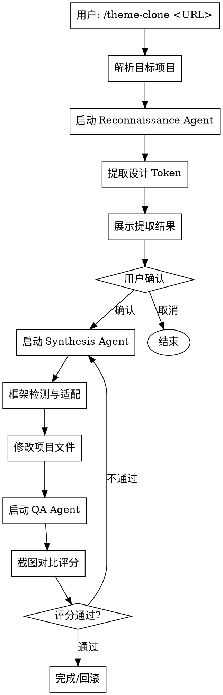

# Theme Clone Skill 设计文档

**日期**: 2026-03-31
**状态**: 已批准
**类型**: 个人工具 Skill

---

## 概述

Theme Clone Skill 是一个从目标网站 URL 提取设计元素、智能适配目标项目框架、并通过感知评分自动校验的自动化工具。

**核心功能：**
1. 从 URL 提取完整设计系统（颜色、字体、间距、阴影等）
2. 智能检测目标项目框架类型并适配
3. 全自动质量校验（SSIM/LPIPS 评分）

---

## 技术架构

### 目录结构

```
project/.claude/skills/theme-clone/
├── SKILL.md                    # 入口：Skill 元数据 + 编排逻辑
├── agents/
│   ├── reconnaissance.md       # Reconnaissance Agent 指令
│   ├── synthesis.md            # Synthesis Agent 指令
│   └── qa.md                   # QA Agent 指令
├── tools/
│   ├── extractor.js             # 浏览器自动化提取脚本
│   ├── adapter.js              # 框架适配转换脚本
│   └── scorer.py               # LPIPS/SSIM 评分脚本
├── prompts/
│   ├── extract-from-url.md     # URL 提取提示词
│   └── adapt-framework.md      # 框架适配提示词
└── config/
    └── framework-rules.json    # 各框架的适配规则
```

### 执行流程



### 三代理职责

| 代理 | 职责 | 工具 |
|------|------|------|
| **Reconnaissance Agent** | 浏览器访问 URL、截图、执行 getComputedStyle、输出原始 JSON Token | Playwright MCP / Puppeteer |
| **Synthesis Agent** | 分析项目结构、检测框架类型、转换 Token、修改样式文件 | File Manager MCP / Code Edit |
| **QA Agent** | 启动预览、截图、计算 SSIM/LPIPS 评分、生成报告 | Playwright MCP / Python |

### 框架检测逻辑

```javascript
// 优先级检测顺序
const frameworkDetection = {
  tailwind_v4: ['tailwind.config.js', '@theme in globals.css'],
  tailwind_v3: ['tailwind.config.js', 'module.exports'],
  shadcn_ui: ['components/ui', 'globals.css', 'lib/utils.ts'],
  css_modules: ['*.module.css'],
  material_ui: ['createTheme', '@mui/material']
};
```

### 设计 Token 输出格式

```json
{
  "colors": {
    "primary": { "hex": "#3b82f6", "oklch": "..." },
    "secondary": { "hex": "#64748b", "oklch": "..." }
  },
  "typography": {
    "fontFamily": { "primary": "Inter, sans-serif" },
    "fontWeight": { "normal": 400, "bold": 700 }
  },
  "spacing": { "base": "4px", "scale": [4, 8, 12, 16, 24, 32] },
  "borderRadius": { "sm": "4px", "md": "8px", "lg": "12px" },
  "shadows": { "sm": "0 1px 2px", "md": "0 4px 6px" }
}
```

---

## 用户交互规范

### 调用方式

```
/theme-clone <URL>                    # 使用当前目录作为目标项目
/theme-clone <URL> @目标项目           # 指定目标项目
```

### 交互流程

1. **解析阶段**：确定目标项目目录
2. **提取阶段**：Reconnaissance Agent 访问 URL，提取设计 Token
3. **确认阶段**：展示提取结果，用户确认后继续
4. **适配阶段**：Synthesis Agent 检测框架并转换 Token
5. **应用阶段**：原地修改项目文件
6. **校验阶段**：QA Agent 运行评分，不通过则回滚

### 输出规范

| 项目 | 说明 |
|------|------|
| 目标框架 | 检测到的框架类型 |
| 设计 Token | 提取的颜色、字体、间距等 |
| 修改文件 | 将被修改的文件列表 |
| 评分结果 | SSIM/LPIPS 分数 |

---

## 评分标准

| 指标 | 通过阈值 | 说明 |
|------|----------|------|
| SSIM | ≥ 0.88 | 结构相似性指数 |
| LPIPS | ≤ 0.15 | 感知哈希距离 |

评分不通过时，自动回滚修改并提示需要人工介入。

---

## 依赖工具

- **Playwright MCP** 或 **Puppeteer**：浏览器自动化
- **Python + TorchMetrics**：LPIPS 评分计算
- **文件系统访问**：修改目标项目文件

---

## 文件清单

| 文件 | 用途 |
|------|------|
| `SKILL.md` | Skill 入口，定义触发条件和编排逻辑 |
| `agents/reconnaissance.md` | URL 扫描和设计提取指令 |
| `agents/synthesis.md` | 框架适配和代码修改指令 |
| `agents/qa.md` | 质量校验指令 |
| `tools/extractor.js` | 浏览器自动化提取脚本 |
| `tools/adapter.js` | Token 转换适配脚本 |
| `tools/scorer.py` | SSIM/LPIPS 评分脚本 |
| `prompts/extract-from-url.md` | URL 提取提示词模板 |
| `prompts/adapt-framework.md` | 框架适配提示词模板 |
| `config/framework-rules.json` | 各框架的变量映射规则 |
