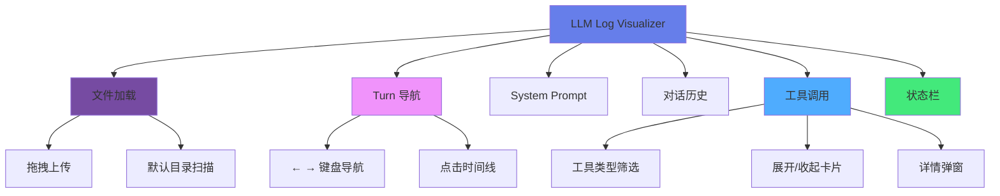
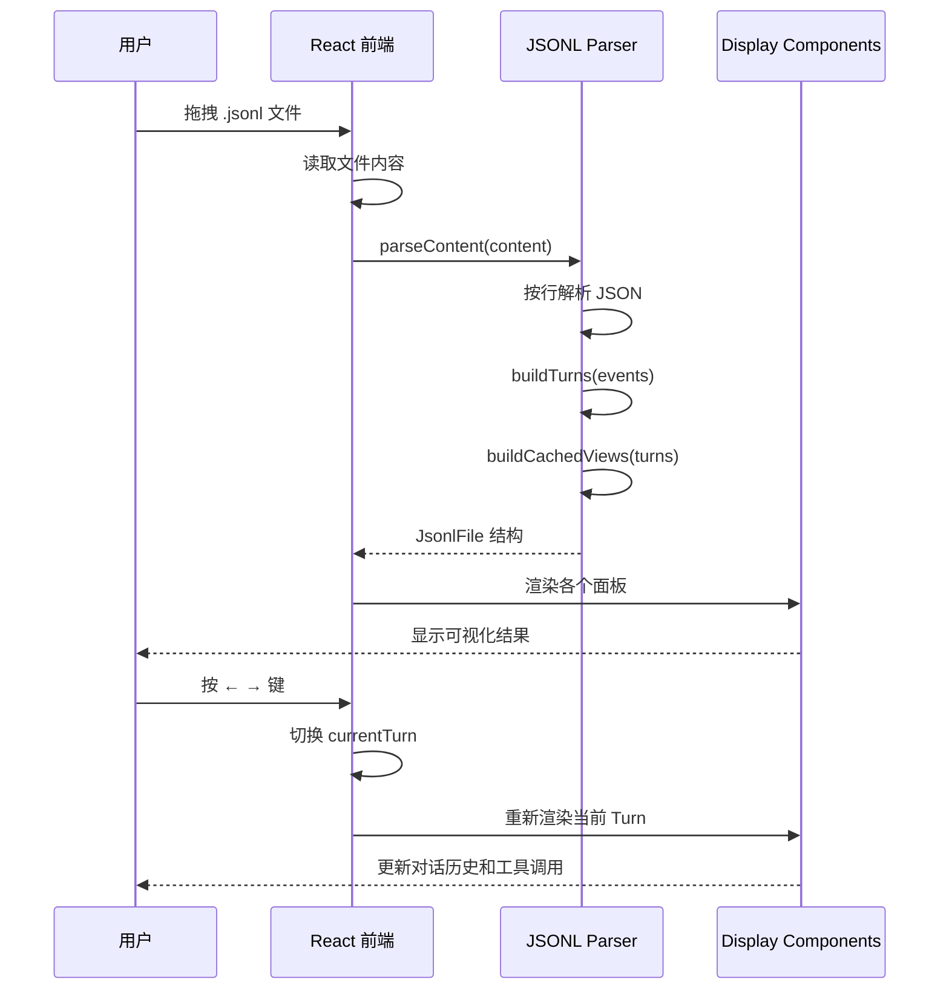
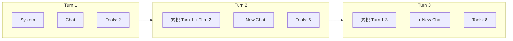

# LLM Log Visualizer

## 目录

- [第一部分：项目概览](#第一部分项目概览)
  - [1.1 项目背景与目标](#11-项目背景与目标)
  - [1.2 整体架构图](#12-整体架构图)
- [第二部分：功能详解](#第二部分功能详解)
  - [2.1 文件加载](#21-文件加载)
  - [2.2 Turn 导航](#22-turn-导航)
  - [2.3 System Prompt](#23-system-prompt)
  - [2.4 对话历史](#24-对话历史)
  - [2.5 工具调用](#25-工具调用)
  - [2.6 状态栏](#26-状态栏)
- [第三部分：数据格式](#第三部分数据格式)
- [第四部分：技术实现](#第四部分技术实现)

---

## 第一部分：项目概览

### 1.1 项目背景与目标

#### 解决的核心问题

本项目旨在解决 LLM Agent 日志分析中的以下痛点：

| 痛点 | 解决方案 |
|------|----------|
| 日志格式难以阅读 | JSONL 转可视化界面，按 Turn 分层展示 |
| 工具调用散落 | 集中展示工具调用，支持展开查看参数和输出 |
| 思考过程不透明 | 单独展示 reasoning 内容 |
| 跨文件分析困难 | 多文件同时加载，快速切换 |
| 手动搜索低效 | 支持按工具类型筛选、键盘导航 |

#### 主要功能特性



#### 技术选型理由

| 技术 | 版本 | 选型理由 |
|------|------|----------|
| **React** | 18.2.0 | 并发特性，组件化架构 |
| **TypeScript** | 5.3.0 | 严格类型检查 |
| **Vite** | 5.0.0 | 快速的 dev server 和构建 |
| **react-markdown** | 9.0.1 | Markdown 渲染 |
| **rehype-highlight** | 7.0.0 | 代码高亮 |
| **remark-gfm** | 4.0.1 | GitHub Flavored Markdown |

### 1.2 整体架构图

#### 前端整体架构图

```mermaid
flowchart TB
    subgraph Entry["应用入口"]
        Index["index.html"]
        Main["main.tsx"]
        App["App.tsx"]
    end

    subgraph Pages["主界面布局"]
        Header["Header<br/>Logo + 文件名 + Turn 导航"]
        Sidebar["Sidebar<br/>文件列表"]
        Content["Content Panes<br/>可调整大小的面板"]
        StatusBar["StatusBar<br/>状态信息"]
    end

    subgraph ContentPanes["内容面板"]
        System["System Prompt Pane<br/>Markdown 渲染"]
        ResizeH["横向调整手柄"]
        ChatArea["Chat Area<br/>垂直分割"]
        
        subgraph ChatAreaSub["对话区域"]
            ChatHistory["Chat History Pane<br/>消息列表"]
            ResizeV["纵向调整手柄"]
            ToolPane["Tool Calls Pane<br/>工具调用"]
        end
    end

    subgraph Components["组件层"]
        Timeline["Timeline.tsx"]
        SystemPrompt["SystemPrompt.tsx<br/>SystemPromptBlock.tsx"]
        ChatHistory["ChatHistory.tsx"]
        ContentBlock["ContentBlock.tsx"]
        ToolCard["ToolCard.tsx"]
        StatusBar["StatusBar.tsx"]
        CodeBlock["CodeBlock.tsx"]
        MarkdownBlock["MarkdownBlock.tsx"]
        ShellBlock["ShellBlock.tsx"]
        TodoBlock["TodoBlock.tsx"]
    end

    subgraph Hooks["自定义 Hooks"]
        JsonlParser["useJsonlParser<br/>JSONL 解析"]
    end

    subgraph Utils["工具函数"]
        ContentType["contentType.ts<br/>内容类型推断"]
        Tokenizer["tokenizer.ts<br/>Token 统计"]
    end

    subgraph Types["类型定义"]
        Types["types/index.ts<br/>事件和接口定义"]
    end

    Entry --> Pages
    Pages --> ContentPanes
    ContentPanes --> Components
    Components --> Hooks
    Components --> Utils
    Utils --> Types

    Index --> Main
    Main --> App
    App --> Pages

    style Entry fill:#e3f2fd
    style Pages fill:#f3e5f5
    style ContentPanes fill:#fff3e0
    style Components fill:#e8f5e9
    style Hooks fill:#e1f5fe
```

#### 面板布局图

```
┌──────────────────────────────────────────────────────────────────────┐
│  L  LLM Log        filename.jsonl           ← Turn 1/3 →           │
├──────────┬─────────────────────────────────┬────────────────────────┤
│          │                                 │                        │
│  Files   │      System Prompt (35%)         │    Conversation       │
│          │                                 │                        │
│  📄 f1   │  ┌─────────────────────────┐   │  ┌──────────────────┐ │
│  📄 f2   │  │ Markdown Rendered      │   │  │ Chat History     │ │
│  📄 f3   │  │ System Instructions    │   │  │ (滚动)           │ │
│          │  │                        │   │  │                  │ │
│          │  └─────────────────────────┘   │  ├──────────────────┤ │
│          │                                 │  │ Tool Calls      │ │
│          │                                 │  │ (滚动)          │ │
│          │                                 │  └──────────────────┘ │
├──────────┴─────────────────────────────────┴────────────────────────┤
│  File: xxx.jsonl  │  Turn: 1/3  │  Tools: 5                      │
└──────────────────────────────────────────────────────────────────────┘
```

#### 事件流解析图



---

## 第二部分：功能详解

### 2.1 文件加载

#### 拖拽上传

```typescript
const handleDrop = useCallback((e: React.DragEvent) => {
  e.preventDefault()
  const files = e.dataTransfer.files
  for (let i = 0; i < files.length; i++) {
    const file = files[i]
    if (file.name.endsWith('.jsonl')) {
      loadFile(file)  // 读取并解析
    }
  }
}, [parseContent])

const loadFile = (file: File) => {
  const reader = new FileReader()
  reader.onload = (e) => {
    const content = e.target?.result as string
    const parsed = parseContent(content)  // JSONL 解析
    // ... 更新状态
  }
  reader.readAsText(file)
}
```

#### 多文件管理

```typescript
interface LoadedFile {
  filename: string
  data: JsonlFile
}

// 支持同时加载多个文件
const [loadedFiles, setLoadedFiles] = useState<LoadedFile[]>([])
const [currentFileIndex, setCurrentFileIndex] = useState(0)

// 切换文件时重置 Turn
const switchFile = (index: number) => {
  setCurrentFileIndex(index)
  setCurrentTurn(1)
  setExpandedTools(new Set())
}
```

### 2.2 Turn 导航

#### Turn 累积视图

每个 Turn 的视图包含从 Turn 1 到当前 Turn 的所有累积数据：



#### 键盘导航

```typescript
useEffect(() => {
  const handleKeyDown = (e: KeyboardEvent) => {
    if (e.key === 'ArrowLeft') handlePrevTurn()
    if (e.key === 'ArrowRight') handleNextTurn()
  }
  window.addEventListener('keydown', handleKeyDown)
  return () => window.removeEventListener('keydown', handleKeyDown)
}, [currentTurn, currentFile])

const handlePrevTurn = () => {
  if (currentTurn > 1) {
    const newTurn = currentTurn - 1
    setCurrentTurn(newTurn)
    setExpandedTools(getToolIndicesForTurn(newTurn, toolTurnCounts))
  }
}
```

### 2.3 System Prompt

#### Markdown 渲染

```typescript
import ReactMarkdown from 'react-markdown'
import rehypeHighlight from 'rehype-highlight'
import remarkGfm from 'remark-gfm'

<ReactMarkdown
  remarkPlugins={[remarkGfm]}
  rehypePlugins={[rehypeHighlight]}
>
  {systemPromptContent}
</ReactMarkdown>
```

#### 可调整宽度

```typescript
const handleResizeStart = (e: React.MouseEvent) => {
  const startX = e.clientX
  const startWidth = systemPaneWidth

  const handleMouseMove = (e: MouseEvent) => {
    const delta = ((e.clientX - startX) / containerWidth) * 100
    const newWidth = Math.min(Math.max(startWidth + delta, 20), 60)
    setSystemPaneWidth(newWidth)
  }
  // ...
}
```

### 2.4 对话历史

#### 消息类型处理

```typescript
type ChatItem =
  | { kind: 'user'; content: string; turn: number }
  | { kind: 'assistant'; content: string; turn: number }
  | { kind: 'reasoning'; content: string; turn: number }
  | { kind: 'agent_switch'; agent: string; turn: number }
  | { kind: 'retry'; attempt: number; error: string; turn: number }
  | { kind: 'file_reference'; filename: string; mime: string; url: string; turn: number }
  | { kind: 'subtask_start'; description: string; turn: number }
  | { kind: 'permission_request'; permissionType: string; title: string; status: string; turn: number }
```

#### 事件渲染

```typescript
const renderReasoning = (event: ReasoningEvent) => (
  <div className="chat-message reasoning">
    <div className="chat-role">🔄 Thinking</div>
    <div className="reasoning-content">{event.content}</div>
  </div>
)

const renderAgentSwitch = (event: AgentSwitchEvent) => (
  <div className="chat-message system">
    <div className="chat-role">🔀 Agent Switch</div>
    <div className="system-event-content">
      Switched to: <strong>{event.agent}</strong>
    </div>
  </div>
)

const renderRetry = (event: RetryEvent) => (
  <div className="chat-message warning">
    <div className="chat-role">⚠️ Retry</div>
    <div className="retry-content">
      Attempt {event.attempt}: {event.error}
    </div>
  </div>
)
```

### 2.5 工具调用

#### 工具类型筛选

```typescript
const [toolTypeFilter, setToolTypeFilter] = useState<string | null>(null)

// 统计工具类型
const toolTypeStats = toolCalls.reduce((acc, tool) => {
  acc[tool.tool] = (acc[tool.tool] || 0) + 1
  return acc
}, {})

// 筛选显示
const filteredTools = toolTypeFilter
  ? toolCalls.filter(tool => tool.tool === toolTypeFilter)
  : toolCalls
```

#### 展开/收起卡片

```typescript
const [expandedTools, setExpandedTools] = useState<Set<number>>(new Set())

const toggleTool = (index: number) => {
  setExpandedTools(prev => {
    const next = new Set(prev)
    if (next.has(index)) {
      next.delete(index)
    } else {
      next.add(index)
    }
    return next
  })
}

// Tool Card 样式
<div className={`tool-card ${isExpanded ? 'expanded' : 'collapsed'}`}>
  <div className="tool-card-header">
    <span className="tool-name">{tool.tool}</span>
    <button onClick={() => toggleTool(originalIndex)}>
      {isExpanded ? '−' : '+'}
    </button>
  </div>
  {isExpanded && (
    <div className="tool-card-body">
      {/* Args and Output */}
    </div>
  )}
</div>
```

#### 详情弹窗

```typescript
const [selectedTool, setSelectedTool] = useState<{ tool: ToolCall; index: number } | null>(null)

{selectedTool && (
  <div className="tool-modal-overlay" onClick={() => setSelectedTool(null)}>
    <div className="tool-modal" onClick={(e) => e.stopPropagation()}>
      <div className="tool-modal-header">
        <span className="tool-name">{selectedTool.tool.tool}</span>
        <button onClick={() => setSelectedTool(null)}>×</button>
      </div>
      <div className="tool-modal-body">
        <pre>{JSON.stringify(selectedTool.tool.args, null, 2)}</pre>
        <ContentBlock content={selectedTool.tool.output} />
      </div>
    </div>
  </div>
)}
```

### 2.6 状态栏

```typescript
<footer className="status-bar">
  {currentFile && (
    <>
      <div className="status-item">
        <span className="status-label">File:</span>
        <span className="status-value">{currentFile.filename}</span>
      </div>
      <div className="status-separator" />
      <div className="status-item">
        <span className="status-label">Turn:</span>
        <span className="status-value">{currentTurn} / {currentFile.turns.length}</span>
      </div>
      <div className="status-separator" />
      <div className="status-item">
        <span className="status-label">Tools:</span>
        <span className="status-value">{currentView?.toolCalls?.length || 0}</span>
      </div>
    </>
  )}
</footer>
```

---

## 第三部分：数据格式

### JSONL 事件类型

```typescript
type EventType =
  | "turn_start"        // Turn 开始
  | "turn_complete"     // Turn 结束
  | "llm_params"        // LLM 参数
  | "text"             // 文本输出
  | "reasoning"        // 思考过程
  | "tool_call_result" // 工具调用结果
  | "step_start"       // 步骤开始
  | "agent_switch"     // Agent 切换
  | "retry"           // 重试
  | "file_reference"   // 文件引用
  | "subtask_start"   // 子任务
  | "permission_request" // 权限请求
```

### Turn 数据结构

```typescript
interface Turn {
  turnStart: {
    turn: number
    sessionID: string
    shortUUID: string
    parentShortUUID: string | null
    model: { providerID: string; modelID: string }
    agent: string
    system: string[]  // System Prompt
    messages: any[]    // 对话消息
  }
  events: AnyEvent[]  // 中间事件
  turnComplete: {
    turn: number
    reason: string
    texts: string[]
    fullText: string
    reasoning: string[]
    toolCalls: ToolCall[]
    tools: Tool[]
  }
}

interface ToolCall {
  id: string
  tool: string
  args: any
  output: string | null
  title: string | null
}
```

### JSONL 示例

```jsonl
{"type": "turn_start", "turn": 1, "sessionID": "abc123", "shortUUID": "xyz", "model": {"providerID": "openai", "modelID": "gpt-4"}, "agent": "default", "system": ["You are a helpful assistant."], "messages": [{"role": "user", "content": "Hello"}]}
{"type": "reasoning", "turn": 1, "content": "The user is greeting me..."}
{"type": "text", "turn": 1, "content": "Hello! How can I help you today?"}
{"type": "tool_call_result", "turn": 1, "id": "call_1", "tool": "bash", "args": {"command": "ls -la"}, "output": "total 32", "title": null}
{"type": "turn_complete", "turn": 1, "reason": "stop", "texts": ["Hello!"], "fullText": "Hello! How can I help you today?", "reasoning": ["The user is greeting"], "toolCalls": [], "tools": []}
```

---

## 第四部分：技术实现

### 项目结构

```
llm-log-visualizer/
├── index.html
├── package.json
├── tsconfig.json
├── vite.config.ts
├── src/
│   ├── main.tsx              # React 入口
│   ├── App.tsx                # 主应用组件
│   ├── App.css                # 全局样式
│   ├── components/
│   │   ├── ChatHistory.tsx    # 对话历史
│   │   ├── CodeBlock.tsx      # 代码块
│   │   ├── ContentBlock.tsx   # 内容块（自动识别类型）
│   │   ├── MarkdownBlock.tsx   # Markdown 渲染
│   │   ├── ShellBlock.tsx     # Shell 命令块
│   │   ├── StatusBar.tsx      # 状态栏
│   │   ├── SystemPrompt.tsx   # System Prompt
│   │   ├── SystemPromptBlock.tsx
│   │   ├── Timeline.tsx       # 时间线
│   │   ├── TodoBlock.tsx      # Todo 列表块
│   │   ├── ToolCard.tsx       # 工具卡片
│   │   └── ToolHistory.tsx    # 工具历史
│   ├── hooks/
│   │   └── useJsonlParser.ts  # JSONL 解析 Hook
│   ├── types/
│   │   └── index.ts           # TypeScript 类型定义
│   └── utils/
│       ├── contentType.ts     # 内容类型推断
│       └── tokenizer.ts       # Token 统计
└── docs/
    └── plans/                 # 设计文档
```

### 内容类型自动识别

```typescript
// utils/contentType.ts
type ContentType = 'text' | 'command' | 'code' | 'markdown' | 'todo' | 'error'

function inferContentType(toolName: string | undefined, content: string): ContentType {
  // Shell 命令检测
  if (toolName === 'bash' || toolName === 'shell') {
    return 'command'
  }

  // Todo 检测
  if (content.includes('- [ ]') || content.includes('- [x]')) {
    return 'todo'
  }

  // Markdown 代码块
  if (content.includes('```')) {
    return 'markdown'
  }

  // JSON/纯文本
  return 'text'
}
```

### 快速开始

```bash
cd project/llm-log-visualizer
npm install     # 安装依赖
npm run dev    # 启动开发服务器
```

访问：http://localhost:5173

### 构建生产版本

```bash
npm run build  # 构建
npm run preview  # 预览生产版本
```
