# RaFlow 技术文档

> 实时语音转录工具 - macOS 悬浮窗应用

---

## 目录

- [第一部分：项目概览](#第一部分项目概览)
  - [1.1 项目背景与目标](#11-项目背景与目标)
  - [1.2 整体架构图](#12-整体架构图)
- [第二部分：技术架构详解](#第二部分技术架构详解)
  - [2.1 前端架构](#21-前端架构)
  - [2.2 后端架构](#22-后端架构)
- [第三部分：核心功能实现](#第三部分核心功能实现)
  - [3.1 音频采集](#31-音频采集)
  - [3.2 实时转录](#32-实时转录)
  - [3.3 状态管理](#33-状态管理)
  - [3.4 设置系统](#34-设置系统)
- [第四部分：数据流与通信](#第四部分数据流与通信)
- [第五部分：安全与权限](#第五部分安全与权限)
- [第六部分：构建与部署](#第六部分构建与部署)
- [第七部分：开发指南](#第七部分开发指南)

---

## 第一部分：项目概览

### 1.1 项目背景与目标

#### 解决的核心问题

| 痛点 | 解决方案 |
|------|----------|
| 传统录音转录工具操作繁琐 | 悬浮窗设计，一键启动 |
| 转录结果需要手动复制 | 自动复制到剪贴板 |
| 无法实时查看转录进度 | 实时显示部分转录结果 |
| 窗口遮挡工作区域 | 极简悬浮窗，始终置顶 |
| 快捷键使用不便 | 支持全局快捷键 Cmd+Shift+H |

#### 主要功能特性

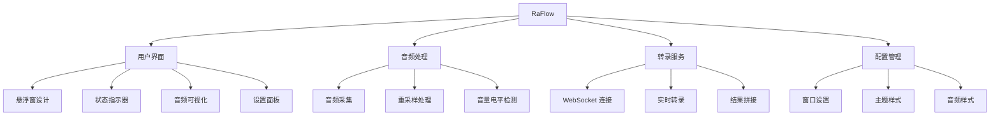

#### 技术选型理由

| 技术 | 版本 | 选型理由 |
|------|------|----------|
| **Tauri** | 2.0.6 | 轻量级、跨平台、原生性能 |
| **Rust** | 2021 | 高性能、内存安全、系统级访问 |
| **React** | 18.2.0 | 组件化、生态丰富、状态管理 |
| **TypeScript** | 5.3+ | 类型安全、IDE 支持 |
| **Vite** | 5.0+ | 快速开发、即时热更新 |
| **Tailwind CSS** | 3.4+ | 原子化 CSS、响应式设计 |
| **Framer Motion** | 11.0+ | 流畅动画、声明式动画 |
| **cpal** | 0.15 | 跨平台音频捕获 |
| **av-foundation** | 0.2 | macOS 原生音频 API |
| **rubato** | 0.15 | 高质量音频重采样 |
| **tokio** | 1.0+ | 异步运行时 |
| **tokio-tungstenite** | 0.26 | WebSocket 支持 |

### 1.2 整体架构图

#### 整体架构图

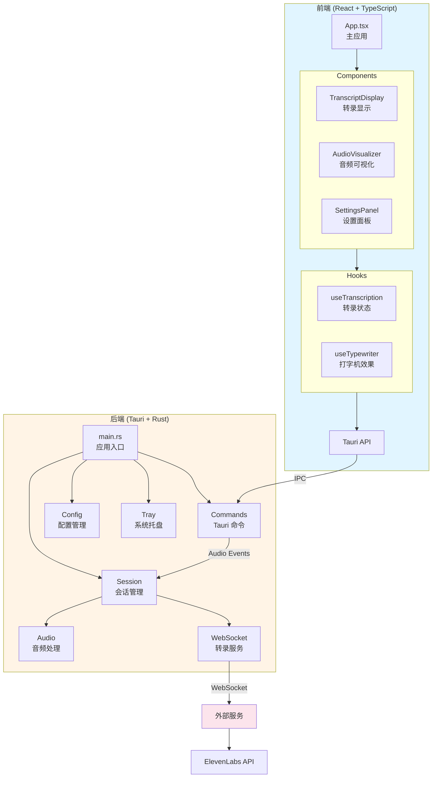

#### 前后端交互流程

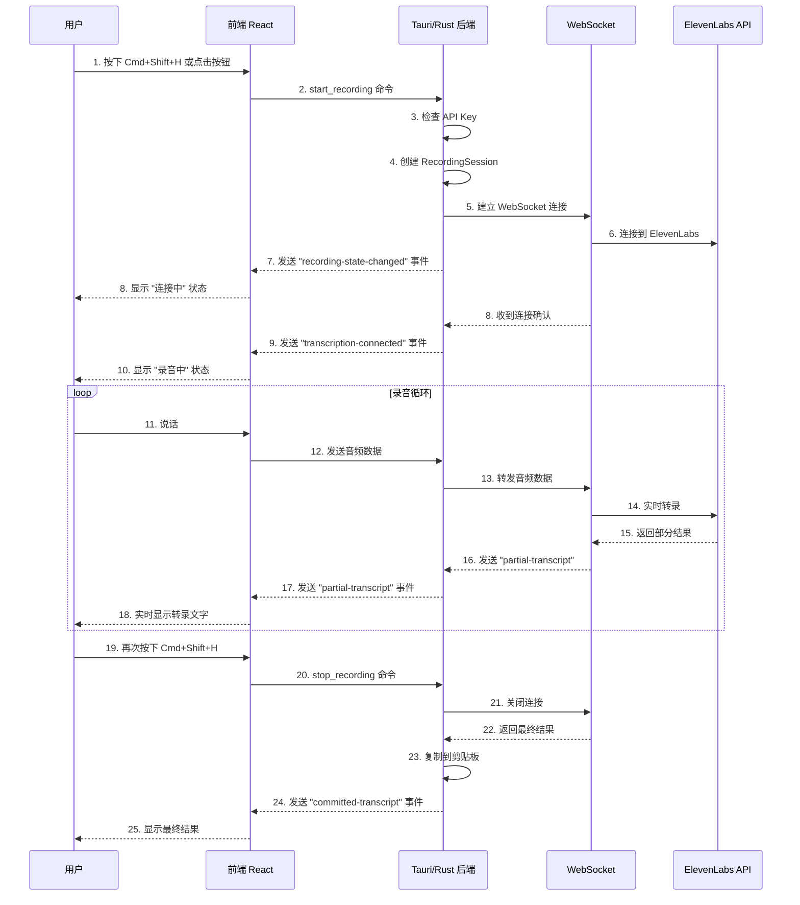

---

## 第二部分：技术架构详解

### 2.1 前端架构

#### 目录结构

```
src/
├── components/                 # React 组件
│   ├── AudioVisualizer.tsx    # 音频可视化组件
│   ├── TranscriptDisplay.tsx  # 转录结果显示
│   ├── SettingsPanel.tsx      # 设置面板
│   ├── WaveformVisualizer.tsx # 波形可视化
│   └── visualizers/           # 可视化子组件
│       ├── ParticleVisualizer.tsx  # 粒子效果
│       ├── PulseVisualizer.tsx     # 脉动效果
│       └── SpectrumVisualizer.tsx  # 频谱效果
├── hooks/                     # 自定义 Hooks
│   ├── useTranscription.ts    # 转录状态管理
│   └── useTypewriter.ts       # 打字机效果
├── App.tsx                    # 主应用组件
├── main.tsx                   # 前端入口
└── styles.css                 # 全局样式
```

#### 组件架构

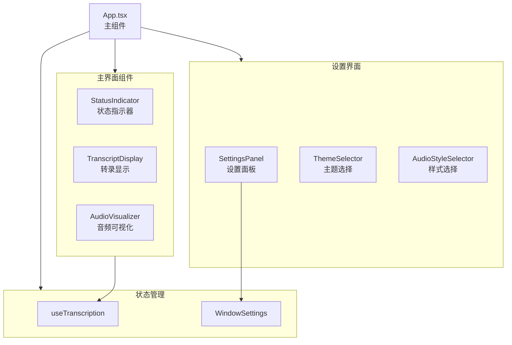

#### 转录状态管理 (useTranscription)

```typescript
/**
 * 录音状态枚举
 * - idle: 空闲状态
 * - connecting: 连接中 (WebSocket 建立连接)
 * - recording: 录音中 (已连接，正在转录)
 * - processing: 处理中
 * - error: 错误状态
 */
export type RecordingStatus = "idle" | "connecting" | "recording" | "processing" | "error";

/**
 * 转录状态接口
 */
export interface TranscriptionState {
  status: RecordingStatus;        // 当前录音状态
  partialText: string;            // 部分转录文本 (实时更新)
  committedText: string;          // 已确认的转录文本
  audioLevel: number;            // 音频电平 (0-1)
  error: TranscriptionError | null;  // 错误信息
}

/**
 * 转录状态管理 Hook
 *
 * 监听后端发送的转录事件，提供统一的转录状态管理
 */
export function useTranscription(): TranscriptionState {
  // 监听的事件类型:
  // - recording-state-changed: 录音状态变化
  // - transcription-connected: 连接成功
  // - partial-transcript: 部分转录结果
  // - committed-transcript: 已确认转录结果
  // - audio-level: 音频电平
  // - transcription-error: 错误事件
}
```

#### 音频可视化系统

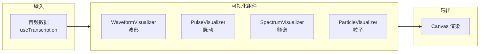

### 2.2 后端架构

#### 目录结构

```
src-tauri/src/
├── main.rs                 # 应用入口
├── lib.rs                  # 库入口，初始化逻辑
├── commands.rs             # Tauri 命令定义
├── config/                # 配置管理模块
│   └── mod.rs             # 配置加载与保存
├── audio/                 # 音频处理模块
│   ├── mod.rs             # 模块导出
│   ├── capture.rs         # 音频捕获接口
│   ├── capture_avaudio.rs # CoreAudio 实现
│   ├── capture_avfoundation.rs # AVFoundation 实现
│   ├── pipeline.rs         # 音频管道
│   └── resampler.rs        # 重采样处理
├── session/                # 会话管理模块
│   ├── mod.rs              # 模块导出
│   ├── recording.rs        # 录音会话实现
│   └── websocket_task.rs   # WebSocket 任务
├── transcription/          # 转录服务模块
│   ├── mod.rs              # 模块导出
│   ├── client.rs           # 转录客户端
│   └── types.rs            # 类型定义
└── clipboard/              # 剪贴板模块
    └── mod.rs              # 剪贴板操作
```

#### 核心模块说明

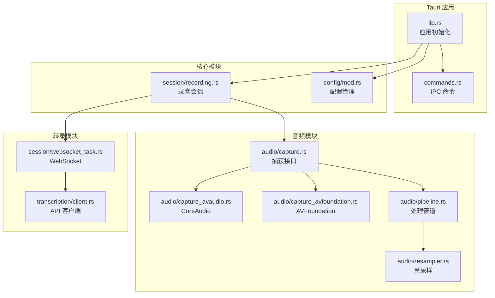

#### 命令系统 (commands.rs)

| 命令 | 功能 | 参数 | 返回值 |
|------|------|------|--------|
| `start_recording` | 开始录音 | - | `Result<String, String>` |
| `stop_recording` | 停止录音 | - | `Result<String, String>` |
| `is_recording` | 检查录音状态 | - | `bool` |
| `get_window_settings` | 获取窗口设置 | - | `FloatingWindowSettings` |
| `save_window_settings` | 保存窗口设置 | `settings: FloatingWindowSettings` | `Result<(), String>` |
| `set_window_position` | 设置窗口位置 | `x: i32, y: i32` | `Result<(), String>` |
| `set_window_size` | 设置窗口大小 | `width: u32, height: u32` | `Result<(), String>` |
| `show_window` | 显示窗口 | - | `Result<(), String>` |
| `hide_window` | 隐藏窗口 | - | `Result<(), String>` |
| `start_dragging` | 开始拖动窗口 | - | `Result<(), String>` |
| `save_window_position` | 保存窗口位置 | - | `Result<(), String>` |
| `update_tray_status` | 更新托盘状态 | `status: String` | `Result<(), String>` |

#### 配置系统 (config/mod.rs)

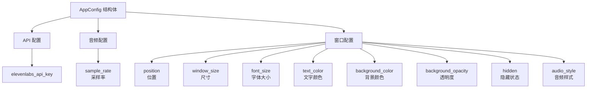

---

## 第三部分：核心功能实现

### 3.1 音频采集

#### 音频采集架构

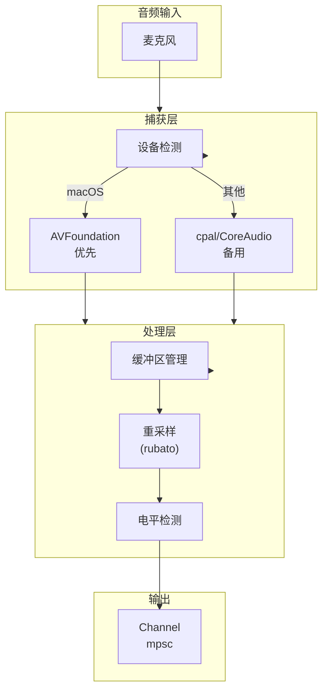

#### 重采样配置

```rust
// 音频重采样器配置
pub struct AudioResampler {
    // 输入采样率 (设备相关)
    input_rate: u32,
    // 输出采样率 (API 要求: 16000 Hz)
    output_rate: u32,
    // 通道数
    channels: usize,
    // 帧数配置
    frames_per_buffer: usize,
}
```

### 3.2 实时转录

#### WebSocket 连接流程

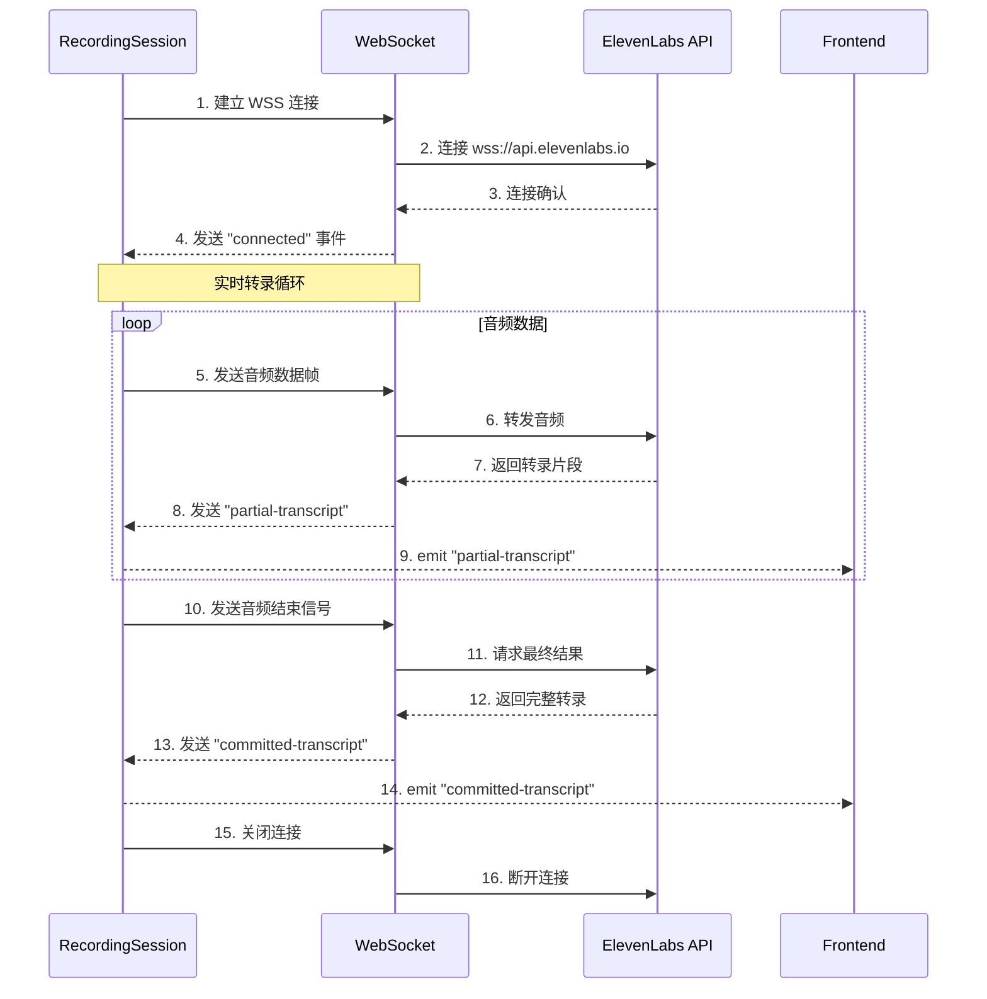

### 3.3 状态管理

#### 会话状态机

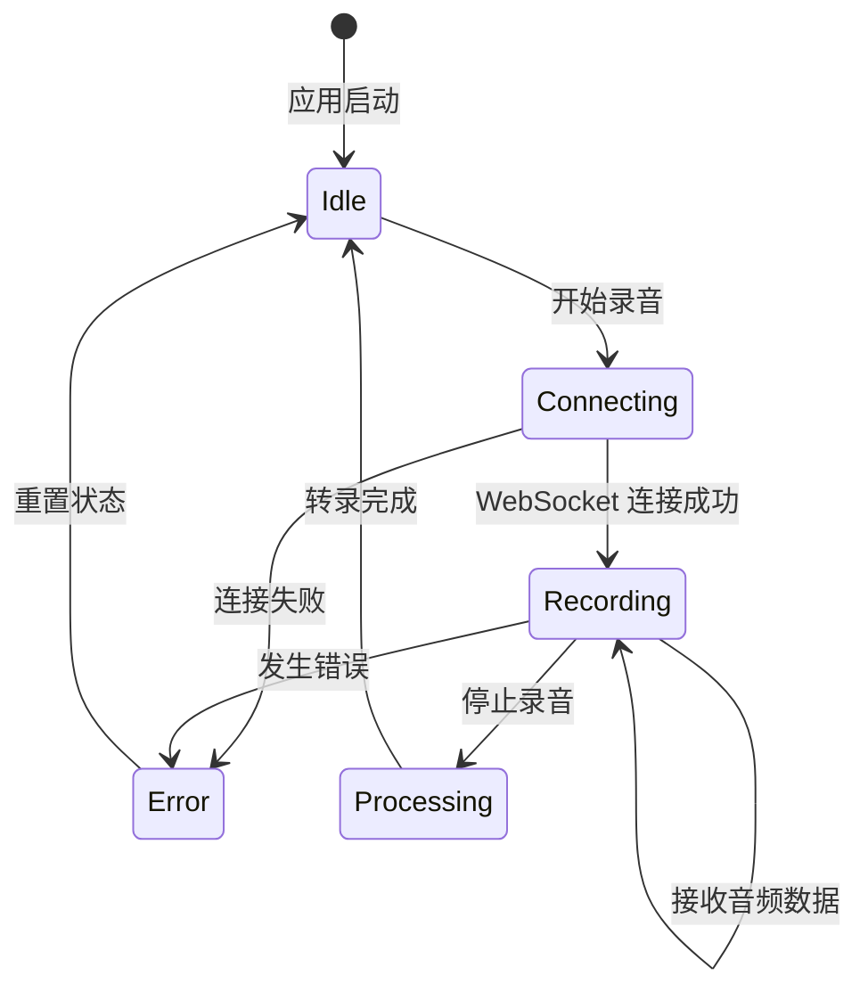

### 3.4 设置系统

#### 主题预设

| 主题 ID | 名称 | 背景色 | 透明度 | 文字色 |
|---------|------|--------|--------|--------|
| `midnight` | 暗夜黑 | #1C1C1E | 90% | #FFFFFF |
| `sunrise` | 晨曦金 | #2D2520 | 85% | #FFD699 |
| `ocean` | 深海蓝 | #0A1929 | 85% | #64B5F6 |
| `mint` | 薄荷绿 | #1A2E2A | 85% | #81D4BC |
| `lavender` | 薰衣草 | #2A2438 | 85% | #D4C4E8 |

#### 音频可视化样式

| 样式 ID | 名称 | 图标 | 说明 |
|---------|------|------|------|
| `waveform` | 波形 | 📊 | 实时波形显示 |
| `pulse` | 脉动 | ⚪ | 圆形脉动效果 |
| `spectrum` | 圆环 | ⭕ | 环形频谱 |
| `particle` | 粒子 | ✨ | 粒子动画效果 |

---

## 第四部分：数据流与通信

#### 事件系统

| 事件名称 | 方向 | 载荷 | 说明 |
|----------|------|------|------|
| `recording-state-changed` | 后端 → 前端 | `boolean` | 录音状态变化 |
| `transcription-connected` | 后端 → 前端 | `void` | WebSocket 连接成功 |
| `partial-transcript` | 后端 → 前端 | `string` | 部分转录结果 |
| `committed-transcript` | 后端 → 前端 | `string` | 已确认转录结果 |
| `audio-level` | 后端 → 前端 | `number` | 音频电平 (0-1) |
| `transcription-error` | 后端 → 前端 | `TranscriptionError` | 错误信息 |
| `open-settings` | 后端 → 前端 | `void` | 打开设置面板 |

#### 错误类型

```typescript
type TranscriptionErrorType = "auth" | "network" | "server";

interface TranscriptionError {
  type: TranscriptionErrorType;
  message: string;
}
```

---

## 第五部分：安全与权限

### macOS 权限配置

```xml
<!-- entitlements.plist -->
<key>com.apple.security.device.audio-input</key>
<true/>

<key>com.apple.security.app-sandbox</key>
<false/>
```

### 隐私权限说明

| 权限 | 说明 | 用途 |
|------|------|------|
| 麦克风 | 必须 | 录音转录功能 |
| 网络 | 必须 | WebSocket 转录服务 |

### API Key 管理

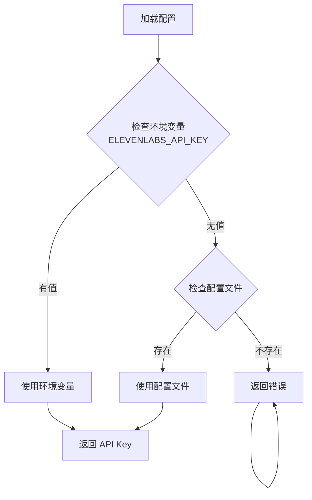

---

## 第六部分：构建与部署

### 环境要求

| 要求 | 版本 |
|------|------|
| Node.js | 18+ |
| Rust | 1.70+ |
| pnpm | 8.0+ |
| macOS | 10.13+ |

### 构建命令

```bash
# 安装依赖
pnpm install

# 前端开发 (Vite)
pnpm dev

# Tauri 开发模式
pnpm tauri dev

# 生产构建
pnpm tauri build

# 构建产物位置
# macOS: src-tauri/target/release/bundle/dmg/
```

### 配置文件

| 文件 | 说明 |
|------|------|
| `.env` | 本地环境变量 |
| `tauri.conf.json` | Tauri 应用配置 |
| `Cargo.toml` | Rust 依赖配置 |
| `package.json` | Node 依赖配置 |

---

## 第七部分：开发指南

### 调试技巧

```bash
# 启用详细日志
# 在 .env 文件中设置
DEBUG_LOGGING=true

# 查看 Tauri 日志
# macOS: ~/Library/Logs/raflow/
```

### 常见问题

#### 麦克风权限问题

首次使用需要授权麦克风权限。详见 [macOS 音频权限指南](./docs/macOS-audio-permission-guide.md)。

#### API Key 配置

1. 在项目根目录创建 `.env` 文件
2. 添加 `ELEVENLABS_API_KEY=your_api_key`
3. 或在设置面板中输入 API Key

### 开发计划

详见 [docs/plans](./docs/plans/) 目录：

- MVP 设计：Phase 1-4
- 转录集成：Phase 5-8
- UI/UX 增强：Phase 9-12
- 悬浮窗设置：Phase 13-15
- 音频样式：Phase 16

---

## 附录

### 快速参考

```bash
# 开发模式
pnpm tauri dev

# 构建应用
pnpm tauri build

# 清理构建
rm -rf src-tauri/target
```

### 目录结构

```
raflow/
├── src/                      # React 前端源码
│   ├── components/          # React 组件
│   ├── hooks/              # 自定义 Hooks
│   ├── App.tsx             # 主应用
│   └── main.tsx            # 入口
├── src-tauri/              # Tauri/Rust 后端
│   ├── src/                # Rust 源码
│   │   ├── main.rs         # 入口
│   │   ├── lib.rs          # 库
│   │   ├── commands.rs     # 命令
│   │   ├── audio/          # 音频模块
│   │   ├── session/        # 会话模块
│   │   ├── transcription/  # 转录模块
│   │   ├── config/         # 配置模块
│   │   └── clipboard/      # 剪贴板模块
│   ├── Cargo.toml          # Rust 依赖
│   └── tauri.conf.json     # Tauri 配置
├── docs/                   # 文档
│   ├── plans/              # 开发计划
│   └── *.md                # 指南文档
└── package.json            # Node 依赖
```

---

**文档版本**: 1.0.0
**最后更新**: 2026-03-15
**维护者**: 开发团队
