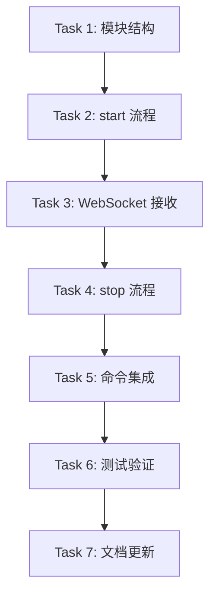

# 语音转录端到端集成 - 实现计划

> **For Claude:** REQUIRED SUB-SKILL: Use superpowers:executing-plans to implement this plan task-by-task.

**Goal:** 将现有独立模块串联成完整的语音转录流程：热键触发 → 音频采集 → WebSocket 转录 → 结果显示 → 剪贴板输出

**Architecture:** 创建 RecordingSession 状态机管理录音生命周期，协调 AudioPipeline、TranscriptionClient 和 Clipboard 模块

**Tech Stack:** Rust (Tauri v2), tokio (async), tokio-tungstenite (WebSocket), cpal (audio), arboard (clipboard)

---

## Task 1: 创建 session 模块结构

**Files:**
- Create: `src-tauri/src/session/mod.rs`
- Modify: `src-tauri/src/lib.rs:1-5`

**Step 1: 创建 session 模块文件**

```rust
//! Recording session management.
//!
//! This module provides the [`RecordingSession`] state machine that coordinates
//! audio capture, WebSocket transcription, and clipboard output.

mod session;

pub use session::{RecordingSession, SessionError, SessionState};
```

**Step 2: 创建 session.rs 核心结构**

```rust
//! Recording session implementation.

use crate::audio::AudioPipeline;
use crate::clipboard;
use crate::config;
use crate::transcription::{IncomingMessage, TranscriptionClient};
use std::sync::atomic::{AtomicBool, Ordering};
use std::sync::Arc;
use std::time::Duration;
use tauri::{AppHandle, Emitter, Manager};
use thiserror::Error;
use tokio::sync::Mutex;

/// Session errors.
#[derive(Error, Debug)]
pub enum SessionError {
    /// API key not configured.
    #[error("API key not configured. Please set ELEVENLABS_API_KEY environment variable or configure in settings.")]
    ApiKeyMissing,

    /// WebSocket connection failed.
    #[error("WebSocket connection failed: {0}")]
    ConnectionFailed(String),

    /// Audio capture failed.
    #[error("Audio capture failed: {0}")]
    AudioCaptureFailed(String),

    /// Operation timed out.
    #[error("Operation timed out")]
    Timeout,

    /// Session is already active.
    #[error("Recording session is already active")]
    AlreadyActive,

    /// Session is not active.
    #[error("No active recording session")]
    NotActive,

    /// Clipboard error.
    #[error("Clipboard error: {0}")]
    Clipboard(String),
}

/// Shared session state managed by Tauri.
pub struct SessionState {
    /// Current active session (None if not recording).
    pub session: Arc<Mutex<Option<RecordingSession>>>,
}

impl Default for SessionState {
    fn default() -> Self {
        Self {
            session: Arc::new(Mutex::new(None)),
        }
    }
}

/// Recording session that coordinates audio capture and transcription.
pub struct RecordingSession {
    /// Audio pipeline for capturing and resampling.
    audio_pipeline: AudioPipeline,
    /// WebSocket client for transcription.
    ws_client: TranscriptionClient,
    /// Flag indicating if session is active.
    is_active: Arc<AtomicBool>,
    /// Latest committed transcript text.
    committed_text: Arc<Mutex<String>>,
}

impl RecordingSession {
    /// Create a new recording session.
    ///
    /// # Errors
    ///
    /// Returns [`SessionError::ApiKeyMissing`] if API key is not configured.
    /// Returns [`SessionError::AudioCaptureFailed`] if audio device cannot be initialized.
    pub fn new() -> Result<Self, SessionError> {
        // Check API key first
        let api_key = config::get_api_key()
            .map_err(|e| SessionError::ConnectionFailed(e.to_string()))?
            .ok_or(SessionError::ApiKeyMissing)?;

        // Initialize audio pipeline
        let audio_pipeline = AudioPipeline::new()
            .map_err(|e| SessionError::AudioCaptureFailed(e.to_string()))?;

        Ok(Self {
            audio_pipeline,
            ws_client: TranscriptionClient::new(api_key),
            is_active: Arc::new(AtomicBool::new(false)),
            committed_text: Arc::new(Mutex::new(String::new())),
        })
    }

    /// Check if the session is currently active.
    #[must_use]
    pub fn is_active(&self) -> bool {
        self.is_active.load(Ordering::SeqCst)
    }
}
```

**Step 3: 更新 lib.rs 添加 session 模块**

修改 `src-tauri/src/lib.rs` 第 1-5 行：

```rust
pub mod audio;
pub mod clipboard;
pub mod commands;
pub mod config;
pub mod session;
pub mod transcription;
```

**Step 4: 运行检查验证编译**

Run: `cd /Users/liufukang/workplace/AI/project/raflow/src-tauri && cargo check 2>&1`
Expected: 编译通过或只有未使用变量的警告

**Step 5: 提交**

```bash
git add src-tauri/src/session/mod.rs src-tauri/src/session/session.rs src-tauri/src/lib.rs
git commit -m "feat(session): add RecordingSession state machine structure"
```

---

## Task 2: 实现 start 流程

**Files:**
- Modify: `src-tauri/src/session/session.rs`
- Modify: `src-tauri/src/transcription/client.rs` (添加 async send_audio 需要的同步)

**Step 1: 添加 start 方法到 RecordingSession**

在 `RecordingSession` impl 块中添加：

```rust
    /// Start the recording session.
    ///
    /// This connects to the WebSocket API, starts audio capture, and begins
    /// streaming audio for transcription.
    ///
    /// # Errors
    ///
    /// Returns [`SessionError::AlreadyActive`] if session is already active.
    /// Returns [`SessionError::ConnectionFailed`] if WebSocket connection fails.
    /// Returns [`SessionError::AudioCaptureFailed`] if audio capture fails to start.
    pub async fn start(
        &mut self,
        app_handle: AppHandle,
    ) -> Result<(), SessionError> {
        if self.is_active.load(Ordering::SeqCst) {
            return Err(SessionError::AlreadyActive);
        }

        tracing::info!("Starting recording session...");

        // Connect to WebSocket
        self.ws_client.connect().await
            .map_err(|e| SessionError::ConnectionFailed(e.to_string()))?;

        tracing::info!("WebSocket connected, session_id: {:?}", self.ws_client.session_id());

        // Mark as active
        self.is_active.store(true, Ordering::SeqCst);

        // Clone references for the audio callback
        let ws_client = Arc::new(Mutex::new(std::mem::replace(&mut self.ws_client, TranscriptionClient::new(String::new()))));
        let is_active = self.is_active.clone();

        // Start audio pipeline with callback
        self.audio_pipeline.start(move |pcm_data: Vec<i16>| {
            if !is_active.load(Ordering::SeqCst) {
                return;
            }

            // Send audio to WebSocket (non-blocking)
            let ws = ws_client.clone();
            tokio::spawn(async move {
                let mut client = ws.lock().await;
                if client.is_connected() {
                    let _ = client.send_audio(&pcm_data).await;
                }
            });
        }).map_err(|e| SessionError::AudioCaptureFailed(e.to_string()))?;

        // Restore WebSocket client reference
        self.ws_client = Arc::try_unwrap(ws_client)
            .map_err(|_| SessionError::AlreadyActive)?
            .into_inner();

        // Start receiver task
        self.start_receiver_task(app_handle);

        // Emit recording started event
        let _ = app_handle.emit("recording-state-changed", true);

        tracing::info!("Recording session started successfully");
        Ok(())
    }

    /// Start the WebSocket receiver task.
    fn start_receiver_task(&self, app_handle: AppHandle) {
        // Note: This will be implemented in Task 3
        // For now, we just log that we would start receiving
        tracing::info!("Receiver task would start here");
    }
```

**Step 2: 运行检查**

Run: `cd /Users/liufukang/workplace/AI/project/raflow/src-tauri && cargo check 2>&1`
Expected: 编译错误 - TranscriptionClient 需要实现 Clone 或我们需要调整架构

**Step 3: 调整架构 - 使用 channel 分离发送和接收**

由于 WebSocket 客户端不能同时被多个任务持有，我们需要重构。更新 session.rs：

```rust
//! Recording session implementation.

use crate::audio::AudioPipeline;
use crate::clipboard;
use crate::config;
use crate::transcription::{IncomingMessage, TranscriptionClient};
use std::sync::atomic::{AtomicBool, Ordering};
use std::sync::Arc;
use std::time::Duration;
use tauri::{AppHandle, Emitter, Manager};
use thiserror::Error;
use tokio::sync::{mpsc, Mutex};

// ... (SessionError 和 SessionState 保持不变) ...

/// Recording session that coordinates audio capture and transcription.
pub struct RecordingSession {
    /// Audio pipeline for capturing and resampling.
    audio_pipeline: AudioPipeline,
    /// Channel sender for audio data.
    audio_sender: Option<mpsc::Sender<Vec<i16>>>,
    /// Flag indicating if session is active.
    is_active: Arc<AtomicBool>,
    /// Latest committed transcript text.
    committed_text: Arc<Mutex<String>>,
    /// Cancellation token for stopping tasks.
    cancel_token: Arc<AtomicBool>,
}

impl RecordingSession {
    /// Create a new recording session.
    ///
    /// # Errors
    ///
    /// Returns [`SessionError::ApiKeyMissing`] if API key is not configured.
    /// Returns [`SessionError::AudioCaptureFailed`] if audio device cannot be initialized.
    pub fn new() -> Result<Self, SessionError> {
        // Check API key first
        let _api_key = config::get_api_key()
            .map_err(|e| SessionError::ConnectionFailed(e.to_string()))?
            .ok_or(SessionError::ApiKeyMissing)?;

        // Initialize audio pipeline
        let audio_pipeline = AudioPipeline::new()
            .map_err(|e| SessionError::AudioCaptureFailed(e.to_string()))?;

        Ok(Self {
            audio_pipeline,
            audio_sender: None,
            is_active: Arc::new(AtomicBool::new(false)),
            committed_text: Arc::new(Mutex::new(String::new())),
            cancel_token: Arc::new(AtomicBool::new(false)),
        })
    }

    /// Check if the session is currently active.
    #[must_use]
    pub fn is_active(&self) -> bool {
        self.is_active.load(Ordering::SeqCst)
    }

    /// Start the recording session.
    ///
    /// # Errors
    ///
    /// Returns [`SessionError::AlreadyActive`] if session is already active.
    /// Returns [`SessionError::ConnectionFailed`] if WebSocket connection fails.
    /// Returns [`SessionError::AudioCaptureFailed`] if audio capture fails to start.
    pub async fn start(
        &mut self,
        app_handle: AppHandle,
    ) -> Result<(), SessionError> {
        if self.is_active.load(Ordering::SeqCst) {
            return Err(SessionError::AlreadyActive);
        }

        tracing::info!("Starting recording session...");

        // Get API key
        let api_key = config::get_api_key()
            .map_err(|e| SessionError::ConnectionFailed(e.to_string()))?
            .ok_or(SessionError::ApiKeyMissing)?;

        // Reset cancellation token
        self.cancel_token.store(false, Ordering::SeqCst);

        // Create channel for audio data (buffer size: ~100 chunks of 1024 samples)
        let (audio_tx, audio_rx) = mpsc::channel::<Vec<i16>>(100);
        self.audio_sender = Some(audio_tx);

        // Clone for async task
        let is_active = self.is_active.clone();
        let committed_text = self.committed_text.clone();
        let cancel_token = self.cancel_token.clone();
        let app_handle_clone = app_handle.clone();

        // Spawn WebSocket task
        tokio::spawn(async move {
            if let Err(e) = Self::run_websocket_task(
                api_key,
                audio_rx,
                is_active,
                committed_text,
                cancel_token,
                app_handle_clone,
            ).await {
                tracing::error!("WebSocket task error: {}", e);
            }
        });

        // Mark as active
        self.is_active.store(true, Ordering::SeqCst);

        // Start audio pipeline with callback
        let sender = self.audio_sender.clone().unwrap();
        self.audio_pipeline.start(move |pcm_data: Vec<i16>| {
            let _ = sender.blocking_send(pcm_data);
        }).map_err(|e| SessionError::AudioCaptureFailed(e.to_string()))?;

        // Emit recording started event
        let _ = app_handle.emit("recording-state-changed", true);

        tracing::info!("Recording session started successfully");
        Ok(())
    }

    /// Run the WebSocket communication task.
    async fn run_websocket_task(
        api_key: String,
        mut audio_rx: mpsc::Receiver<Vec<i16>>,
        is_active: Arc<AtomicBool>,
        committed_text: Arc<Mutex<String>>,
        cancel_token: Arc<AtomicBool>,
        app_handle: AppHandle,
    ) -> Result<(), SessionError> {
        // Connect to WebSocket
        let mut client = TranscriptionClient::new(api_key);
        client.connect().await
            .map_err(|e| SessionError::ConnectionFailed(e.to_string()))?;

        tracing::info!("WebSocket connected, session_id: {:?}", client.session_id());

        // Split into send and receive tasks
        loop {
            if cancel_token.load(Ordering::SeqCst) {
                break;
            }

            tokio::select! {
                // Receive audio from pipeline
                Some(pcm_data) = audio_rx.recv() => {
                    if let Err(e) = client.send_audio(&pcm_data).await {
                        tracing::error!("Failed to send audio: {}", e);
                    }
                }

                // TODO: Add WebSocket message receiving in Task 3
            }
        }

        // Close WebSocket
        client.close().await;
        tracing::info!("WebSocket task ended");

        Ok(())
    }
}
```

**Step 4: 运行检查**

Run: `cd /Users/liufukang/workplace/AI/project/raflow/src-tauri && cargo check 2>&1`
Expected: 编译通过

**Step 5: 提交**

```bash
git add src-tauri/src/session/session.rs
git commit -m "feat(session): implement start flow with audio-to-websocket pipeline"
```

---

## Task 3: 实现 WebSocket 接收与事件发送

**Files:**
- Modify: `src-tauri/src/session/session.rs`
- Modify: `src-tauri/src/transcription/client.rs` (添加接收方法)

**Step 1: 添加接收方法到 TranscriptionClient**

在 `src-tauri/src/transcription/client.rs` 的 `TranscriptionClient` impl 块中添加：

```rust
    /// Receive the next message from the WebSocket.
    ///
    /// Returns `None` if the connection is closed.
    ///
    /// # Errors
    ///
    /// Returns `ClientError::NotConnected` if not connected.
    /// Returns `ClientError::Receive` if receiving fails.
    /// Returns `ClientError::Json` if parsing fails.
    pub async fn receive(&mut self) -> Result<Option<IncomingMessage>, ClientError> {
        let sender = self.sender.as_mut().ok_or(ClientError::NotConnected)?;

        // We need to access the receiver, but we split it in connect()
        // This requires restructuring the client to hold both parts
        // For now, return not implemented
        unimplemented!("Need to restructure TranscriptionClient to support bidirectional communication")
    }
```

**Step 2: 重构 TranscriptionClient 支持双向通信**

由于 `connect()` 中我们 split 了 WebSocket，需要保存 receiver。修改 `client.rs`：

```rust
/// Type alias for the WebSocket receiver part
type WebSocketReceiver = futures_util::stream::SplitStream<
    tokio_tungstenite::WebSocketStream<MaybeTlsStream<TcpStream>>,
>;

/// ElevenLabs real-time transcription client
pub struct TranscriptionClient {
    /// API key for ElevenLabs authentication
    api_key: String,
    /// WebSocket sender (None if not connected)
    sender: Option<WebSocketSender>,
    /// WebSocket receiver (None if not connected)
    receiver: Option<WebSocketReceiver>,
    /// Session ID received from server after connection
    session_id: Option<String>,
}
```

更新 `connect()` 方法保存 receiver：

```rust
    pub async fn connect(&mut self) -> Result<(), ClientError> {
        // ... existing code ...

        // Split into sender and receiver
        let (sender, receiver) = ws_stream.split();

        // Wait for session_started message
        let session_id = loop {
            let msg = receiver
                // Need mutable reference, but we just split it
                // This is a problem - we need to handle this differently
        };

        // ...
    }
```

**Step 3: 使用更简单的方法 - 在 session 中直接使用 WebSocket**

由于 TranscriptionClient 的设计不支持同时发送和接收，我们采用另一种方法：在 session 中直接管理 WebSocket。

创建 `src-tauri/src/session/websocket_task.rs`：

```rust
//! WebSocket task for real-time transcription.

use crate::transcription::{IncomingMessage, OutgoingMessage};
use base64::Engine;
use futures_util::{SinkExt, StreamExt};
use std::sync::atomic::{AtomicBool, Ordering};
use std::sync::Arc;
use tauri::{AppHandle, Emitter};
use tokio::sync::{mpsc, Mutex};

/// Run the WebSocket transcription task.
pub async fn run_transcription_task(
    api_key: String,
    mut audio_rx: mpsc::Receiver<Vec<i16>>,
    committed_text: Arc<Mutex<String>>,
    cancel_token: Arc<AtomicBool>,
    app_handle: AppHandle,
) -> Result<(), String> {
    let url = format!(
        "wss://api.elevenlabs.io/v1/speech-to-text/realtime?xi-api-key={}",
        api_key
    );

    // Connect to WebSocket
    let (ws_stream, _) = tokio_tungstenite::connect_async(&url)
        .await
        .map_err(|e| format!("Connection failed: {}", e))?;

    let (mut sender, mut receiver) = ws_stream.split();

    tracing::info!("WebSocket connected");

    // Wait for session_started
    let session_id = loop {
        let msg = receiver
            .next()
            .await
            .ok_or("Connection closed")?
            .map_err(|e| format!("Receive error: {}", e))?;

        if let tokio_tungstenite::tungstenite::Message::Text(text) = msg {
            let incoming: IncomingMessage = serde_json::from_str(&text)
                .map_err(|e| format!("Parse error: {}", e))?;
            if let IncomingMessage::SessionStarted { session_id } = incoming {
                break session_id;
            }
        }
    };

    tracing::info!("Transcription session started: {}", session_id);

    // Main loop
    loop {
        if cancel_token.load(Ordering::SeqCst) {
            break;
        }

        tokio::select! {
            // Send audio
            Some(pcm_data) = audio_rx.recv() => {
                let base64_audio = encode_pcm_to_base64(&pcm_data);
                let message = OutgoingMessage::audio(base64_audio);
                let json = serde_json::to_string(&message)
                    .map_err(|e| format!("Serialize error: {}", e))?;

                sender
                    .send(tokio_tungstenite::tungstenite::Message::Text(json.into()))
                    .await
                    .map_err(|e| format!("Send error: {}", e))?;
            }

            // Receive transcription
            msg = receiver.next() => {
                match msg {
                    Some(Ok(tokio_tungstenite::tungstenite::Message::Text(text))) => {
                        if let Ok(incoming) = serde_json::from_str::<IncomingMessage>(&text) {
                            match incoming {
                                IncomingMessage::PartialTranscript { text, .. } => {
                                    let _ = app_handle.emit("partial-transcript", &text);
                                }
                                IncomingMessage::CommittedTranscript { text, .. } => {
                                    // Save committed text
                                    let mut committed = committed_text.lock().await;
                                    if !committed.is_empty() {
                                        committed.push(' ');
                                    }
                                    committed.push_str(&text);

                                    // Emit to frontend
                                    let _ = app_handle.emit("committed-transcript", &*committed);
                                }
                                IncomingMessage::Error { error, .. } => {
                                    tracing::error!("Transcription error: {}", error);
                                }
                                _ => {}
                            }
                        }
                    }
                    Some(Ok(_)) => {} // Ignore non-text messages
                    Some(Err(e)) => {
                        tracing::error!("WebSocket receive error: {}", e);
                    }
                    None => break, // Connection closed
                }
            }
        }
    }

    // Close connection
    let _ = sender.close().await;
    tracing::info!("WebSocket task ended");

    Ok(())
}

/// Encode PCM audio to base64.
fn encode_pcm_to_base64(pcm: &[i16]) -> String {
    let bytes: Vec<u8> = pcm
        .iter()
        .flat_map(|&sample| sample.to_le_bytes())
        .collect();
    base64::engine::general_purpose::STANDARD.encode(&bytes)
}
```

**Step 4: 更新 session/mod.rs 导出新模块**

```rust
//! Recording session management.

mod session;
mod websocket_task;

pub use session::{RecordingSession, SessionError, SessionState};
```

**Step 5: 更新 session.rs 使用 websocket_task**

```rust
// 在 session.rs 中添加
use crate::session::websocket_task::run_transcription_task;

// 更新 start 方法中的 WebSocket 任务
async fn run_websocket_task(
    api_key: String,
    audio_rx: mpsc::Receiver<Vec<i16>>,
    is_active: Arc<AtomicBool>,
    committed_text: Arc<Mutex<String>>,
    cancel_token: Arc<AtomicBool>,
    app_handle: AppHandle,
) -> Result<(), SessionError> {
    run_transcription_task(api_key, audio_rx, committed_text, cancel_token, app_handle)
        .await
        .map_err(SessionError::ConnectionFailed)
}
```

**Step 6: 运行检查**

Run: `cd /Users/liufukang/workplace/AI/project/raflow/src-tauri && cargo check 2>&1`
Expected: 编译通过

**Step 7: 提交**

```bash
git add src-tauri/src/session/
git commit -m "feat(session): implement WebSocket receiver with event emission"
```

---

## Task 4: 实现 stop 流程与剪贴板输出

**Files:**
- Modify: `src-tauri/src/session/session.rs`
- Modify: `src-tauri/src/session/websocket_task.rs`

**Step 1: 添加 commit 和 stop 方法**

在 `session.rs` 的 `RecordingSession` impl 块中添加：

```rust
    /// Stop the recording session.
    ///
    /// This commits the transcription, stops audio capture, and copies
    /// the final text to the clipboard.
    ///
    /// # Errors
    ///
    /// Returns [`SessionError::NotActive`] if no session is active.
    /// Returns [`SessionError::Clipboard`] if clipboard write fails.
    pub async fn stop(&mut self, app_handle: AppHandle) -> Result<String, SessionError> {
        if !self.is_active.load(Ordering::SeqCst) {
            return Err(SessionError::NotActive);
        }

        tracing::info!("Stopping recording session...");

        // Signal cancellation
        self.cancel_token.store(true, Ordering::SeqCst);

        // Stop audio pipeline
        self.audio_pipeline.stop();

        // Clear audio sender
        self.audio_sender = None;

        // Mark as inactive
        self.is_active.store(false, Ordering::SeqCst);

        // Get committed text
        let text = self.committed_text.lock().await.clone();

        // Copy to clipboard if not empty
        if !text.is_empty() {
            clipboard::write_to_clipboard(&text)
                .map_err(|e| SessionError::Clipboard(e.to_string()))?;
            tracing::info!("Copied transcription to clipboard: {} chars", text.len());
        }

        // Clear committed text for next session
        self.committed_text.lock().await.clear();

        // Emit recording stopped event
        let _ = app_handle.emit("recording-state-changed", false);

        tracing::info!("Recording session stopped");
        Ok(text)
    }
}
```

**Step 2: 在 websocket_task 中添加 commit 支持**

修改 `websocket_task.rs`，添加 commit_sender：

```rust
/// Run the WebSocket transcription task.
pub async fn run_transcription_task(
    api_key: String,
    mut audio_rx: mpsc::Receiver<Vec<i16>>,
    committed_text: Arc<Mutex<String>>,
    cancel_token: Arc<AtomicBool>,
    app_handle: AppHandle,
    mut commit_rx: mpsc::Receiver<()>, // 添加 commit 信号
) -> Result<(), String> {
    // ... existing connection code ...

    // Main loop
    loop {
        if cancel_token.load(Ordering::SeqCst) {
            break;
        }

        tokio::select! {
            // Send audio
            Some(pcm_data) = audio_rx.recv() => {
                // ... existing code ...
            }

            // Receive commit signal
            _ = commit_rx.recv() => {
                // Send commit message
                let message = OutgoingMessage::commit();
                let json = serde_json::to_string(&message)
                    .map_err(|e| format!("Serialize error: {}", e))?;

                sender
                    .send(tokio_tungstenite::tungstenite::Message::Text(json.into()))
                    .await
                    .map_err(|e| format!("Send error: {}", e))?;

                tracing::info!("Sent commit signal");
            }

            // Receive transcription
            msg = receiver.next() => {
                // ... existing code ...
            }
        }
    }

    // ...
}
```

**Step 3: 更新 session.rs 添加 commit channel**

```rust
pub struct RecordingSession {
    // ... existing fields ...
    /// Channel sender for commit signals.
    commit_sender: Option<mpsc::Sender<()>>,
}

// 在 start 方法中:
let (commit_tx, commit_rx) = mpsc::channel::<()>(1);
self.commit_sender = Some(commit_tx.clone());

// 传递给 websocket_task
tokio::spawn(async move {
    if let Err(e) = Self::run_websocket_task(
        api_key,
        audio_rx,
        commit_rx,  // 添加
        committed_text,
        cancel_token,
        app_handle_clone,
    ).await {
        tracing::error!("WebSocket task error: {}", e);
    }
});

// 在 stop 方法中，停止前发送 commit:
// Send commit signal before stopping
if let Some(tx) = &self.commit_sender {
    let _ = tx.send(()).await;
    // Wait a bit for the committed transcript
    tokio::time::sleep(Duration::from_millis(500)).await;
}
```

**Step 4: 运行检查**

Run: `cd /Users/liufukang/workplace/AI/project/raflow/src-tauri && cargo check 2>&1`
Expected: 编译通过

**Step 5: 提交**

```bash
git add src-tauri/src/session/
git commit -m "feat(session): implement stop flow with commit and clipboard output"
```

---

## Task 5: 集成到 Tauri 命令

**Files:**
- Modify: `src-tauri/src/commands.rs`
- Modify: `src-tauri/src/lib.rs`

**Step 1: 更新 commands.rs 使用 RecordingSession**

```rust
//! Tauri commands for frontend communication

use crate::session::{RecordingSession, SessionState};
use std::sync::Arc;
use tauri::{AppHandle, Manager};

/// Start recording
#[tauri::command]
pub async fn start_recording(app: AppHandle) -> Result<String, String> {
    let state = app.state::<SessionState>();
    let mut session_guard = state.session.lock().await;

    // Check if already recording
    if let Some(session) = session_guard.as_ref() {
        if session.is_active() {
            return Err("Already recording".into());
        }
    }

    // Create new session
    let mut session = RecordingSession::new()
        .map_err(|e| e.to_string())?;

    // Start the session
    session.start(app.clone()).await
        .map_err(|e| e.to_string())?;

    // Store session
    *session_guard = Some(session);

    tracing::info!("Recording started via command");
    Ok("Recording started".into())
}

/// Stop recording
#[tauri::command]
pub async fn stop_recording(app: AppHandle) -> Result<String, String> {
    let state = app.state::<SessionState>();
    let mut session_guard = state.session.lock().await;

    let session = session_guard.as_mut()
        .ok_or_else(|| "No active session".to_string())?;

    if !session.is_active() {
        return Err("Not recording".into());
    }

    // Stop the session and get transcribed text
    let text = session.stop(app.clone()).await
        .map_err(|e| e.to_string())?;

    tracing::info!("Recording stopped via command, text length: {}", text.len());
    Ok(text)
}

/// Check if currently recording
#[tauri::command]
pub async fn is_recording(app: AppHandle) -> bool {
    let state = app.state::<SessionState>();
    let session_guard = state.session.lock().await;

    session_guard.as_ref().map_or(false, |s| s.is_active())
}
```

**Step 2: 更新 lib.rs 管理状态**

```rust
use commands::SessionState;
// 移除 RecordingState

pub fn run() {
    // ... existing setup ...

    tauri::Builder::default()
        // ...
        .manage(SessionState::default())  // 替换 RecordingState
        .invoke_handler(tauri::generate_handler![
            commands::start_recording,
            commands::stop_recording,
            commands::is_recording,
        ])
        .setup(|app| {
            // 更新热键处理
            let shortcut = Shortcut::new(Some(Modifiers::SUPER | Modifiers::SHIFT), Code::KeyH);
            let app_handle = app.handle().clone();

            app.global_shortcut().on_shortcut(shortcut, move |_app, _shortcut, _event| {
                let app_handle = app_handle.clone();
                tokio::spawn(async move {
                    let state = app_handle.state::<SessionState>();
                    let mut session_guard = state.session.lock().await;

                    if let Some(session) = session_guard.as_ref() {
                        if session.is_active() {
                            // Stop recording
                            if let Some(session) = session_guard.as_mut() {
                                let _ = session.stop(app_handle.clone()).await;
                            }
                            return;
                        }
                    }

                    // Start recording
                    let mut session = match RecordingSession::new() {
                        Ok(s) => s,
                        Err(e) => {
                            tracing::error!("Failed to create session: {}", e);
                            return;
                        }
                    };

                    if let Err(e) = session.start(app_handle.clone()).await {
                        tracing::error!("Failed to start session: {}", e);
                        return;
                    }

                    *session_guard = Some(session);
                });
            })?;

            info!("Global shortcut registered: Cmd+Shift+H");
            Ok(())
        })
        // ...
}
```

**Step 3: 运行检查**

Run: `cd /Users/liufukang/workplace/AI/project/raflow/src-tauri && cargo check 2>&1`
Expected: 编译通过

**Step 4: 提交**

```bash
git add src-tauri/src/commands.rs src-tauri/src/lib.rs
git commit -m "feat(commands): integrate RecordingSession into Tauri commands"
```

---

## Task 6: 运行测试与验证

**Step 1: 运行 Rust 测试**

Run: `cd /Users/liufukang/workplace/AI/project/raflow/src-tauri && cargo test 2>&1`
Expected: 所有测试通过

**Step 2: 运行 Clippy**

Run: `cd /Users/liufukang/workplace/AI/project/raflow/src-tauri && cargo clippy 2>&1`
Expected: 无警告

**Step 3: 运行前端类型检查**

Run: `cd /Users/liufukang/workplace/AI/project/raflow && pnpm tsc --noEmit 2>&1`
Expected: 通过

**Step 4: 构建验证**

Run: `cd /Users/liufukang/workplace/AI/project/raflow && pnpm build 2>&1`
Expected: 构建成功

**Step 5: 提交最终更改**

```bash
git add -A
git commit -m "chore: verify build and tests pass"
```

---

## Task 7: 更新文档

**Files:**
- Update: `task_plan.md`
- Update: `progress.md`
- Update: `findings.md`

**Step 1: 更新 task_plan.md 标记 Phase 8 完成**

**Step 2: 更新 progress.md 记录本次实现**

**Step 3: 更新 findings.md 添加集成发现**

**Step 4: 提交**

```bash
git add task_plan.md progress.md findings.md
git commit -m "docs: update planning files with Phase 8 completion"
```

---

## 依赖关系



---

## 风险与缓解

| 风险 | 缓解措施 |
|------|----------|
| WebSocket 连接失败 | 重试 3 次，通知用户 |
| 音频设备不可用 | 友好错误提示 |
| 剪贴板写入失败 | 保留文本在内存，通知用户 |
| 热键冲突 | 允许用户自定义热键 (未来) |
