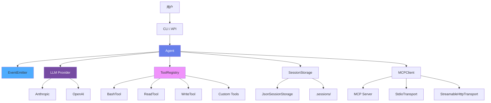
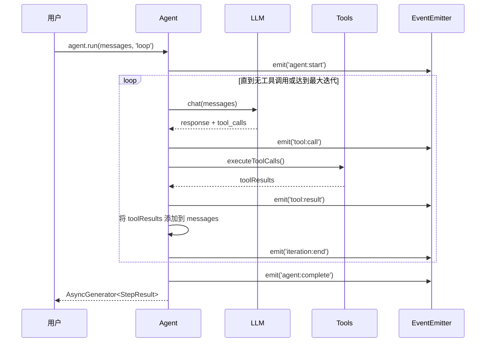
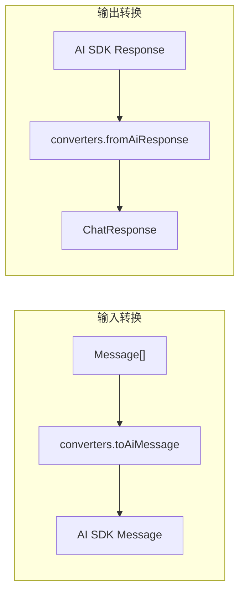

# Simple Agent

一个基于 TypeScript 的模块化 Agent 框架，支持多种 LLM 提供者、工具系统和 MCP 集成。

---

## 目录

- [快速开始](#快速开始)
- [项目架构](#项目架构)
- [核心概念](#核心概念)
- [场景教程](#场景教程)
- [CLI 用法](#cli-用法)
- [API 参考](#api-参考)
- [示例索引](#示例索引)

---

## 快速开始

### 1. 安装

```bash
bun install
```

### 2. 配置环境

创建 `.env` 文件：

```bash
# MiniMax 配置
ANTHROPIC_API_KEY=sk-cp-your-api-key
ANTHROPIC_BASE_URL=https://api.minimaxi.com/anthropic/v1
MODEL=MiniMax-M2.7
PROVIDER=anthropic
```

### 3. 运行示例

```bash
# 基础示例
bun run examples/basic.ts

# 自定义工具示例
bun run examples/custom-tool.ts

# MCP 集成示例
bun run examples/mcp.ts
```

---

## 项目架构

### 整体架构图



### 目录结构

```
src/
├── agent/              # Agent 核心
│   ├── agent.ts       # Agent 类
│   ├── loop.ts        # 循环执行模式
│   └── step.ts        # 单步执行模式
├── events/            # 事件系统
│   └── emitter.ts     # EventEmitter 实现
├── llm/              # LLM 提供者
│   ├── base.ts       # 基础接口
│   ├── anthropic.ts  # Anthropic 提供者
│   ├── openai.ts     # OpenAI 提供者
│   └── converters.ts # 消息格式转换
├── mcp/              # MCP 集成
│   ├── client.ts     # MCP 客户端
│   ├── tool.ts       # MCP 工具适配
│   ├── types.ts      # 类型定义
│   └── transport/    # 传输层
│       ├── stdio.ts
│       └── streamable-http.ts
├── storage/          # 会话存储
│   └── json.ts       # JSON 文件存储
├── tools/            # 内置工具
│   ├── bash.ts       # Shell 执行
│   ├── read.ts       # 文件读取
│   ├── write.ts      # 文件写入
│   ├── registry.ts   # 工具注册表
│   └── types.ts      # 工具接口定义
├── index.ts          # CLI 入口
└── types.ts          # 共享类型
```

---

## 核心概念

### 执行模式

| 模式 | 行为 | 适用场景 |
|------|------|----------|
| `loop` | 自动循环直到无工具调用或达到最大迭代次数 | 复杂多步任务 |
| `step` | 只执行一步 | 调试、单次交互 |

### 工具系统

工具需要实现 `Tool` 接口：

```typescript
interface Tool {
  name: string;                    // 工具名称
  description: string;             // 工具描述（LLM 用来决策）
  parameters: ZodSchema;            // 参数 Schema
  execute(
    params: unknown,
    context: ToolContext
  ): Promise<ToolResult>;
}

interface ToolResult {
  success: boolean;
  result?: string;      // 成功时返回的结果
  error?: string;      // 失败时的错误信息
}
```

### 事件系统

```typescript
agent.on('agent:start', (data) => {});       // Agent 启动
agent.on('agent:complete', () => {});         // Agent 完成
agent.on('tool:call', (data) => {});          // 工具调用前
agent.on('tool:result', (data) => {});        // 工具结果
agent.on('iteration:start', (data) => {});    // 循环迭代开始
agent.on('iteration:end', (data) => {});      // 循环迭代结束
```

### StepResult 类型

```typescript
type StepResult =
  | { type: 'message'; content: string }                    // LLM 消息
  | { type: 'tool-call'; metadata: { toolCalls: ToolCall[]; usage: Usage } }
  | { type: 'tool-result'; content: string }
  | { type: 'done'; content: string }
  | { type: 'error'; content: string };
```

---

## 场景教程

### 场景 1：基础 Agent

**目标**：创建 Agent、执行任务、监听事件

```typescript
import { config } from 'dotenv';
import { Agent } from './src/agent/agent';
import { BashTool, ReadTool, WriteTool } from './src/tools';

config({ override: true });

async function main() {
  // 1. 创建 Agent
  const agent = new Agent({
    provider: process.env.PROVIDER as 'openai' | 'anthropic',
    model: process.env.MODEL || 'gpt-4o',
    apiKey: process.env.ANTHROPIC_API_KEY || process.env.OPENAI_API_KEY,
    baseURL: process.env.ANTHROPIC_BASE_URL,
  });

  // 2. 注册工具
  agent.registerTools([
    new BashTool(),
    new ReadTool(),
    new WriteTool(),
  ]);

  // 3. 订阅事件
  agent.on('agent:start', (data) => console.log('[Agent] 启动:', data));
  agent.on('agent:complete', () => console.log('[Agent] 完成'));
  agent.on('tool:call', (data) => console.log('[Tool] 调用:', data));
  agent.on('tool:result', (data) => console.log('[Tool] 结果:', data));

  // 4. 执行任务
  const messages = [{ role: 'user' as const, content: '列出当前目录文件' }];

  for await (const stepResult of agent.run(messages, 'loop')) {
    switch (stepResult.type) {
      case 'message':
        console.log('[助手]', stepResult.content);
        break;
      case 'tool-call':
        console.log('[工具调用]', stepResult.metadata);
        break;
      case 'tool-result':
        console.log('[工具结果]', stepResult.content);
        break;
      case 'done':
        console.log('[完成]');
        break;
      case 'error':
        console.error('[错误]', stepResult.content);
        break;
    }
  }
}

main();
```

**运行**：`bun run examples/basic.ts`

**关键点**：
- `agent.run()` 返回异步生成器，遍历获取每步结果
- `loop` 模式自动循环直到无工具调用
- `step` 模式只执行一步

---

### 场景 2：自定义工具

**目标**：实现自己的工具，定义参数 Schema

```typescript
import { config } from 'dotenv';
import { z } from 'zod';
import { Agent } from './src/agent/agent';
import type { Tool, ToolContext, ToolResult } from './src/tools/types';

config({ override: true });

// 定义自定义工具
class CalculatorTool implements Tool {
  name = 'calculator';
  description = '执行数学计算';
  parameters = z.object({
    expression: z.string().describe('数学表达式，如 "2 + 2"'),
  });

  async execute(params: unknown, _context: ToolContext): Promise<ToolResult> {
    const { expression } = this.parameters.parse(params);
    try {
      const result = eval(expression); // 生产环境请用 mathjs
      return { success: true, result: JSON.stringify({ expression, result }) };
    } catch (error) {
      return { success: false, error: error instanceof Error ? error.message : String(error) };
    }
  }
}

async function main() {
  const agent = new Agent({
    provider: process.env.PROVIDER as 'openai' | 'anthropic',
    model: process.env.MODEL || 'gpt-4o',
    apiKey: process.env.ANTHROPIC_API_KEY || process.env.OPENAI_API_KEY,
    baseURL: process.env.ANTHROPIC_BASE_URL,
  });

  // 注册自定义工具
  agent.registerTools([new CalculatorTool()]);

  const messages = [{ role: 'user' as const, content: '计算 25 * 4 + 10' }];

  for await (const stepResult of agent.run(messages, 'loop')) {
    if (stepResult.type === 'message') {
      console.log('[助手]', stepResult.content);
    }
  }
}

main();
```

**运行**：`bun run examples/custom-tool.ts`

**关键点**：
- 实现 `Tool` 接口：`name`、`description`、`parameters`、`execute`
- 使用 Zod 定义参数 Schema，支持描述和默认值
- Agent 会自动将工具注册到 LLM

---

### 场景 3：MCP 集成

**目标**：连接 MCP 服务器，使用其提供的工具

**前置**：需要安装 MCP 服务器（如 `@modelcontextprotocol/server-filesystem`）

```bash
npx -y @modelcontextprotocol/server-filesystem .
```

```typescript
import { config } from 'dotenv';
import { Agent } from './src/agent/agent';
import { MCPClient } from './src/mcp';
import { BashTool, ReadTool, WriteTool } from './src/tools';

config({ override: true });

async function main() {
  // 1. 创建 MCP 客户端
  const mcpClient = new MCPClient();

  // 2. 连接 MCP 服务器
  await mcpClient.connect({
    name: 'filesystem',
    transport: 'stdio',
    command: 'npx',
    args: ['-y', '@modelcontextprotocol/server-filesystem', '.'],
  });

  // 3. 获取 MCP 工具
  const mcpTools = await mcpClient.listTools();
  console.log('[MCP] 可用工具:', mcpTools.map(t => t.name).join(', '));

  // 4. 创建 Agent 并注册工具
  const agent = new Agent({
    provider: process.env.PROVIDER as 'openai' | 'anthropic',
    model: process.env.MODEL || 'gpt-4o',
    apiKey: process.env.ANTHROPIC_API_KEY || process.env.OPENAI_API_KEY,
    baseURL: process.env.ANTHROPIC_BASE_URL,
  });

  // 5. 混合注册内置工具和 MCP 工具
  agent.registerTools([
    new BashTool(),
    new ReadTool(),
    new WriteTool(),
    ...mcpTools,
  ]);

  // 6. 执行任务
  const messages = [{ role: 'user' as const, content: '读取 package.json 文件' }];

  for await (const stepResult of agent.run(messages, 'loop')) {
    if (stepResult.type === 'message') {
      console.log('[助手]', stepResult.content);
    }
  }

  // 7. 断开连接
  await mcpClient.disconnect('filesystem');
}

main();
```

**运行**：`bun run examples/mcp.ts`

**关键点**：
- `MCPClient` 支持 `stdio` 和 `streamable-http` 传输
- MCP 工具与内置工具可混合使用
- 使用后记得 `disconnect()` 清理连接

---

### 场景 4：CLI 与会话

**目标**：使用 CLI、会话持久化、多模式执行

**CLI 基本用法**：

```bash
# 使用 .env 默认配置
bun run src/index.ts --prompt "你好"

# 指定任务
bun run src/index.ts -p "列出 src 目录下的所有 TypeScript 文件"

# 单步执行模式（调试用）
bun run src/index.ts --prompt "你好" --mode step
```

**会话恢复**：

```bash
# 查看会话列表
ls .sessions/

# 恢复会话继续对话
bun run src/index.ts --prompt "继续之前的任务" --session session-xxx
```

---

## CLI 用法

### CLI 选项

| 选项 | 简写 | 默认值 | 描述 |
|------|------|--------|------|
| `--prompt` | `-p` | 必填 | 用户提示词 |
| `--model` | `-m` | 来自 .env | 模型名称 |
| `--provider` | - | 来自 .env | `openai` 或 `anthropic` |
| `--mode` | - | `loop` | 执行模式：`step` 或 `loop` |
| `--session` | - | 新会话 | 会话 ID |
| `--api-key` | - | 来自 .env | API 密钥 |
| `--base-url` | - | 来自 .env | API Base URL |

### 会话管理

会话自动保存在 `.sessions/` 目录，可通过 `SESSION_DIR` 环境变量配置。

---

## API 参考

### Agent 配置

```typescript
const agent = new Agent({
  provider: 'anthropic',        // 'openai' | 'anthropic'
  model: 'MiniMax-M2.7',         // 模型名称
  apiKey: 'sk-cp-xxx',           // API 密钥
  baseURL: 'https://...',        // 自定义 API 地址
  maxIterations: 10,             // 最大迭代次数
  systemPrompt: '你是一个助手',  // 系统提示词
});
```

### 内置工具

| 工具 | 用途 | 参数 |
|------|------|------|
| `BashTool` | 执行 Shell 命令 | `{ command: string }` |
| `ReadTool` | 读取文件 | `{ path: string }` |
| `WriteTool` | 写入文件 | `{ path: string, content: string }` |

### 工具接口定义

```typescript
// src/tools/types.ts

interface ToolContext {
  // 上下文信息（预留扩展）
}

interface Tool {
  name: string;
  description: string;
  parameters: ZodSchema;
  execute(params: unknown, context: ToolContext): Promise<ToolResult>;
}

interface ToolResult {
  success: boolean;
  result?: string;
  error?: string;
}
```

### LLM Provider 接口

```typescript
interface LLMProvider {
  name: string;
  model: string;
  supportsTools(): boolean;
  chat(messages: Message[], options?: ChatOptions): Promise<ChatResponse>;
}

interface ChatResponse {
  content: string;
  reasoning?: string;      // 仅 Anthropic 支持
  toolCalls?: ToolCall[];
  usage: {
    promptTokens: number;
    completionTokens: number;
    totalTokens: number;
  };
}
```

### MCPClient

```typescript
const mcpClient = new MCPClient();

// 连接 MCP 服务器
await mcpClient.connect({
  name: 'server-name',
  transport: 'stdio' | 'streamable-http',
  command: 'npx',
  args: ['-y', '@modelcontextprotocol/server-filesystem', '.'],
});

// 获取可用工具
const tools = await mcpClient.listTools();

// 断开连接
await mcpClient.disconnect('server-name');
```

---

## 数据流分析

### Loop 模式执行流程



### 消息格式转换



---

## 错误处理

### 错误类型

| 类型 | 说明 |
|------|------|
| `LLM Error` | LLM API 调用失败 |
| `Tool Error` | 工具执行失败 |
| `Max Iterations` | 达到最大迭代次数 |
| `MCP Error` | MCP 连接/通信失败 |

### 错误处理示例

```typescript
for await (const stepResult of agent.run(messages, 'loop')) {
  if (stepResult.type === 'error') {
    console.error('[错误]', stepResult.content);
    // 处理错误：记录、重试、或终止
  }
}
```

### 重试机制

LLM 调用内置重试逻辑（通过 Vercel AI SDK）。

工具执行不自动重试，可在工具实现中添加：

```typescript
async execute(params: unknown, context: ToolContext): Promise<ToolResult> {
  const maxRetries = 3;
  for (let i = 0; i < maxRetries; i++) {
    try {
      // 执行逻辑
      return { success: true, result: '...' };
    } catch (error) {
      if (i === maxRetries - 1) {
        return { success: false, error: String(error) };
      }
    }
  }
}
```

---

## 安全考虑

### 输入验证

- 工具参数通过 Zod Schema 验证
- LLM 输出不会被直接执行

### 工具权限

- `BashTool` 可执行任意 Shell 命令，应在受信任环境中使用
- 考虑使用沙箱环境限制命令执行

### API 密钥管理

- 不要将 API 密钥提交到代码仓库
- 使用环境变量或 `.env` 文件（已加入 `.gitignore`）

---

## 示例索引

| 文件 | 描述 | 关键功能 |
|------|------|----------|
| `examples/basic.ts` | 基础 Agent | 创建 Agent、注册工具、执行任务 |
| `examples/custom-tool.ts` | 自定义工具 | 实现 Tool 接口、Zod 参数 |
| `examples/mcp.ts` | MCP 集成 | 连接 MCP 服务器、使用 MCP 工具 |

---

## 测试

```bash
bun test
```

---

## 配置参考

### 环境变量

| 变量 | 描述 |
|------|------|
| `ANTHROPIC_API_KEY` | Anthropic/MiniMax API 密钥 |
| `ANTHROPIC_BASE_URL` | 自定义 API 地址（MiniMax 使用 `https://api.minimaxi.com/anthropic/v1`） |
| `OPENAI_API_KEY` | OpenAI API 密钥 |
| `OPENAI_BASE_URL` | OpenAI 兼容 API 地址 |
| `PROVIDER` | LLM 提供者：`openai` 或 `anthropic` |
| `MODEL` | 模型名称 |
| `SESSION_DIR` | 会话存储目录（默认 `.sessions/`） |
