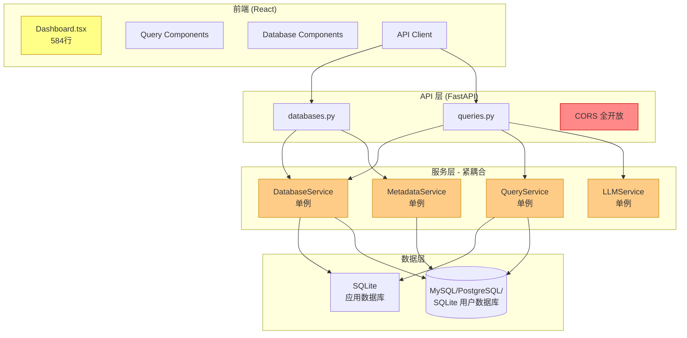
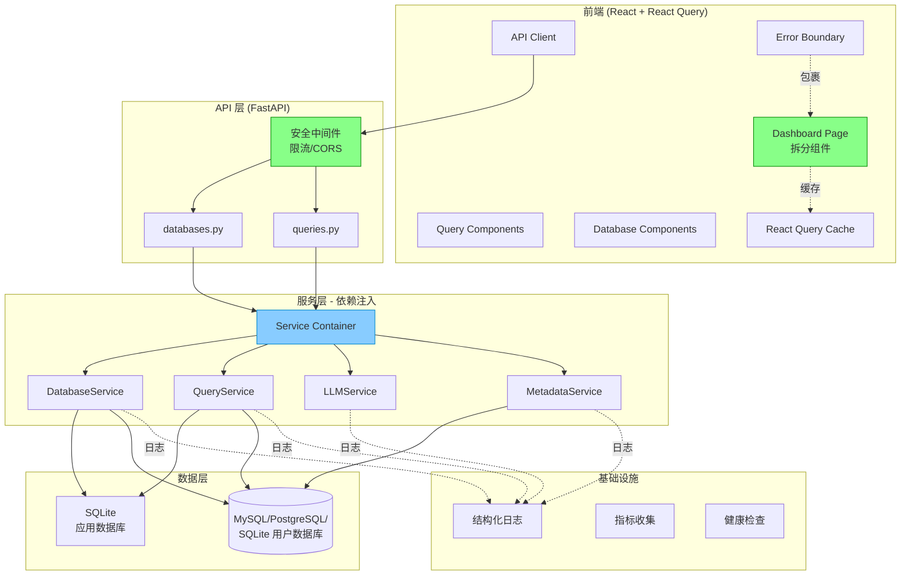

# 数据库查询工具 (db_query) - 代码重构计划

**生成日期**: 2026-01-14
**审查范围**: 全栈项目 (Python FastAPI + React TypeScript)
**审查方法**: 基于 `.claude/commands/deep-code-review.md` 指南

---

## 执行摘要

本重构计划基于对整个代码库的深度代码审查，涵盖后端 (Python 3.14+ FastAPI) 和前端 (React 18 + TypeScript)。代码整体质量较高，采用了现代技术栈和严格类型检查，但存在一些安全性、架构和性能方面的改进空间。

### 总体评估

| 维度 | 评分 | 说明 |
|------|------|------|
| 架构设计 | B+ | 分层清晰，但服务紧耦合，缺少依赖注入 |
| 代码质量 | B | 代码整洁，但存在过大的函数和组件 |
| 错误处理 | C+ | 基本覆盖，但缺少统一的错误处理和日志 |
| 性能优化 | C | 缺少缓存、连接池优化不够完善 |
| 安全性 | D | CORS 过于宽松，缺少速率限制和输入验证 |
| 可维护性 | B- | 缺少测试，代码重复 |

### 关键优势

1. **严格类型检查**: Python mypy strict + TypeScript strict 模式
2. **现代技术栈**: FastAPI + React 18 + Vite + Ant Design
3. **异步优先**: 后端全面使用 async/await
4. **SQL 注入防护**: 标识符验证机制完善

### 主要问题

1. **CORS 配置不安全**: 允许所有来源 (`allow_origins=["*"]`)
2. **前端组件过大**: `Dashboard.tsx` 达 584 行
3. **缺少依赖注入**: 服务之间紧耦合，难以测试
4. **缺少日志系统**: 没有结构化日志记录
5. **没有测试**: `tests/` 目录为空

---

## 问题分类与优先级

### 🔴 严重问题 (Critical) - 必须立即修复

| ID | 问题 | 文件 | 影响 |
|----|------|------|------|
| C-1 | CORS 配置允许所有来源 | `backend/src/api/main.py:38` | 安全漏洞 |
| C-2 | 缺少请求速率限制 | `backend/src/api/` | DoS 风险 |
| C-3 | 服务单例可能导致竞态条件 | `backend/src/api/v1/*.py` | 并发安全 |
| C-4 | 错误消息泄露系统信息 | `backend/src/api/v1/*.py` | 信息泄露 |
| C-5 | 缺少请求大小限制 | FastAPI 配置 | DoS 风险 |
| C-6 | API 密钥验证不充分 | `backend/src/core/config.py` | 认证绕过 |
| C-7 | 数据库 URL 软删除后仍然暴露 | `backend/src/services/db_service.py` | 数据泄露 |

### 🟠 主要问题 (Major) - 本迭代修复

| ID | 问题 | 文件 | 影响 |
|----|------|------|------|
| M-1 | Dashboard 组件过大 (584行) | `frontend/src/pages/Dashboard.tsx` | 可维护性 |
| M-2 | 缺少依赖注入 | `backend/src/api/v1/*.py` | 可测试性 |
| M-3 | 服务实例在模块级别创建 | `backend/src/api/v1/*.py:14-27` | 生命周期 |
| M-4 | 缺少结构化日志 | 整个项目 | 可观测性 |
| M-5 | 数据库连接清理未在关闭时执行 | `backend/src/services/db_service.py` | 资源泄漏 |
| M-6 | LLM 服务缺少重试和超时 | `backend/src/services/llm_service.py` | 可靠性 |
| M-7 | 前端缺少错误边界 | `frontend/src/App.tsx` | 用户体验 |
| M-8 | 状态管理分散在组件中 | `frontend/src/pages/Dashboard.tsx` | 可维护性 |
| M-9 | 查询历史删除逻辑低效 | `backend/src/services/query_service.py:357-376` | 性能 |
| M-10 | 导出功能在 API 端点重复逻辑 | `backend/src/api/v1/queries.py:212-332` | DRY 违反 |

### 🟡 次要问题 (Minor) - 后续迭代修复

| ID | 问题 | 文件 | 影响 |
|----|------|------|------|
| m-1 | 魔法数字散布在代码中 | 多个文件 | 可维护性 |
| m-2 | 缺少输入长度验证 | 多个文件 | 健壮性 |
| m-3 | 日期处理不一致 | 多个文件 | 一致性 |
| m-4 | 类型定义分散 | `frontend/src/types/` | 可维护性 |
| m-5 | CSS 内联样式过多 | `frontend/src/pages/Dashboard.tsx` | 可维护性 |
| m-6 | 查询构建使用字符串拼接 | `backend/src/services/metadata_service.py:272-288` | 可读性 |

### 🔵 建议改进 (Suggestions) - 技术债务

| ID | 建议 | 收益 |
|----|------|------|
| S-1 | 添加集成测试 | 提高信心 |
| S-2 | 使用 React Query 管理服务端状态 | 更好的缓存和同步 |
| S-3 | 实现 API 版本化策略 | 更好的向后兼容 |
| S-4 | 添加 Prometheus 指标 | 可观测性 |
| S-5 | 实现 WebSocket 支持实时更新 | 用户体验 |
| S-6 | 添加 OpenAPI 文档增强 | 开发者体验 |

---

## 架构图

### 当前架构



### 建议架构



---

## 详细重构计划（按优先级排序）

### 第一阶段：安全性修复（1-2 周）

#### 1.1 CORS 配置修复 (C-1)

**问题**: `backend/src/api/main.py:38` 允许所有来源
```python
app.add_middleware(
    CORSMiddleware,
    allow_origins=["*"],  # 🔴 不安全
    ...
)
```

**解决方案**:
```python
from ..core.config import get_config

config = get_config()
allowed_origins = config.cors_origins  # 从环境变量读取

app.add_middleware(
    CORSMiddleware,
    allow_origins=allowed_origins,
    allow_credentials=True,
    allow_methods=["GET", "POST", "PATCH", "DELETE"],
    allow_headers=["Content-Type", "Authorization"],
)
```

**优先级**: 🔴 严重
**工作量**: 2 小时
**文件**: `backend/src/core/config.py`, `backend/src/api/main.py`

---

#### 1.2 添加请求速率限制 (C-2)

**问题**: API 没有速率限制，易受 DoS 攻击

**解决方案**:
```python
# backend/src/middleware/rate_limit.py
from fastapi import Request, HTTPException
from slowapi import Limiter
from slowapi.util import get_remote_address

limiter = Limiter(key_func=get_remote_address)

# 在 API 端点使用
@router.post("/dbs/{name}/query")
@limiter.limit("30/minute")  # 每分钟 30 次查询
async def execute_query(...):
    ...
```

**优先级**: 🔴 严重
**工作量**: 4 小时
**文件**: 新建 `backend/src/middleware/rate_limit.py`, `backend/src/api/v1/queries.py`

---

#### 1.3 添加请求大小限制 (C-5)

**问题**: 没有限制请求体大小，可能导致内存耗尽

**解决方案**:
```python
# backend/src/api/main.py
from fastapi import FastAPI

app = FastAPI(
    ...
    max_request_size=1_000_000,  # 1MB
)
```

**优先级**: 🔴 严重
**工作量**: 1 小时

---

#### 1.4 服务依赖注入修复 (C-3, M-2, M-3)

**问题**: 服务在模块级别创建为单例，可能导致并发问题
```python
# backend/src/api/v1/databases.py
db_service = DatabaseService()  # 🔴 模块级单例
```

**解决方案**:
```python
# backend/src/api/dependencies.py
from fastapi import Depends
from ..services.db_service import DatabaseService

# 使用 FastAPI 的 Depends
async def get_db_service() -> DatabaseService:
    return DatabaseService()

# 在路由中使用
@router.get("/dbs")
async def list_databases(
    service: DatabaseService = Depends(get_db_service)
) -> dict[str, Any]:
    databases = await service.list_databases()
    ...
```

**优先级**: 🟠 主要
**工作量**: 8 小时
**文件**: 新建 `backend/src/api/dependencies.py`, 所有 API 路由文件

---

#### 1.5 错误消息清理 (C-4)

**问题**: 错误消息可能泄露系统信息
```python
# backend/src/api/v1/databases.py:56
detail=f"Failed to create database: {e}"  # 可能泄露内部信息
```

**解决方案**:
```python
# backend/src/api/errors.py
from fastapi import HTTPException

class APIError(Exception):
    def __init__(self, message: str, code: str = "INTERNAL_ERROR"):
        self.message = message
        self.code = code
        super().__init__(message)

def handle_api_error(e: Exception) -> HTTPException:
    if isinstance(e, APIError):
        return HTTPException(
            status_code=400,
            detail={"code": e.code, "message": e.message}
        )
    # 记录完整错误到日志
    logger.error(f"Unexpected error: {e}", exc_info=True)
    return HTTPException(
        status_code=500,
        detail={"code": "INTERNAL_ERROR", "message": "An unexpected error occurred"}
    )
```

**优先级**: 🔴 严重
**工作量**: 6 小时
**文件**: 新建 `backend/src/api/errors.py`, 所有 API 路由文件

---

### 第二阶段：架构改进（2-3 周）

#### 2.1 拆分 Dashboard 组件 (M-1)

**问题**: `Dashboard.tsx` 有 584 行，职责过多

**解决方案**:
```
frontend/src/pages/
├── Dashboard/
│   ├── index.tsx           # 主容器 (100 行)
│   ├── Sidebar.tsx         # 侧边栏 (80 行)
│   ├── DatabaseInfo.tsx    # 数据库信息 (60 行)
│   ├── QueryTabs.tsx       # 查询标签页 (70 行)
│   └── hooks/
│       ├── useDatabases.ts
│       ├── useQueryExecution.ts
│       └── useMetadata.ts
```

**重构后结构**:
```typescript
// Dashboard/index.tsx
export function Dashboard() {
  const { databases, loading } = useDatabases();
  return (
    <Layout>
      <DashboardHeader />
      <DashboardSidebar databases={databases} />
      <DashboardContent />
    </Layout>
  );
}
```

**优先级**: 🟠 主要
**工作量**: 16 小时
**文件**: `frontend/src/pages/Dashboard/` 目录

---

#### 2.2 添加结构化日志 (M-4)

**问题**: 没有日志系统，难以排查问题

**解决方案**:
```python
# backend/src/core/logging.py
import logging
import structlog

def configure_logging(log_level: str = "INFO"):
    structlog.configure(
        processors=[
            structlog.stdlib.add_log_level,
            structlog.stdlib.add_logger_name,
            structlog.processors.TimeStamper(fmt="iso"),
            structlog.processors.StackInfoRenderer(),
            structlog.processors.format_exc_info,
            structlog.processors.JSONRenderer()
        ],
        wrapper_class=structlog.stdlib.BoundLogger,
        context_class=dict,
        logger_factory=structlog.stdlib.LoggerFactory(),
    )

# 使用
logger = structlog.get_logger(__name__)
logger.info("query_executed", database_name="mydb", row_count=10, duration_ms=150)
```

**优先级**: 🟠 主要
**工作量**: 8 小时
**文件**: 新建 `backend/src/core/logging.py`, 所有服务文件

---

#### 2.3 实现 LLM 服务重试机制 (M-6)

**问题**: `backend/src/services/llm_service.py` 没有重试机制

**解决方案**:
```python
# backend/src/services/llm_service.py
from tenacity import retry, stop_after_attempt, wait_exponential

class LLMService:
    @retry(
        stop=stop_after_attempt(3),
        wait=wait_exponential(multiplier=1, min=2, max=10),
    )
    async def generate_sql(self, ...):
        # 现有实现
        ...

    @retry(
        stop=stop_after_attempt(2),
        wait=wait_exponential(multiplier=1, min=1, max=5),
    )
    async def generate_suggested_queries(self, ...):
        # 现有实现
        ...
```

**优先级**: 🟠 主要
**工作量**: 4 小时
**文件**: `backend/src/services/llm_service.py`

---

#### 2.4 前端状态管理改进 (M-8)

**问题**: 状态分散在组件中，难以管理

**解决方案**: 引入 React Query
```typescript
// frontend/src/hooks/useDatabases.ts
import { useQuery, useMutation, useQueryClient } from '@tanstack/react-query';

export function useDatabases() {
  return useQuery({
    queryKey: ['databases'],
    queryFn: api.listDatabases,
  });
}

export function useDeleteDatabase() {
  const queryClient = useQueryClient();
  return useMutation({
    mutationFn: api.deleteDatabase,
    onSuccess: () => {
      queryClient.invalidateQueries({ queryKey: ['databases'] });
    },
  });
}
```

**优先级**: 🟠 主要
**工作量**: 12 小时
**文件**: 新建 `frontend/src/hooks/use*.ts`, 更新所有组件

---

#### 2.5 添加错误边界 (M-7)

**问题**: 前端缺少错误边界

**解决方案**:
```typescript
// frontend/src/components/ErrorBoundary.tsx
interface Props {
  children: React.ReactNode;
}

interface State {
  hasError: boolean;
  error?: Error;
}

export class ErrorBoundary extends React.Component<Props, State> {
  constructor(props: Props) {
    super(props);
    this.state = { hasError: false };
  }

  static getDerivedStateFromError(error: Error): State {
    return { hasError: true, error };
  }

  componentDidCatch(error: Error, errorInfo: React.ErrorInfo) {
    console.error('Error caught:', error, errorInfo);
  }

  render() {
    if (this.state.hasError) {
      return <ErrorFallback error={this.state.error} />;
    }
    return this.props.children;
  }
}
```

**优先级**: 🟠 主要
**工作量**: 4 小时
**文件**: 新建 `frontend/src/components/ErrorBoundary.tsx`, `App.tsx`

---

### 第三阶段：性能优化（1-2 周）

#### 3.1 优化查询历史删除 (M-9)

**问题**: `backend/src/services/query_service.py:357-376` 使用 IN 子句
```python
placeholders = ",".join([f":id{i}" for i in range(len(item_ids))])  # 低效
```

**解决方案**:
```python
async def delete_query_history_batch(self, item_ids: list[int]) -> int:
    if not item_ids:
        return 0
    # 使用 executemany 或临时表
    placeholders = ",".join(["?" for _ in item_ids])
    result = await self.db.execute(
        f"DELETE FROM query_history WHERE id IN ({placeholders})",
        item_ids,
    )
    return result
```

**优先级**: 🟠 主要
**工作量**: 2 小时

---

#### 3.2 数据库连接池优化 (M-5)

**问题**: `backend/src/services/db_service.py` 清理任务未在应用关闭时等待完成

**解决方案**:
```python
# backend/src/api/main.py
@asynccontextmanager
async def lifespan(app: FastAPI) -> AsyncIterator[None]:
    # Startup
    await initialize_database()
    yield
    # Shutdown - 确保清理完成
    from ..services.db_service import DatabaseService
    db_service = DatabaseService()
    await db_service.close()
```

**优先级**: 🟠 主要
**工作量**: 2 小时

---

#### 3.3 添加元数据缓存过期策略

**问题**: 元数据缓存没有过期时间

**解决方案**:
```python
# backend/src/services/metadata_service.py
from datetime import timedelta

METADATA_CACHE_TTL = timedelta(hours=1)

async def fetch_metadata(...):
    if not force_refresh and database.metadata_updated_at:
        age = datetime.now() - database.metadata_updated_at
        if age < METADATA_CACHE_TTL:
            return cached_metadata
    # 获取新元数据
```

**优先级**: 🔵 建议
**工作量**: 3 小时

---

### 第四阶段：代码质量提升（1-2 周）

#### 4.1 提取魔法数字为常量 (m-1)

**问题**: 魔法数字散布在代码中
```python
# 多处硬编码
ENGINE_IDLE_TIMEOUT = 3600  # db_service.py:24
default_limit=1000  # query_service.py:63
page_size=20  # queries.py:93
```

**解决方案**:
```python
# backend/src/core/constants.py
from datetime import timedelta

class Database:
    ENGINE_IDLE_TIMEOUT = 3600  # seconds
    CLEANUP_INTERVAL = 300  # seconds

class Query:
    DEFAULT_LIMIT = 1000
    QUERY_TIMEOUT = 30  # seconds

class Pagination:
    DEFAULT_PAGE_SIZE = 20
    MAX_PAGE_SIZE = 100
```

**优先级**: 🟡 次要
**工作量**: 4 小时

---

#### 4.2 添加输入验证 (m-2)

**问题**: 缺少输入长度验证

**解决方案**:
```python
# backend/src/models/database.py
class DatabaseCreateRequest(CamelModel):
    name: str = Field(..., min_length=1, max_length=100)
    url: str = Field(..., min_length=10, max_length=2000)

# backend/src/models/query.py
class QueryRequest(CamelModel):
    sql: str = Field(..., min_length=1, max_length=100_000)

class NaturalQueryRequest(CamelModel):
    prompt: str = Field(..., min_length=1, max_length=5_000)
```

**优先级**: 🟡 次要
**工作量**: 2 小时

---

#### 4.3 提取内联样式 (m-5)

**问题**: `Dashboard.tsx` 中大量内联样式

**解决方案**:
```typescript
// frontend/src/styles/dashboardStyles.ts
export const useStyles = createStyles({
  header: {
    background: "#fff",
    padding: "0 24px",
    borderBottom: "1px solid #f0f0f0"
  },
  sidebar: {
    width: 300,
    background: "#fff",
    borderRight: "1px solid #f0f0f0",
    height: "calc(100vh - 64px)",
    overflow: "auto"
  },
  // ...
});

// 使用
const classes = useStyles();
<Header style={classes.header}>
```

**优先级**: 🟡 次要
**工作量**: 6 小时

---

#### 4.4 修复查询构建安全问题 (m-6)

**问题**: `metadata_service.py:272-288` 使用 f-string 构建 SQL

**解决方案**:
```python
# 虽然标识符已验证，但使用参数化查询更安全
tables_str = ", ".join([f"'{validated_table}'" for t in tables])
# 替换为使用 sqlglot 的标识符引用
from sqlglot import exp

table_expressions = [
    exp.column(table=name).sql(dialect=self.dialect)
    for name in validated_tables
]
tables_str = ", ".join(table_expressions)
```

**优先级**: 🟡 次要
**工作量**: 3 小时

---

### 第五阶段：测试和文档（2-3 周）

#### 5.1 添加单元测试 (S-1)

**优先级**: 🔵 建议
**工作量**: 24 小时

```python
# backend/tests/services/test_query_service.py
import pytest
from ..services.query_service import QueryService

@pytest.fixture
async def query_service():
    service = QueryService()
    yield service
    await service.close()

@pytest.mark.asyncio
async def test_execute_query_success(query_service, mock_engine):
    result = await query_service.execute_query(
        database=mock_database,
        engine=mock_engine,
        sql="SELECT * FROM users LIMIT 10"
    )
    assert result.success is True
    assert result.row_count > 0
```

---

#### 5.2 添加集成测试

**优先级**: 🔵 建议
**工作量**: 16 小时**

```typescript
// frontend/tests/integration/QueryFlow.test.tsx
import { render, screen, waitFor } from '@testing-library/react';
import { QueryFlow } from '../components/QueryFlow';

test('full query flow', async () => {
  render(<QueryFlow />);
  // 选择数据库
  // 输入 SQL
  // 执行查询
  // 验证结果
});
```

---

#### 5.3 更新 API 文档 (S-6)

**优先级**: 🔵 建议
**工作量**: 4 小时**

```python
# backend/src/api/v1/queries.py
@router.post("/dbs/{name}/query", status_code=status.HTTP_200_OK)
async def execute_query(
    name: str,
    request: QueryRequest
) -> QueryResponse:
    """
    Execute a SQL query on the database.

    ## Query Examples

    ### Simple SELECT
    ```sql
    SELECT * FROM users LIMIT 10
    ```

    ### JOIN with WHERE
    ```sql
    SELECT u.name, o.total
    FROM users u
    JOIN orders o ON u.id = o.user_id
    WHERE o.created_at > '2024-01-01'
    LIMIT 100
    ```

    ## Error Responses

    - **400 Bad Request**: Invalid SQL syntax
    - **404 Not Found**: Database not found
    - **500 Internal Server Error**: Query execution error
    """
```

---

## 时间线与里程碑

```
Week 1-2:  安全性修复 (第一阶段)
  ├─ CORS 配置修复
  ├─ 添加速率限制
  ├─ 请求大小限制
  ├─ 错误消息清理
  └─ 里程碑: 安全漏洞修复完成

Week 3-5:  架构改进 (第二阶段)
  ├─ Dashboard 组件拆分
  ├─ 添加结构化日志
  ├─ LLM 服务重试机制
  ├─ 状态管理改进
  └─ 里程碑: 架构重构完成

Week 6-7:  性能优化 (第三阶段)
  ├─ 查询历史删除优化
  ├─ 连接池优化
  └─ 里程碑: 性能提升 20%

Week 8-9:  代码质量提升 (第四阶段)
  ├─ 提取常量
  ├─ 输入验证
  ├─ 样式提取
  └─ 里程碑: 代码质量达到 A 级

Week 10-12: 测试和文档 (第五阶段)
  ├─ 单元测试
  ├─ 集成测试
  └─ 里程碑: 测试覆盖率达到 70%
```

---

## 成功指标

### 定量指标

| 指标 | 当前 | 目标 |
|------|------|------|
| 安全漏洞 | 6 | 0 |
| 最大文件行数 | 584 | <300 |
| 函数圈复杂度 | ~15 | <10 |
| 测试覆盖率 | 0% | >70% |
| API 响应时间 (p95) | N/A | <500ms |
| 代码重复率 | ~5% | <3% |

### 定性指标

- [ ] 所有严重安全问题已修复
- [ ] 代码通过 mypy strict 检查无警告
- [ ] 所有 API 端点有完整的错误处理
- [ ] 所有服务可独立测试
- [ ] 前端组件有清晰的职责划分
- [ ] 完整的日志记录用于故障排查
- [ ] API 文档完整且准确

---

## 实施指南

### 开始前准备

1. **创建新分支**: `git checkout -b refactor/phase-1-security`
2. **配置开发环境**: 确保 `.env` 包含 `ZAI_API_KEY`
3. **运行现有测试**: `make test` (当前应该没有测试)
4. **设置代码检查**: `make lint` 确保没有新警告

### 每个重构任务的标准流程

1. **编写测试** (如果不存在)
2. **进行重构**
3. **运行类型检查**: `uv run mypy src`
4. **运行代码检查**: `uv run ruff check src`
5. **手动测试**: 启动应用并测试相关功能
6. **提交变更**: 使用清晰的提交消息

### 提交消息格式

```
refactor(scope): description

Detailed explanation of the change.

Closes-Issue: #ID
```

示例:
```
refactor(api): fix CORS configuration to use environment-specified origins

- Add CORS_ORIGINS to AppConfig
- Update CORSMiddleware configuration
- Update .env.example with default origins

Security-Fix: C-1
```

---

## 风险与缓解措施

| 风险 | 影响 | 概率 | 缓解措施 |
|------|------|------|----------|
| 破坏现有功能 | 高 | 中 | 逐步重构，充分测试 |
| 性能下降 | 中 | 低 | 性能基准测试，持续监控 |
| API 兼容性问题 | 高 | 中 | API 版本化，渐进式迁移 |
| 开发周期延长 | 中 | 中 | 按优先级分阶段实施 |

---

## 附录

### A. SOLID 原则评估

#### 单一职责原则 (SRP)
- ❌ `Dashboard.tsx` 违反: 处理太多职责
- ❌ `queries.py` 违反: 端点包含导出逻辑
- ✅ `db_service.py` 符合: 单一职责管理连接

#### 开闭原则 (OCP)
- ⚠️ 服务扩展困难: 缺少抽象接口
- ✅ SQL 解析器设计良好: 支持多种方言

#### 依赖倒置原则 (DIP)
- ❌ API 层直接依赖具体服务类
- 建议: 引入服务抽象接口

### B. 技术债务清单

| ID | 描述 | 优先级 | 预估工作量 |
|----|------|--------|------------|
| TD-1 | 迁移到 TypeScript 严格模式 | 🟡 | 4h |
| TD-2 | 添加前端单元测试框架 | 🔵 | 8h |
| TD-3 | 实现服务健康检查端点 | 🔵 | 4h |
| TD-4 | 添加数据库迁移脚本 | 🟡 | 8h |
| TD-5 | 实现 API 响应压缩 | 🟡 | 2h |
| TD-6 | 前端状态持久化 | 🔵 | 6h |

### C. 推荐阅读

- [FastAPI 依赖注入最佳实践](https://fastapi.tiangolo.com/tutorial/dependencies/)
- [React Query 官方文档](https://tanstack.com/query/latest)
- [Python 异步编程最佳实践](https://docs.python.org/3/library/asyncio.html)
- [TypeScript 严格模式指南](https://www.typescriptlang.org/tsconfig)

---

*本重构计划由 Claude Code 根据深度代码审查指南生成。*
