# RaFlow - 语音交互工具需求设计文档

## 文档信息

| 属性 | 值 |
|------|-----|
| 项目名称 | RaFlow (Real-time Assistant Flow) |
| 版本 | 1.0.0 |
| 创建日期 | 2026-01-18 |
| 目标平台 | macOS (Sequoia 15.0+) |
| 文档状态 | 设计阶段 |

---

## 1. 系统概述

### 1.1 项目愿景

RaFlow 是一款基于 Tauri v2 构建的下一代语音交互工具，旨在通过 ElevenLabs Scribe v2 Realtime API 提供超低延迟（<150ms）的语音转录服务。工具以系统托盘方式常驻后台，通过全局快捷键唤醒，能够在任何应用的光标位置智能插入转录文本，或在不可输入时自动回退至剪贴板。

### 1.2 核心价值主张

- **零感知延迟**：从语音到文本的转换延迟 <150ms，实现"说话即显示"的流畅体验
- **智能注入策略**：通过 macOS Accessibility API 自动判断当前焦点元素的可编辑性
- **系统级集成**：原生 macOS 应用，支持全局快捷键、系统通知、托盘管理
- **隐私优先**：所有音频处理在本地完成，仅发送音频流至 ElevenLabs API
- **轻量级架构**：基于 Rust 后端，空闲内存占用 <50MB

### 1.3 目标用户

- 开发者和程序员（需要频繁编写代码注释和文档）
- 内容创作者（写作、博客、社交媒体）
- 商务人士（邮件、即时通讯、文档协作）
- 辅助功能用户（因物理原因难以使用键盘）

---

## 2. 系统架构设计

### 2.1 整体架构图

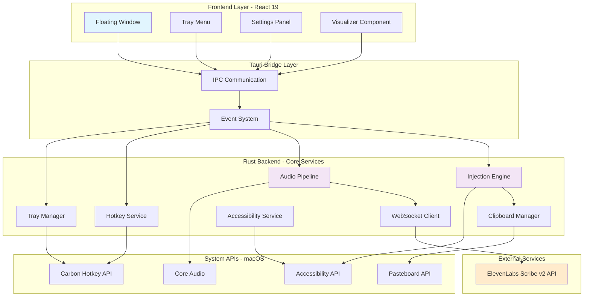

### 2.2 分层架构说明

#### 2.2.1 前端层（Frontend Layer）

**职责**：用户界面渲染和交互反馈

| 组件 | 功能描述 |
|------|----------|
| **Floating Window** | 透明、无边框、始终置顶的悬浮窗，显示实时转录文本和音频波形 |
| **Tray Menu** | 系统托盘图标和菜单，提供快速操作入口（开始/停止录音、设置、退出） |
| **Settings Panel** | 配置界面（API Key、快捷键、语言、注入模式等） |
| **Visualizer Component** | 实时音频波形可视化，使用 Canvas 或 SVG 绘制 |

#### 2.2.2 Tauri 桥接层（Tauri Bridge Layer）

**职责**：前后端通信和事件分发

- **IPC Communication**：命令调用（前端 → 后端）
- **Event System**：状态推送（后端 → 前端）

#### 2.2.3 Rust 后端层（Rust Backend）

**职责**：核心业务逻辑和系统集成

| 服务 | 功能描述 |
|------|----------|
| **Tray Manager** | 托盘图标管理、菜单构建、生命周期控制 |
| **Hotkey Service** | 全局快捷键注册和事件处理（默认 Cmd+Shift+Space） |
| **Audio Pipeline** | 音频采集、重采样、格式转换 |
| **WebSocket Client** | 与 ElevenLabs API 的 WebSocket 长连接管理 |
| **Injection Engine** | 文本注入策略执行（直接输入 / 剪贴板粘贴） |
| **Accessibility Service** | macOS 辅助功能 API 集成，检测焦点元素 |
| **Clipboard Manager** | 剪贴板读写操作，支持文本恢复 |

#### 2.2.4 系统 API 层（System APIs）

**职责**：与 macOS 系统底层交互

- **Accessibility API**：获取焦点元素信息、判断可编辑性
- **Core Audio**：底层音频设备访问
- **Carbon Hotkey API**：全局快捷键注册
- **Pasteboard API**：剪贴板操作

---

## 3. 核心组件设计

### 3.1 音频管道（Audio Pipeline）

#### 3.1.1 组件架构

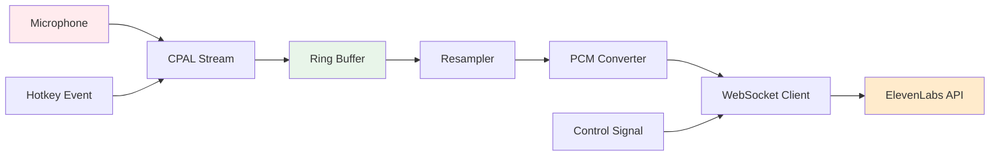

#### 3.1.2 数据流详细设计

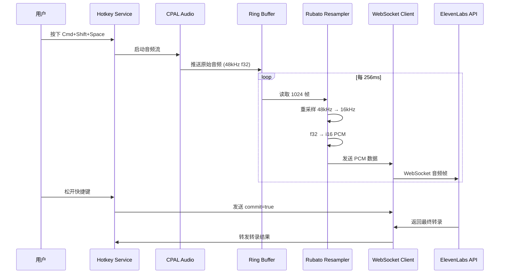

#### 3.1.3 技术实现要点

| 技术点 | 实现方案 |
|--------|----------|
| **音频采集** | 使用 `cpal` 0.16.0，从默认输入设备读取 |
| **采样率转换** | 使用 `rubato` 1.0.0，48kHz → 16kHz |
| **线程安全** | 使用 `ringbuf` 0.3 实现无锁生产者-消费者模式 |
| **缓冲区大小** | Ring Buffer 容量 8192 帧，约 512ms @ 16kHz |
| **延迟优化** | 音频回调仅推入 Ring Buffer，耗时 <10μs |
| **格式转换** | Float32 (-1.0~1.0) → Int16 PCM (LE) |

### 3.2 文本注入引擎（Injection Engine）

#### 3.2.1 注入策略决策树

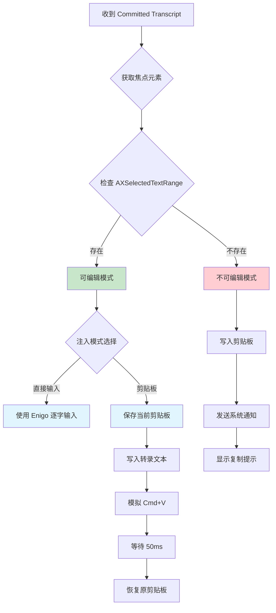

#### 3.2.2 Accessibility 检测流程

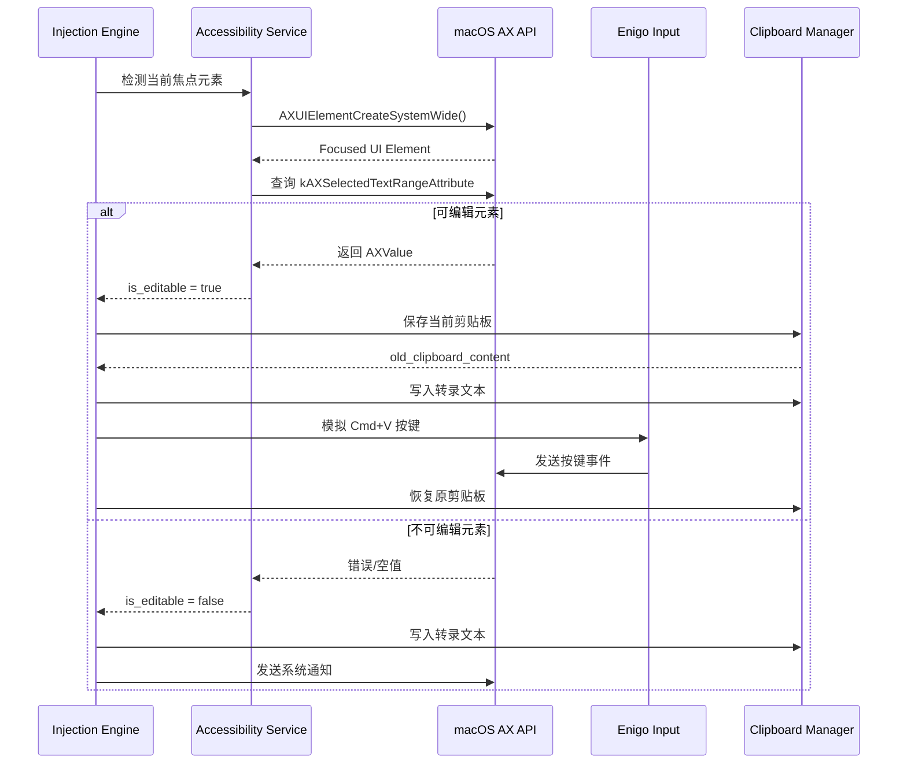

#### 3.2.3 注入模式对比

| 模式 | 优点 | 缺点 | 适用场景 |
|------|------|------|----------|
| **直接输入** | 看起来自然，无需剪贴板操作 | 速度慢（约 10 字/秒），长文本会中断用户操作 | 短语、单个单词 |
| **剪贴板粘贴** | 速度快（<100ms），适合长文本 | 需要保存/恢复剪贴板，可能覆盖用户内容 | 长段落、完整句子 |
| **智能混合** | 结合两者优势，自动选择 | 实现复杂，需要额外的长度阈值判断 | **推荐方案** |

### 3.3 WebSocket 客户端（WebSocket Client）

#### 3.3.1 连接状态机

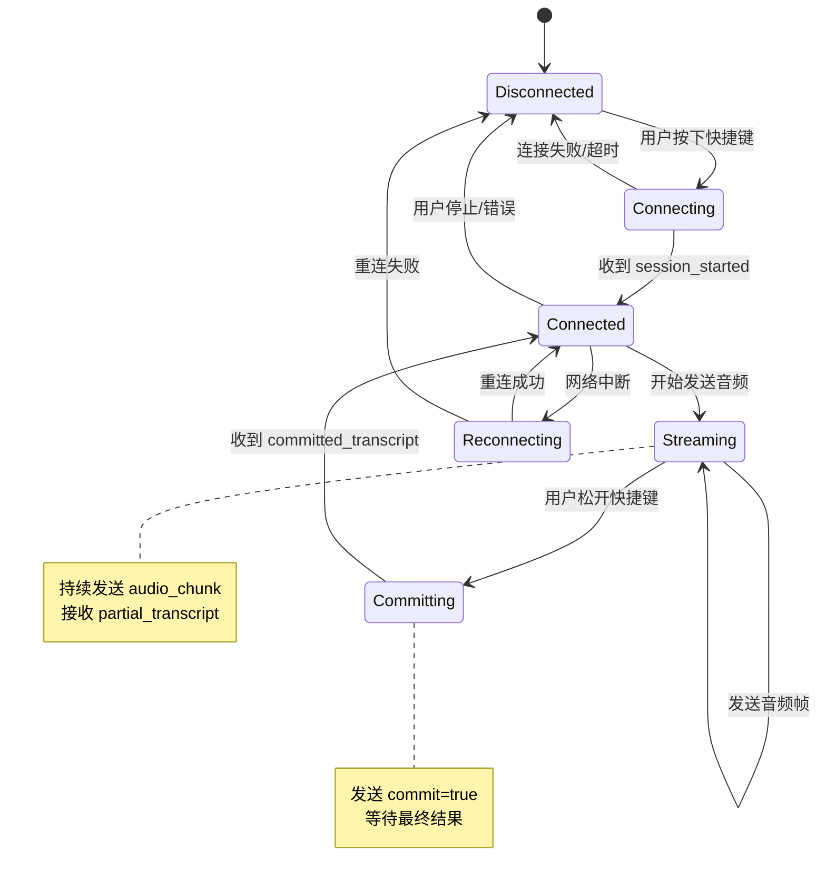

#### 3.3.2 消息协议设计

**客户端 → 服务端**

```typescript
// 音频数据帧
interface AudioChunkMessage {
  message_type: "input_audio_chunk";
  audio_base_64: string;  // Base64 编码的 PCM Int16 数据
  commit?: boolean;       // true 表示提交最终片段
}

// 配置消息（可选）
interface ConfigMessage {
  message_type: "config";
  model_id?: string;      // 默认 "scribe_v2_realtime"
  language?: string;      // 语言代码，默认自动检测
  vad_threshold?: number; // VAD 阈值，默认 0.4
}
```

**服务端 → 客户端**

```typescript
// 会话开始
interface SessionStartedMessage {
  message_type: "session_started";
  session_id: string;
  config: {
    sample_rate: number;
    model_id: string;
    vad_threshold: number;
  };
}

// 部分转录（临时结果）
interface PartialTranscriptMessage {
  message_type: "partial_transcript";
  text: string;
  created_at_ts: number;
}

// 已提交转录（最终结果）
interface CommittedTranscriptMessage {
  message_type: "committed_transcript";
  text: string;
  created_at_ts: number;
  language?: string;
}

// 错误消息
interface ErrorMessage {
  message_type: "error";
  error: {
    code: string;
    message: string;
    details?: any;
  };
}
```

---

## 4. 数据模型设计

### 4.1 核心数据结构

#### 4.1.1 Rust 后端数据模型

```rust
/// 音频配置
#[derive(Debug, Clone, Serialize, Deserialize)]
pub struct AudioConfig {
    pub input_sample_rate: u32,    // 输入采样率（通常 48000）
    pub target_sample_rate: u32,    // 目标采样率（固定 16000）
    pub channels: u16,              // 声道数（单声道 = 1）
    pub chunk_size: usize,          // 每块帧数（1024）
}

/// 转录结果
#[derive(Debug, Clone, Serialize, Deserialize)]
pub struct Transcript {
    pub id: String,                 // 唯一标识
    pub partial_text: String,       // 部分文本
    pub committed_text: String,     // 已提交文本
    pub language: Option<String>,   // 检测到的语言
    pub confidence: f32,            // 置信度
    pub created_at: DateTime<Utc>,
    pub audio_duration_ms: u64,     // 音频时长
}

/// 注入配置
#[derive(Debug, Clone, Serialize, Deserialize)]
pub struct InjectionConfig {
    pub mode: InjectionMode,
    pub max_length_for_typing: usize, // 超过此长度使用剪贴板（默认 50）
    pub restore_clipboard: bool,      // 是否恢复原剪贴板（默认 true）
    pub paste_delay_ms: u64,          // 粘贴后延迟（默认 50）
}

#[derive(Debug, Clone, Serialize, Deserialize)]
pub enum InjectionMode {
    Auto,       // 自动选择（推荐）
    Typing,     // 强制使用打字
    Clipboard,  // 强制使用剪贴板
}

/// 应用设置
#[derive(Debug, Clone, Serialize, Deserialize)]
pub struct AppSettings {
    pub api_key: String,              // ElevenLabs API Key
    pub hotkey: String,               // 全局快捷键（默认 "Cmd+Shift+Space"）
    pub language: Option<String>,     // 目标语言（None = 自动检测）
    pub injection_config: InjectionConfig,
    pub show_notifications: bool,     // 是否显示系统通知
    pub visualizer_enabled: bool,     // 是否启用波形可视化
}
```

#### 4.1.2 前端数据模型

```typescript
// 转录状态
interface TranscriptState {
  isRecording: boolean;
  partialText: string;
  committedText: string;
  language: string | null;
  confidence: number;
  audioLevel: number; // 0.0 - 1.0，用于可视化
}

// UI 状态
interface UIState {
  isFloatingWindowVisible: boolean;
  windowPosition: { x: number; y: number };
  isClickThrough: boolean;
}

// 应用状态
interface AppState {
  transcript: TranscriptState;
  ui: UIState;
  settings: AppSettings;
  connectionStatus: 'disconnected' | 'connecting' | 'connected' | 'error';
  error: string | null;
}
```

### 4.2 事件系统设计

#### 4.2.1 后端 → 前端事件

```typescript
// 转录更新
interface TranscriptUpdateEvent {
  type: 'transcript-update';
  data: {
    partial?: string;
    committed?: string;
    language?: string;
    confidence?: number;
  };
}

// 录音状态变化
interface RecordingStateChangedEvent {
  type: 'recording-state-changed';
  data: {
    isRecording: boolean;
  };
}

// 连接状态变化
interface ConnectionStatusEvent {
  type: 'connection-status';
  data: {
    status: 'disconnected' | 'connecting' | 'connected' | 'error';
    error?: string;
  };
}

// 音频级别更新（用于可视化）
interface AudioLevelEvent {
  type: 'audio-level';
  data: {
    level: number; // 0.0 - 1.0
  };
}
```

#### 4.2.2 前端 → 后端命令

```typescript
// 启动录音
interface StartRecordingCommand {
  type: 'start-recording';
}

// 停止录音
interface StopRecordingCommand {
  type: 'stop-recording';
}

// 更新设置
interface UpdateSettingsCommand {
  type: 'update-settings';
  data: Partial<AppSettings>;
}

// 手动注入文本
interface InjectTextCommand {
  type: 'inject-text';
  data: {
    text: string;
    forceMode?: 'typing' | 'clipboard';
  };
}
```

---

## 5. 用户界面设计

### 5.1 悬浮窗（Floating Window）

#### 5.1.1 布局设计

```
┌─────────────────────────────────────┐
│  ━━━━━━━━━━━━━━━━━━━━━━━━━━━━━━   │ ← 音频波形（动态）
│                                     │
│  你好，这是一段示例转录文本          │ ← Partial（灰色）
│  这是已经确认的文本内容              │ ← Committed（黑色）
│                                     │
│                                     │
└─────────────────────────────────────┘
      宽度: 400px    高度: 150px
```

#### 5.1.2 Tauri 窗口配置

```json
{
  "label": "floating",
  "title": "RaFlow",
  "width": 400,
  "height": 150,
  "x": 0,
  "y": 0,
  "decorations": false,
  "transparent": true,
  "alwaysOnTop": true,
  "skipTaskbar": true,
  "center": false,
  "resizable": false
}
```

### 5.2 托盘菜单（Tray Menu）

```
┌─────────────────┐
│  🎤 RaFlow      │
├─────────────────┤
│  开始录音        │ ← 默认快捷键提示
│  停止录音        │
├─────────────────┤
│  设置...         │
│  帮助            │
├─────────────────┤
│  退出 RaFlow     │
└─────────────────┘
```

### 5.3 设置面板（Settings Panel）

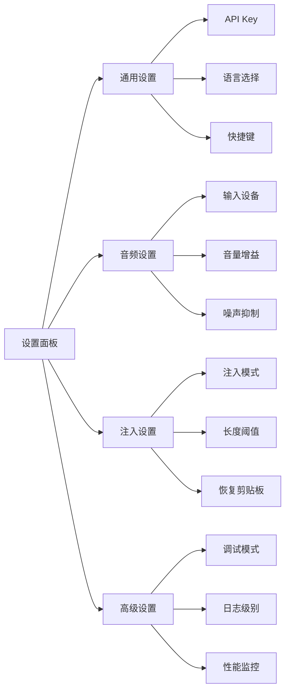

---

## 6. 技术栈和依赖

### 6.1 Rust 后端依赖（Cargo.toml）

```toml
[package]
name = "raflow"
version = "1.0.0"
edition = "2021"
rust-version = "1.77.2"

[dependencies]
# Tauri 核心
tauri = { version = "2.1", features = ["tray-icon", "protocol-asset"] }
tauri-plugin-global-shortcut = "2.3"
tauri-plugin-clipboard-manager = "2.3"
serde = { version = "1.0", features = ["derive"] }
serde_json = "1.0"
tokio = { version = "1.42", features = ["full"] }

# 音频处理
cpal = "0.16"
rubato = "1.0"
ringbuf = "0.3"

# WebSocket
tokio-tungstenite = "0.28"
futures-util = "0.3"

# 文本注入和系统交互
enigo = "0.6"
arboard = "3.4"

# macOS 辅助功能
[target.'cfg(target_os = "macos")'.dependencies]
accessibility-sys = "0.1"
cocoa = "0.26"
objc = "0.2"

# 窗口信息
active-win = "0.4"

# 日志和错误处理
tracing = "0.1"
tracing-subscriber = { version = "0.3", features = ["env-filter"] }
anyhow = "1.0"
thiserror = "2.0"

# 配置管理
toml = "0.8"
dirs = "5.0"

# 时间处理
chrono = { version = "0.4", features = ["serde"] }
```

### 6.2 前端依赖（package.json）

```json
{
  "name": "raflow-frontend",
  "version": "1.0.0",
  "type": "module",
  "scripts": {
    "dev": "vite",
    "build": "tsc && vite build",
    "preview": "vite preview",
    "type-check": "tsc --noEmit"
  },
  "dependencies": {
    "@tauri-apps/api": "^2.1.0",
    "@tauri-apps/plugin-global-shortcut": "^2.3.1",
    "@tauri-apps/plugin-clipboard-manager": "^2.3.2",
    "react": "^19.2.0",
    "react-dom": "^19.2.0",
    "framer-motion": "^12.26.0",
    "clsx": "^2.1.0",
    "tailwind-merge": "^2.5.0"
  },
  "devDependencies": {
    "@types/react": "^19.2.8",
    "@types/react-dom": "^19.2.6",
    "@vitejs/plugin-react": "^4.3.0",
    "typescript": "^5.9.3",
    "vite": "^6.0.0",
    "tailwindcss": "^4.0.0",
    "autoprefixer": "^10.4.0",
    "postcss": "^8.4.0"
  }
}
```

### 6.3 开发工具

| 工具 | 用途 |
|------|------|
| **Rust Analyzer** | Rust IDE 支持 |
| **Tauri CLI** | `cargo tauri` 命令行工具 |
| **Vite** | 前端构建工具 |
| **ESLint** | JavaScript/TypeScript 代码检查 |
| **Prettier** | 代码格式化 |

---

## 7. 安全性设计

### 7.1 API Key 管理

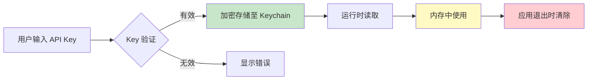

**实现要点**：
- 使用 macOS Keychain 存储加密的 API Key
- 运行时仅在内存中解密，不写入日志
- 提供重新输入和验证机制

### 7.2 权限管理

| 权限 | 用途 | 请求时机 |
|------|------|----------|
| **麦克风** | 音频采集 | 首次启动录音时 |
| **辅助功能** | 文本注入、窗口检测 | 应用启动时检查 |
| **通知** | 显示状态提示 | 首次显示通知时 |

**权限检查流程**：

```rust
// 检查辅助功能权限
fn check_accessibility_permission() -> bool {
    #[cfg(target_os = "macos")]
    unsafe {
        use accessibility_sys::*;
        let trusted = AXIsProcessTrusted();
        trusted != 0
    }

    #[cfg(not(target_os = "macos"))]
    true
}

// 请求辅助功能权限
fn request_accessibility_permission() {
    #[cfg(target_os = "macos")]
    unsafe {
        use accessibility_sys::*;
        AXIsProcessTrustedWithOptions(/* options */);
    }
}
```

### 7.3 网络安全

- **WSS 加密**：所有 WebSocket 通信使用 TLS 1.3
- **证书验证**：启用完整的证书链验证
- **超时控制**：连接超时 10s，读写超时 30s
- **重试策略**：指数退避，最大重试 3 次

---

## 8. 性能优化策略

### 8.1 内存优化

| 策略 | 实现方式 | 预期效果 |
|------|----------|----------|
| **音频缓冲区** | 固定大小 Ring Buffer | 避免频繁内存分配 |
| **字符串池化** | 重用字符串对象 | 减少堆分配 |
| **延迟清理** | 定期清理过期数据 | 控制内存增长 |

### 8.2 CPU 优化

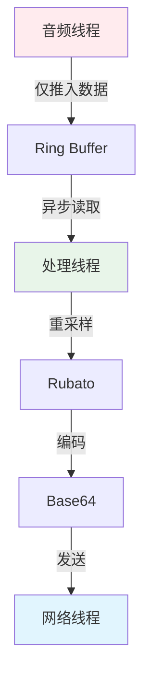

**关键优化点**：
- 音频回调函数耗时 <10μs
- 使用异步 I/O 避免阻塞
- 重采样结果缓存

### 8.3 网络优化

| 优化项 | 策略 | 目标 |
|--------|------|------|
| **连接复用** | 长连接，避免频繁握手 | 减少握手延迟 |
| **批量发送** | 每 256ms 发送一次音频块 | 减少网络往返 |
| **压缩** | 可选的音频压缩 | 降低带宽消耗 |

---

## 9. 错误处理和恢复

### 9.1 错误分类

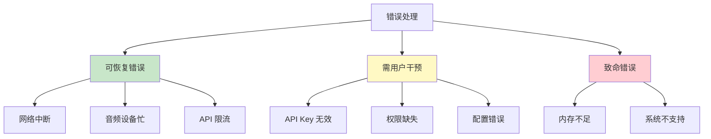

### 9.2 重试策略

```rust
pub struct RetryConfig {
    pub max_attempts: u32,      // 最大重试次数
    pub base_delay_ms: u64,     // 基础延迟
    pub max_delay_ms: u64,      // 最大延迟
    pub backoff_factor: f64,    // 退避因子
}

// 指数退避实现
async fn retry_with_backoff<T, E, F, Fut>(operation: F) -> Result<T, E>
where
    F: Fn() -> Fut,
    Fut: std::future::Future<Output = Result<T, E>>,
{
    let config = RetryConfig {
        max_attempts: 3,
        base_delay_ms: 1000,
        max_delay_ms: 10000,
        backoff_factor: 2.0,
    };

    for attempt in 0..config.max_attempts {
        match operation().await {
            Ok(result) => return Ok(result),
            Err(e) if attempt < config.max_attempts - 1 => {
                let delay = (config.base_delay_ms as f64
                    * config.backoff_factor.powi(attempt as i32))
                    .min(config.max_delay_ms as f64) as u64;
                tokio::time::sleep(Duration::from_millis(delay)).await;
            }
            Err(e) => return Err(e),
        }
    }
    unreachable!()
}
```

---

## 10. 部署架构

### 10.1 应用分发

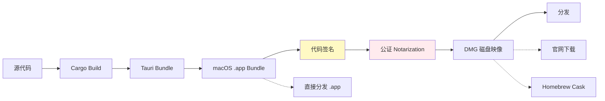

### 10.2 更新机制

- **检查频率**：应用启动时检查
- **更新策略**：静默下载，用户确认后安装
- **回滚机制**：保留旧版本，支持回退

---

## 11. 测试策略

### 11.1 单元测试

| 模块 | 测试覆盖 | 工具 |
|------|----------|------|
| **音频管道** | 重采样、格式转换 | Rust 内置测试 |
| **WebSocket** | 消息编解码 | mockito |
| **注入引擎** | 策略选择逻辑 | Rust 内置测试 |

### 11.2 集成测试

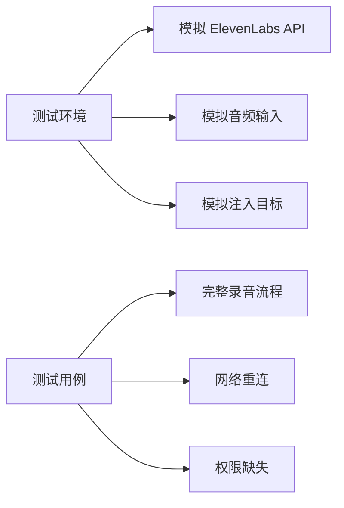

### 11.3 性能测试

| 指标 | 目标值 | 测试方法 |
|------|--------|----------|
| **内存占用** | <50MB 空闲 | Instrument |
| **CPU 占用** | <5% 录音时 | Activity Monitor |
| **延迟** | <150ms E2E | 专用测试工具 |
| **启动时间** | <2s | 手动测试 |

---

## 12. 国际化和本地化

### 12.1 支持语言

- **界面语言**：简体中文、English（初始）
- **转录语言**：90+ 语言（ElevenLabs 支持）

### 12.2 本地化实现

```rust
// 使用 i18n 库
use i18n::Locale;

pub fn get_locale() -> Locale {
    let system_locale = sys_locale::get_locale().unwrap();
    match system_locale.as_str() {
        "zh-CN" => Locale::ZhCN,
        "en-US" => Locale::EnUS,
        _ => Locale::EnUS, // 默认英语
    }
}
```

---

## 13. 附录

### 13.1 快捷键默认配置

| 快捷键 | 功能 |
|--------|------|
| `Cmd+Shift+Space` | 开始/停止录音 |
| `Cmd+Shift+V` | 手动粘贴最后转录 |
| `Cmd+Shift+H` | 隐藏/显示悬浮窗 |
| `Cmd+,` | 打开设置 |

### 13.2 配置文件位置

| 平台 | 配置目录 |
|------|----------|
| **macOS** | `~/Library/Application Support/raflow/` |
| **日志文件** | `~/Library/Logs/raflow/` |

### 13.3 依赖版本汇总

| 类别 | 依赖 | 版本 | 用途 |
|------|------|------|------|
| **Rust** | tauri | 2.1 | 核心框架 |
| | cpal | 0.16 | 音频采集 |
| | rubato | 1.0 | 重采样 |
| | tokio-tungstenite | 0.28 | WebSocket |
| | enigo | 0.6 | 输入模拟 |
| **前端** | React | 19.2 | UI 框架 |
| | TypeScript | 5.9 | 类型系统 |
| | Framer Motion | 12.26 | 动画 |
| **外部 API** | ElevenLabs | v2 | 语音转录 |

### 13.4 参考资料

**本设计文档基于以下资源的最新信息：**

- [Tauri v2 文档](https://v2.tauri.app/)
- [Tauri v2 稳定版发布公告](https://v2.tauri.app/blog/tauri-20/)
- [ElevenLabs Scribe v2 Realtime 文档](https://elevenlabs.io/docs/api-reference/speech-to-text/v-1-speech-to-text-realtime)
- [ElevenLabs 文档主页](https://elevenlabs.io/docs/overview/intro)
- [cpal crate](https://crates.io/crates/cpal) - 0.16.0 (2026年1月4日更新)
- [rubato crate](https://crates.io/crates/rubato) - 1.0.0 (2025年12月30日发布)
- [tokio-tungstenite](https://docs.rs/crate/tokio-tungstenite/latest) - 0.28.0
- [enigo crate](https://crates.io/crates/enigo) - 0.6.1 (2025年8月28日更新)
- [Tauri 全局快捷键插件](https://v2.tauri.app/plugin/global-shortcut/) - 2.3.1
- [Tauri 剪贴板插件](https://v2.tauri.app/plugin/clipboard/) - 2.3.2
- [React 19.2 文档](https://react.dev/versions)
- [Framer Motion 文档](https://motion.dev/)
- [macOS Accessibility API 文档](https://developer.apple.com/documentation/applicationservices/axuielement_h)
- [Wispr Flow 官网](https://wisprflow.ai/) - 产品参考

---

## 14. 版本历史

| 版本 | 日期 | 变更 |
|------|------|------|
| 1.0.0 | 2026-01-18 | 初始设计文档 |

---

**文档结束**

*本文档由 AI 辅助生成，基于 2026 年 1 月的最新技术信息和依赖版本。*
