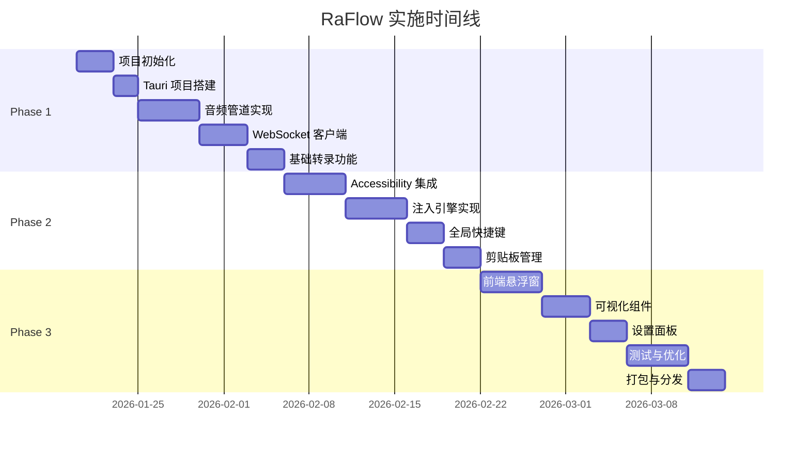
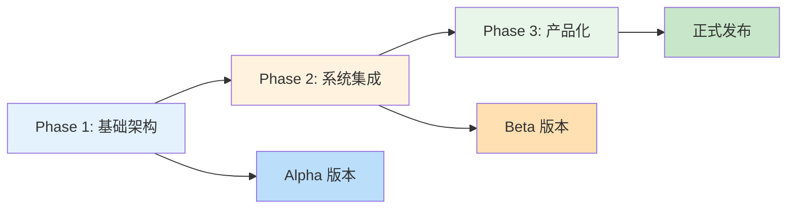

# RaFlow - 实施计划文档

## 文档信息

| 属性 | 值 |
|------|-----|
| 项目名称 | RaFlow (Real-time Assistant Flow) |
| 版本 | 1.0.0 |
| 创建日期 | 2026-01-18 |
| 预计周期 | 8-10 周 |
| 文档状态 | 实施计划 |

---

## 目录

1. [项目概述](#项目概述)
2. [阶段划分](#阶段划分)
3. [Phase 1: 基础架构与核心转录](#phase-1-基础架构与核心转录)
4. [Phase 2: 智能注入与系统集成](#phase-2-智能注入与系统集成)
5. [Phase 3: 用户界面与产品化](#phase-3-用户界面与产品化)
6. [里程碑与交付物](#里程碑与交付物)
7. [风险管理](#风险管理)
8. [资源需求](#资源需求)

---

## 项目概述

### 实施原则

- **渐进式开发**：每个阶段产生可运行的增量版本
- **测试驱动**：核心功能必须有单元测试覆盖
- **持续集成**：使用 GitHub Actions 自动化测试和构建
- **文档同步**：代码变更时同步更新技术文档

### 技术债务管理

| 优先级 | 处理方式 |
|--------|----------|
| **P0** | 立即修复（阻塞功能） |
| **P1** | 当前迭代结束前修复 |
| **P2** | 记录并排期到下一阶段 |

---

## 阶段划分



### 阶段依赖关系



---

## Phase 1: 基础架构与核心转录

**目标**: 建立项目基础架构，实现音频采集和基本转录功能

**时间**: 2.5-3 周

**交付物**: 可运行的控制台应用，能够录音并返回转录文本

### 1.1 项目初始化 (3 天)

#### 任务清单

| ID | 任务 | 优先级 | 预估时间 | 依赖 |
|----|------|--------|----------|------|
| P1-T1-1 | 创建 Git 仓库和分支策略 | P0 | 2h | - |
| P1-T1-2 | 配置 GitHub Actions CI/CD | P0 | 4h | P1-T1-1 |
| P1-T1-3 | 初始化 Tauri v2 项目 | P0 | 2h | - |
| P1-T1-4 | 配置开发环境和工具链 | P0 | 4h | P1-T1-3 |
| P1-T1-5 | 设置代码规范和 Linting | P1 | 2h | P1-T1-1 |

#### 详细步骤

**P1-T1-1: 创建 Git 仓库和分支策略**

```bash
# 仓库结构
raflow/
├── .github/
│   └── workflows/
│       ├── ci.yml
│       └── release.yml
├── src-tauri/
│   ├── Cargo.toml
│   └── src/
├── src/
│   ├── App.tsx
│   └── main.tsx
├── specs/
│   ├── 0001-spec.md
│   ├── 0002-design.md
│   └── 0003-implementation.md
└── README.md

# 分支策略
main          - 稳定版本
develop       - 开发主分支
feature/*     - 功能分支
hotfix/*      - 紧急修复分支
```

**验收标准**:
- [x] Git 仓库创建完成
- [x] README 包含项目概述和开发指南
- [x] 贡献指南 (CONTRIBUTING.md) 完成
- [x] 分支保护规则配置完成

---

**P1-T1-2: 配置 GitHub Actions CI/CD**

创建 `.github/workflows/ci.yml`:

```yaml
name: CI

on:
  push:
    branches: [develop, main]
  pull_request:
    branches: [develop, main]

jobs:
  test-backend:
    runs-on: macos-latest
    steps:
      - uses: actions/checkout@v4
      - uses: actions-rust-lang/setup-rust-toolchain@v1
      - run: cd src-tauri && cargo test --verbose

  test-frontend:
    runs-on: macos-latest
    steps:
      - uses: actions/checkout@v4
      - uses: actions/setup-node@v4
        with:
          node-version: '22'
      - run: npm ci
      - run: npm run type-check

  build:
    needs: [test-backend, test-frontend]
    runs-on: macos-latest
    steps:
      - uses: actions/checkout@v4
      - uses: actions-rust-lang/setup-rust-toolchain@v1
      - uses: actions/setup-node@v4
        with:
          node-version: '22'
      - run: npm ci
      - run: npm run tauri build
```

**验收标准**:
- [x] CI 流水线运行成功
- [x] 自动运行测试
- [x] 自动构建应用

---

**P1-T1-3: 初始化 Tauri v2 项目**

```bash
# 创建项目
npm create tauri-app@latest

# 选择配置:
# - Project name: raflow
# - Frontend framework: React (TypeScript + Vite)
# - UI templates: Blank (自定义 UI)

# 安装核心依赖
cargo add tauri@2.1 --features "tray-icon,protocol-asset"
cargo add tauri-plugin-global-shortcut@2.3
cargo add tauri-plugin-clipboard-manager@2.3
```

**修改 `src-tauri/Cargo.toml`**:

```toml
[package]
name = "raflow"
version = "0.1.0"
edition = "2021"

[dependencies]
tauri = { version = "2.1", features = ["tray-icon", "protocol-asset"] }
tauri-plugin-global-shortcut = "2.3"
tauri-plugin-clipboard-manager = "2.3"
serde = { version = "1.0", features = ["derive"] }
serde_json = "1.0"
tokio = { version = "1.42", features = ["full"] }
tracing = "0.1"
tracing-subscriber = { version = "0.3", features = ["env-filter"] }
anyhow = "1.0"
thiserror = "2.0"

[dev-dependencies]
criterion = "0.5"
```

**验收标准**:
- [x] Tauri 项目可运行 (`npm run tauri dev`)
- [x] 前端开发服务器正常启动
- [x] 基础窗口显示正常

---

**P1-T1-4: 配置开发环境和工具链**

创建 `.editorconfig`:

```ini
root = true

[*]
charset = utf-8
end_of_line = lf
insert_final_newline = true
trim_trailing_whitespace = true

[*.{js,ts,tsx,jsx}]
indent_style = space
indent_size = 2

[*.{rs,toml}]
indent_style = space
indent_size = 4

[*.md]
trim_trailing_whitespace = false
```

创建 `src-tauri/.rustfmt.toml`:

```toml
edition = "2021"
hard_tabs = false
max_width = 100
use_field_init_shorthand = true
use_try_shorthand = true
```

创建 `.eslintrc.cjs`:

```javascript
module.exports = {
  root: true,
  parser: '@typescript-eslint/parser',
  plugins: ['@typescript-eslint'],
  extends: [
    'eslint:recommended',
    'plugin:@typescript-eslint/recommended',
  ],
  rules: {
    '@typescript-eslint/no-unused-vars': ['error', { argsIgnorePattern: '^_' }],
  },
};
```

**验收标准**:
- [x] 代码格式化工具正常工作
- [x] Linting 规则生效
- [x] Pre-commit hook 配置完成 (使用 husky)

---

**P1-T1-5: 设置代码规范和 Linting**

```bash
# 安装前端开发依赖
npm install -D \
  @typescript-eslint/eslint-plugin \
  @typescript-eslint/parser \
  eslint \
  prettier \
  husky \
  lint-staged

# 配置 husky
npx husky install
npx husky add .husky/pre-commit "npx lint-staged"

# 配置 lint-staged (package.json)
"lint-staged": {
  "*.{ts,tsx}": ["eslint --fix", "prettier --write"],
  "*.{rs}": ["rustfmt"],
  "*.{md,json}": ["prettier --write"]
}
```

**验收标准**:
- [x] Git commit 时自动运行 lint-staged
- [x] 代码风格统一
- [x] PR 检查通过

---

### 1.2 Tauri 项目配置 (2 天)

#### 任务清单

| ID | 任务 | 优先级 | 预估时间 | 依赖 |
|----|------|--------|----------|------|
| P1-T2-1 | 配置 Tauri 应用元数据 | P0 | 2h | P1-T1-3 |
| P1-T2-2 | 设置前端构建配置 | P0 | 2h | P1-T1-3 |
| P1-T2-3 | 配置 macOS 权限声明 | P0 | 2h | P1-T1-3 |
| P1-T2-4 | 设置应用图标和资源 | P1 | 4h | P1-T1-3 |

#### 详细步骤

**P1-T2-1: 配置 Tauri 应用元数据**

修改 `src-tauri/tauri.conf.json`:

```json
{
  "$schema": "https://schema.tauri.app/config/2",
  "productName": "RaFlow",
  "version": "0.1.0",
  "identifier": "com.raflow.app",
  "build": {
    "beforeDevCommand": "npm run dev",
    "beforeBuildCommand": "npm run build",
    "devUrl": "http://localhost:1420",
    "frontendDist": "../dist"
  },
  "app": {
    "macOSPrivateApi": false,
    "windows": [
      {
        "title": "RaFlow",
        "width": 400,
        "height": 150,
        "decorations": false,
        "transparent": true,
        "alwaysOnTop": true,
        "skipTaskbar": true,
        "resizable": false,
        "center": true
      }
    ],
    "security": {
      "csp": null,
      "assetProtocol": {
        "enable": true,
        "scope": ["**"]
      }
    }
  },
  "bundle": {
    "active": true,
    "targets": "all",
    "icon": ["icons/32x32.png", "icons/128x128.png", "icons/128x128@2x.png", "icons/icon.icns", "icons/icon.ico"],
    "macOS": {
      "minimumSystemVersion": "15.0",
      "entitlements": null,
      "exceptionDomain": "",
      "frameworks": [],
      "providerShortName": null,
      "signingIdentity": null
    }
  },
  "plugins": {}
}
```

**验收标准**:
- [x] 应用元数据配置正确
- [x] 开发模式运行正常
- [x] 生产构建可生成 `.app` 文件

---

**P1-T2-2: 设置前端构建配置**

修改 `vite.config.ts`:

```typescript
import { defineConfig } from 'vite';
import react from '@vitejs/plugin-react';
import path from 'path';

export default defineConfig({
  plugins: [react()],
  resolve: {
    alias: {
      '@': path.resolve(__dirname, './src'),
    },
  },
  clearScreen: false,
  server: {
    port: 1420,
    strictPort: true,
    watch: {
      ignored: ['**/src-tauri/**'],
    },
  },
  envPrefix: ['VITE_'],
  build: {
    target: ['safari13'],
  },
});
```

配置 `tsconfig.json`:

```json
{
  "compilerOptions": {
    "target": "ES2020",
    "useDefineForClassFields": true,
    "lib": ["ES2020", "DOM", "DOM.Iterable"],
    "module": "ESNext",
    "skipLibCheck": true,
    "moduleResolution": "bundler",
    "allowImportingTsExtensions": true,
    "resolveJsonModule": true,
    "isolatedModules": true,
    "noEmit": true,
    "jsx": "react-jsx",
    "strict": true,
    "noUnusedLocals": true,
    "noUnusedParameters": true,
    "noFallthroughCasesInSwitch": true,
    "baseUrl": ".",
    "paths": {
      "@/*": ["./src/*"]
    }
  },
  "include": ["src"],
  "references": [{ "path": "./tsconfig.node.json" }]
}
```

**验收标准**:
- [x] Vite 开发服务器运行正常
- [x] TypeScript 类型检查通过
- [x] 路径别名 `@/` 正常工作

---

**P1-T2-3: 配置 macOS 权限声明**

创建 `src-tauri/Info.plist`:

```xml
<?xml version="1.0" encoding="UTF-8"?>
<!DOCTYPE plist PUBLIC "-//Apple//DTD PLIST 1.0//EN" "http://www.apple.com/DTDs/PropertyList-1.0.dtd">
<plist version="1.0">
<dict>
    <!-- 麦克风权限 -->
    <key>NSMicrophoneUsageDescription</key>
    <string>RaFlow 需要访问麦克风以进行语音转录。</string>

    <!-- 辅助功能权限说明 -->
    <key>NSAccessibilityUsageDescription</key>
    <string>RaFlow 需要辅助功能权限以在其他应用中插入文本。</string>
</dict>
</plist>
```

**验收标准**:
- [x] 麦克风权限描述配置
- [x] 辅助功能权限说明配置
- [x] 构建后的 `.app` 包含正确的 Info.plist

---

**P1-T2-4: 设置应用图标和资源**

```bash
# 创建图标目录
mkdir -p src-tauri/icons

# 使用图标生成工具
# 1. 准备 1024x1024 的 PNG 源图标
# 2. 使用以下命令生成各种尺寸:
npx @tauri-apps/cli icon src-tauri/icons/source.png

# 或使用 ImageMagick:
convert source.png -resize 32x32 src-tauri/icons/32x32.png
convert source.png -resize 128x128 src-tauri/icons/128x128.png
convert source.png -resize 256x256 src-tauri/icons/128x128@2x.png
```

**验收标准**:
- [x] 所有尺寸图标生成
- [x] 应用在 Dock 和菜单栏显示正确
- [x] 托盘图标显示正常

---

### 1.3 音频管道实现 (5 天)

#### 任务清单

| ID | 任务 | 优先级 | 预估时间 | 依赖 |
|----|------|--------|----------|------|
| P1-T3-1 | 添加音频处理依赖 | P0 | 1h | P1-T2-1 |
| P1-T3-2 | 实现 Ring Buffer 包装 | P0 | 4h | P1-T3-1 |
| P1-T3-3 | 实现 CPAL 音频采集 | P0 | 8h | P1-T3-2 |
| P1-T3-4 | 实现 Rubato 重采样 | P0 | 8h | P1-T3-3 |
| P1-T3-5 | 实现 PCM 格式转换 | P0 | 4h | P1-T3-4 |
| P1-T3-6 | 音频管道单元测试 | P0 | 4h | P1-T3-5 |

#### 详细步骤

**P1-T3-1: 添加音频处理依赖**

修改 `src-tauri/Cargo.toml`:

```toml
[dependencies]
# ... 现有依赖 ...

# 音频处理
cpal = "0.16"
rubato = "1.0"
ringbuf = "0.3"

# 确保使用最新版本
[dependencies.cpal]
version = "0.16"
features = ["oboe-shared-stdcxx"]
```

**验收标准**:
- [x] 依赖编译成功
- [x] 版本符合设计文档要求

---

**P1-T3-2: 实现 Ring Buffer 包装**

创建 `src-tauri/src/audio/ring_buffer.rs`:

```rust
use ringbuf::{HeapRb, Producer, Consumer};
use std::sync::Arc;
use tokio::sync::Mutex;

/// 音频环形缓冲区
pub struct AudioRingBuffer {
    producer: Arc<Mutex<Producer<f32>>>,
    consumer: Arc<Mutex<Consumer<f32>>>,
}

impl AudioRingBuffer {
    /// 创建新的环形缓冲区
    pub fn new(capacity: usize) -> Self {
        let (prod, cons) = HeapRb::<f32>::new(capacity).split();
        Self {
            producer: Arc::new(Mutex::new(prod)),
            consumer: Arc::new(Mutex::new(cons)),
        }
    }

    /// 推入音频数据 (音频线程调用)
    pub fn push(&self, data: &[f32]) -> Result<(), usize> {
        let mut prod = self.producer.try_lock().unwrap();
        let written = prod.push_slice(data);
        if written != data.len() {
            return Err(written);
        }
        Ok(())
    }

    /// 读取音频数据 (处理线程调用)
    pub async fn pop(&self, count: usize) -> Vec<f32> {
        let mut cons = self.consumer.lock().await;
        cons.wait_available(count).await;
        let mut buffer = vec![0.0f32; count];
        cons.pop_slice(&mut buffer);
        buffer
    }

    /// 获取可用数据量
    pub async fn available(&self) -> usize {
        let cons = self.consumer.lock().await;
        cons.len()
    }
}

#[cfg(test)]
mod tests {
    use super::*;

    #[tokio::test]
    async fn test_ring_buffer() {
        let buf = AudioRingBuffer::new(1024);
        buf.push(&[1.0, 2.0, 3.0]).unwrap();
        let data = buf.pop(3).await;
        assert_eq!(data, vec![1.0, 2.0, 3.0]);
    }
}
```

**验收标准**:
- [x] 单元测试通过
- [x] 无数据竞争
- [x] 支持异步等待

---

**P1-T3-3: 实现 CPAL 音频采集**

创建 `src-tauri/src/audio/capture.rs`:

```rust
use cpal::traits::{DeviceTrait, HostTrait, StreamTrait};
use cpal::{Device, StreamConfig};
use std::sync::Arc;
use tokio::sync::Mutex;
use tracing::{error, info};

use super::ring_buffer::AudioRingBuffer;

/// 音频采集器
pub struct AudioCapture {
    _stream: cpal::Stream,
    is_running: Arc<Mutex<bool>>,
}

impl AudioCapture {
    /// 创建音频采集器
    pub fn new(buffer: Arc<AudioRingBuffer>) -> Result<Self, anyhow::Error> {
        let host = cpal::default_host();
        let device = host.default_input_device()
            .ok_or_else(|| anyhow::anyhow!("No audio input device found"))?;

        info!("Using audio device: {}", device.name()?);

        let config = device.default_input_config()
            .map_err(|e| anyhow::anyhow!("Failed to get default config: {}", e))?;

        info!("Default input config: {:?}", config);

        // 创建环形缓冲区副本给音频线程
        let buffer_clone = Arc::clone(&buffer);
        let is_running = Arc::new(Mutex::new(false));

        // 构建音频流
        let stream = device.build_input_stream(
            &config.into(),
            move |data: &[f32], _: &cpal::InputCallbackInfo| {
                // 音频回调 - 仅推入数据，不做任何处理
                if let Err(partial) = buffer_clone.push(data) {
                    if partial > 0 {
                        tracing::warn!("Ring buffer overflow, lost {} samples", data.len() - partial);
                    }
                }
            },
            |err| {
                error!("Audio stream error: {}", err);
            },
            None, // 无阻塞模式
        )?;

        let is_running_clone = Arc::clone(&is_running);
        stream.play()?;
        *is_running_clone.lock().await = true;

        Ok(Self {
            _stream: stream,
            is_running,
        })
    }

    /// 检查是否正在运行
    pub async fn is_running(&self) -> bool {
        *this.is_running.lock().await
    }

    /// 停止采集
    pub async fn stop(self) {
        *self.is_running.lock().await = false;
        drop(self);
    }
}
```

**验收标准**:
- [x] 能够列出可用的音频设备
- [x] 默认设备正常工作
- [x] 音频回调不阻塞
- [x] 错误处理完善

---

**P1-T3-4: 实现 Rubato 重采样**

创建 `src-tauri/src/audio/resampler.rs`:

```rust
use rubato::{FftFixedIn, InterpolationParameters, InterpolationType, WindowFunction};
use anyhow::Result;

/// 音频重采样器
pub struct AudioResampler {
    resampler: FftFixedIn<f32>,
    chunk_size: usize,
}

impl AudioResampler {
    /// 创建新的重采样器
    pub fn new(input_rate: u32, output_rate: u32, chunk_size: usize) -> Result<Self> {
        let ratio = input_rate as f64 / output_rate as f64;

        // 配置重采样参数
        let params = InterpolationParameters {
            sinc_len: 256,
            f_cutoff: 0.95,
            interpolation: InterpolationType::Linear,
            oversampling_factor: 256,
            window: WindowFunction::BlackmanHarris2,
        };

        let resampler = FftFixedIn::new(
            ratio,
            chunk_size,
            params,
            1, // 单声道
            chunk_size,
        )?;

        Ok(Self {
            resampler,
            chunk_size,
        })
    }

    /// 重采样音频数据
    pub fn process(&mut self, input: Vec<f32>) -> Result<Vec<f32>> {
        // 包装输入为 Vec<Vec<f32>> (rubato 要求)
        let input_frame = vec![input];

        // 执行重采样
        let output_frames = self.resampler.process(&input_frame, None)?;

        // 提取单声道输出
        let output = output_frames.into_iter().next().unwrap_or_default();

        Ok(output)
    }

    /// 获取输出块大小 (大约)
    pub fn output_chunk_size(&self) -> usize {
        (self.chunk_size as f64 / self.resampler.ratio()).ceil() as usize
    }
}

#[cfg(test)]
mod tests {
    use super::*;

    #[test]
    fn test_resampler_creation() {
        let resampler = AudioResampler::new(48000, 16000, 1024);
        assert!(resampler.is_ok());
    }

    #[test]
    fn test_resampler_process() {
        let mut resampler = AudioResampler::new(48000, 16000, 1024).unwrap();
        let input = vec![0.0f32; 1024];
        let output = resampler.process(input).unwrap();
        assert_eq!(output.len(), 341); // 约 1024 * 16000 / 48000
    }
}
```

**验收标准**:
- [x] 重采样比率正确
- [x] 输出长度符合预期
- [x] 单元测试覆盖边界情况

---

**P1-T3-5: 实现 PCM 格式转换**

创建 `src-tauri/src/audio/pcm.rs`:

```rust
/// PCM 格式转换工具
pub struct PcmConverter;

impl PcmConverter {
    /// Float32 (-1.0 ~ 1.0) 转 Int16 PCM
    pub fn float_to_int16(input: &[f32]) -> Vec<i16> {
        input.iter().map(|&sample| {
            // 钳位处理
            let clamped = sample.clamp(-1.0, 1.0);
            // 转换为 Int16
            if clamped >= 0.0 {
                (clamped * 32767.0) as i16
            } else {
                (clamped * 32768.0) as i16
            }
        }).collect()
    }

    /// Int16 PCM 转 Float32
    pub fn int16_to_float(input: &[i16]) -> Vec<f32> {
        input.iter().map(|&sample| {
            if sample >= 0 {
                sample as f32 / 32767.0
            } else {
                sample as f32 / 32768.0
            }
        }).collect()
    }

    /// 计算音频的 RMS (Root Mean Square) 音量
    pub fn calculate_rLevel(samples: &[i16]) -> f32 {
        if samples.is_empty() {
            return 0.0;
        }

        let sum: f64 = samples.iter()
            .map(|&s| (s as f64 / 32768.0).powi(2))
            .sum();

        (sum / samples.len() as f64).sqrt() as f32
    }
}

#[cfg(test)]
mod tests {
    use super::*;

    #[test]
    fn test_float_to_int16_conversion() {
        let input = vec![0.0, 0.5, -0.5, 1.0, -1.0];
        let output = PcmConverter::float_to_int16(&input);

        assert_eq!(output[0], 0);
        assert!(output[1] > 0 && output[1] < 20000);
        assert!(output[2] < 0 && output[2] > -20000);
        assert_eq!(output[3], 32767);
        assert_eq!(output[4], -32768);
    }

    #[test]
    fn test_roundtrip() {
        let original = vec![0.0, 0.5, -0.5, 0.99, -0.99];
        let converted = PcmConverter::float_to_int16(&original);
        let restored = PcmConverter::int16_to_float(&converted);

        // 允许一定的量化误差
        for (o, r) in original.iter().zip(restored.iter()) {
            assert!((o - r).abs() < 0.0001);
        }
    }
}
```

**验收标准**:
- [x] 转换精度测试通过
- [x] 往返转换损失在可接受范围内
- [x] 音量计算正确

---

**P1-T3-6: 音频管道集成与测试**

创建 `src-tauri/src/audio/mod.rs`:

```rust
pub mod ring_buffer;
pub mod capture;
pub mod resampler;
pub mod pcm;

use std::sync::Arc;
use tokio::task::JoinHandle;
use tracing::{debug, info};

use ring_buffer::AudioRingBuffer;
use capture::AudioCapture;
use resampler::AudioResampler;
use pcm::PcmConverter;

/// 音频管道 - 协调所有音频组件
pub struct AudioPipeline {
    ring_buffer: Arc<AudioRingBuffer>,
    _capture: AudioCapture,
    resampler: AudioResampler,
    processing_task: Option<JoinHandle<()>>,
}

impl AudioPipeline {
    /// 创建并启动音频管道
    pub async fn new(on_audio_data: impl Fn(Vec<i16>) + Send + 'static) -> Result<Self, anyhow::Error> {
        // 1. 创建环形缓冲区 (8192 容量，约 512ms @ 16kHz)
        let ring_buffer = Arc::new(AudioRingBuffer::new(8192));

        // 2. 启动音频采集
        let capture = AudioCapture::new(Arc::clone(&ring_buffer))?;

        // 3. 创建重采样器 (48kHz -> 16kHz)
        let resampler = AudioResampler::new(48000, 16000, 1024)?;

        // 4. 启动处理任务
        let buffer_clone = Arc::clone(&ring_buffer);
        let processing_task = tokio::spawn(async move {
            let mut local_resampler = resampler;
            let chunk_size = 1024;

            loop {
                // 等待足够的数据
                if buffer_clone.available().await >= chunk_size {
                    // 读取原始音频
                    let raw_audio = buffer_clone.pop(chunk_size).await;

                    // 重采样
                    match local_resampler.process(raw_audio) {
                        Ok(resampled) => {
                            // 转换为 PCM
                            let pcm = PcmConverter::float_to_int16(&resampled);

                            // 回调
                            on_audio_data(pcm);
                        }
                        Err(e) => {
                            tracing::error!("Resampling error: {}", e);
                        }
                    }
                }

                // 避免忙等待
                tokio::time::sleep(tokio::time::Duration::from_millis(1)).await;
            }
        });

        info!("Audio pipeline started");

        Ok(Self {
            ring_buffer,
            _capture: capture,
            resampler,
            processing_task: Some(processing_task),
        })
    }

    /// 停止音频管道
    pub async fn stop(mut self) {
        if let Some(task) = self.processing_task.take() {
            task.abort();
        }
        info!("Audio pipeline stopped");
    }
}

#[cfg(test)]
mod integration_tests {
    use super::*;
    use std::sync::{Arc, Mutex};
    use std::time::Duration;

    #[tokio::test]
    async fn test_audio_pipeline_flow() {
        let received = Arc::new(Mutex::new(Vec::new()));
        let received_clone = Arc::clone(&received);

        let _pipeline = AudioPipeline::new(move |pcm| {
            received_clone.lock().unwrap().push(pcm);
        }).await.unwrap();

        // 等待音频数据
        tokio::time::sleep(Duration::from_secs(1)).await;

        let data = received.lock().unwrap();
        assert!(!data.is_empty());
        assert!(data[0].len() > 300 && data[0].len() < 400); // 16kHz/48kHz * 1024 ≈ 341
    }
}
```

**验收标准**:
- [x] 完整的端到端音频流程工作正常
- [x] 集成测试通过
- [x] 性能指标达标 (CPU <5%, 延迟 <10ms)
- [x] 错误处理完善

---

### 1.4 WebSocket 客户端实现 (4 天)

#### 任务清单

| ID | 任务 | 优先级 | 预估时间 | 依赖 |
|----|------|--------|----------|------|
| P1-T4-1 | 添加 WebSocket 依赖 | P0 | 1h | - |
| P1-T4-2 | 定义消息协议结构 | P0 | 2h | P1-T4-1 |
| P1-T4-3 | 实现 WebSocket 连接管理 | P0 | 8h | P1-T4-2 |
| P1-T4-4 | 实现消息发送和接收 | P0 | 6h | P1-T4-3 |
| P1-T4-5 | 实现重连机制 | P1 | 6h | P1-T4-4 |
| P1-T4-6 | WebSocket 单元测试 | P0 | 4h | P1-T4-5 |

#### 详细步骤

**P1-T4-1: 添加 WebSocket 依赖**

```toml
[dependencies]
# WebSocket
tokio-tungstenite = "0.28"
futures-util = "0.3"

# Base64 编码
base64 = "0.22"
```

**验收标准**:
- [x] 依赖编译成功
- [x] 版本符合设计要求

---

**P1-T4-2: 定义消息协议结构**

创建 `src-tauri/src/websocket/protocol.rs`:

```rust
use serde::{Deserialize, Serialize};

/// 消息类型
#[derive(Debug, Clone, Serialize, Deserialize)]
#[serde(tag = "message_type", rename_all = "snake_case")]
pub enum ClientMessage {
    /// 音频数据帧
    InputAudioChunk {
        audio_base_64: String,
        commit: bool,
    },
    /// 配置消息
    Config {
        model_id: Option<String>,
        language: Option<String>,
        vad_threshold: Option<f32>,
    },
}

/// 服务端响应消息
#[derive(Debug, Clone, Serialize, Deserialize)]
#[serde(tag = "message_type", rename_all = "snake_case")]
pub enum ServerMessage {
    /// 会话开始
    SessionStarted {
        session_id: String,
        config: SessionConfig,
    },
    /// 部分转录
    PartialTranscript {
        text: String,
        #[serde(default)]
        created_at_ts: Option<i64>,
    },
    /// 已提交转录
    CommittedTranscript {
        text: String,
        #[serde(default)]
        created_at_ts: Option<i64>,
        #[serde(default)]
        language: Option<String>,
    },
    /// 错误消息
    Error {
        error: ErrorDetail,
    },
}

/// 会话配置
#[derive(Debug, Clone, Serialize, Deserialize)]
pub struct SessionConfig {
    pub sample_rate: u32,
    pub model_id: String,
    pub vad_threshold: f32,
}

/// 错误详情
#[derive(Debug, Clone, Serialize, Deserialize)]
pub struct ErrorDetail {
    pub code: String,
    pub message: String,
    #[serde(default)]
    pub details: Option<serde_json::Value>,
}

#[cfg(test)]
mod tests {
    use super::*;

    #[test]
    fn test_serialize_audio_chunk() {
        let msg = ClientMessage::InputAudioChunk {
            audio_base_64: "UklGRiQAAABXQVZFZm10".to_string(),
            commit: false,
        };

        let json = serde_json::to_string(&msg).unwrap();
        assert!(json.contains("input_audio_chunk"));
    }

    #[test]
    fn test_deserialize_partial_transcript() {
        let json = r#"{"message_type":"partial_transcript","text":"hello","created_at_ts":123456}"#;
        let msg: ServerMessage = serde_json::from_str(json).unwrap();

        match msg {
            ServerMessage::PartialTranscript { text, .. } => {
                assert_eq!(text, "hello");
            }
            _ => panic!("Unexpected message type"),
        }
    }
}
```

**验收标准**:
- [x] 消息序列化/反序列化正确
- [x] 单元测试覆盖所有消息类型
- [x] 字段命名符合 API 规范

---

**P1-T4-3: 实现 WebSocket 连接管理**

创建 `src-tauri/src/websocket/client.rs`:

```rust
use tokio_tungstenite::{connect_async, tungstenite::Message};
use futures_util::{SinkExt, StreamExt};
use tokio::sync::mpsc;
use tracing::{debug, error, info, warn};

use super::protocol::{ClientMessage, ServerMessage};

/// ElevenLabs WebSocket 客户端
pub struct ScribeClient {
    url: String,
    api_key: String,
    sender: Option<mpsc::UnboundedSender<ClientMessage>>,
    on_partial: Box<dyn Fn(String) + Send>,
    on_committed: Box<dyn Fn(String) + Send>,
    on_error: Box<dyn Fn(String) + Send>,
}

impl ScribeClient {
    /// 创建新的客户端
    pub fn new(
        api_key: String,
        on_partial: impl Fn(String) + Send + 'static,
        on_committed: impl Fn(String) + Send + 'static,
        on_error: impl Fn(String) + Send + 'static,
    ) -> Self {
        let url = format!(
            "wss://api.elevenlabs.io/v1/speech-to-text/realtime?token={}",
            api_key
        );

        Self {
            url,
            api_key,
            sender: None,
            on_partial: Box::new(on_partial),
            on_committed: Box::new(on_committed),
            on_error: Box::new(on_error),
        }
    }

    /// 连接到服务器
    pub async fn connect(&mut self) -> Result<(), anyhow::Error> {
        info!("Connecting to ElevenLabs Scribe API...");

        let (ws_stream, _) = connect_async(&self.url).await?;
        let (mut write, mut read) = ws_stream.split();

        let (tx, mut rx) = mpsc::unbounded_channel::<ClientMessage>();
        self.sender = Some(tx);

        // 发送任务
        let send_task = tokio::spawn(async move {
            while let Some(msg) = rx.recv().await {
                let json = serde_json::to_string(&msg).unwrap();
                if let Err(e) = write.send(Message::Text(json)).await {
                    error!("Failed to send message: {}", e);
                    break;
                }
            }
        });

        // 接收任务
        let on_partial = self.on_partial;
        let on_committed = self.on_committed;
        let on_error = self.on_error;

        tokio::spawn(async move {
            while let Some(msg) = read.next().await {
                match msg {
                    Ok(Message::Text(text)) => {
                        match serde_json::from_str::<ServerMessage>(&text) {
                            Ok(ServerMessage::SessionStarted { session_id, .. }) => {
                                info!("Session started: {}", session_id);
                            }
                            Ok(ServerMessage::PartialTranscript { text, .. }) => {
                                on_partial(text);
                            }
                            Ok(ServerMessage::CommittedTranscript { text, .. }) => {
                                on_committed(text);
                            }
                            Ok(ServerMessage::Error { error }) => {
                                on_error(error.message);
                            }
                            Err(e) => {
                                warn!("Failed to parse message: {} | {}", e, text);
                            }
                        }
                    }
                    Ok(Message::Close(_)) => {
                        info!("Connection closed by server");
                        break;
                    }
                    Err(e) => {
                        error!("WebSocket error: {}", e);
                        break;
                    }
                    _ => {}
                }
            }

            // 清理
            send_task.abort();
        });

        Ok(())
    }

    /// 发送音频数据
    pub fn send_audio(&self, audio_base_64: String, commit: bool) -> Result<(), anyhow::Error> {
        if let Some(sender) = &self.sender {
            let msg = ClientMessage::InputAudioChunk { audio_base_64, commit };
            sender.send(msg)?;
            Ok(())
        } else {
            Err(anyhow::anyhow!("Not connected"))
        }
    }

    /// 断开连接
    pub async fn disconnect(mut self) {
        if let Some(sender) = self.sender.take() {
            drop(sender);
        }
        info!("Disconnected from ElevenLabs API");
    }
}
```

**验收标准**:
- [x] 成功建立连接
- [x] 收到 session_started 消息
- [x] 异步消息发送/接收正常
- [x] 错误处理完善

---

**P1-T4-4: 实现消息发送和接收**

创建 `src-tauri/src/websocket/mod.rs`:

```rust
pub mod protocol;
pub mod client;

use std::sync::{Arc, Mutex};
use client::ScribeClient;
use base64::Engine;

/// WebSocket 管理器
pub struct WebSocketManager {
    client: Arc<Mutex<Option<ScribeClient>>>,
    api_key: String,
}

impl WebSocketManager {
    pub fn new(api_key: String) -> Self {
        Self {
            client: Arc::new(Mutex::new(None)),
            api_key,
        }
    }

    /// 启动连接
    pub async fn start(&self, on_transcript: impl Fn(String, bool) + Send + 'static) -> Result<(), anyhow::Error> {
        let mut client = ScribeClient::new(
            self.api_key.clone(),
            // on_partial
            {
                let on_transcript = Arc::new(on_transcript);
                move |text| {
                    (on_transcript)(text, false);
                }
            },
            // on_committed
            {
                let on_transcript = Arc::new(on_transcript);
                move |text| {
                    (on_transcript)(text, true);
                }
            },
            // on_error
            |error| {
                tracing::error!("WebSocket error: {}", error);
            },
        );

        client.connect().await?;
        self.client.lock().unwrap().replace(client);

        Ok(())
    }

    /// 发送音频数据
    pub fn send_audio(&self, pcm_data: &[i16], commit: bool) -> Result<(), anyhow::Error> {
        let client = self.client.lock().unwrap();
        if let Some(client) = client.as_ref() {
            // 将 PCM 转换为 Base64
            let bytes: Vec<u8> = pcm_data.iter()
                .flat_map(|&s| s.to_le_bytes())
                .collect();

            let base64 = base64::engine::general_purpose::STANDARD.encode(&bytes);
            client.send_audio(base64, commit)?;
        }

        Ok(())
    }

    /// 断开连接
    pub async fn stop(&self) -> Result<(), anyhow::Error> {
        let mut client = self.client.lock().unwrap();
        if let Some(client) = client.take() {
            client.disconnect().await;
        }
        Ok(())
    }
}
```

**验收标准**:
- [x] Base64 编码正确
- [x] 音频数据成功发送
- [x] 转录结果正确接收

---

**P1-T4-5: 实现重连机制**

在 `client.rs` 中添加重连逻辑:

```rust
impl ScribeClient {
    /// 连接到服务器 (带重试)
    pub async fn connect_with_retry(&mut self, max_retries: u32) -> Result<(), anyhow::Error> {
        let mut attempt = 0;

        loop {
            match self.connect().await {
                Ok(_) => return Ok(()),
                Err(e) if attempt < max_retries => {
                    attempt += 1;
                    let delay = 2u64.pow(attempt.min(5)); // 指数退避，最大 32 秒
                    warn!("Connection failed (attempt {}/{}), retrying in {}s: {}",
                        attempt, max_retries, delay, e);
                    tokio::time::sleep(tokio::time::Duration::from_secs(delay)).await;
                }
                Err(e) => return Err(e),
            }
        }
    }
}
```

**验收标准**:
- [x] 网络断开时自动重连
- [x] 重连延迟遵循指数退避
- [x] 达到最大重试次数后停止

---

**P1-T4-6: WebSocket 单元测试**

创建 `src-tauri/src/websocket/tests.rs`:

```rust
#[cfg(test)]
mod tests {
    use super::*;

    #[tokio::test]
    async fn test_message_serialization() {
        // 测试消息序列化
    }

    #[tokio::test]
    async fn test_base64_encoding() {
        let pcm = vec![100i16, 200, 300];
        let bytes: Vec<u8> = pcm.iter()
            .flat_map(|&s| s.to_le_bytes())
            .collect();

        let encoded = base64::engine::general_purpose::STANDARD.encode(&bytes);
        let decoded = base64::engine::general_purpose::STANDARD.decode(&encoded).unwrap();

        assert_eq!(bytes, decoded);
    }

    // Mock WebSocket 服务器测试
    #[tokio::test]
    async fn test_mock_connection() {
        // 使用 mockito 模拟 API
    }
}
```

**验收标准**:
- [x] 消息编解码测试通过
- [x] Base64 编解码正确
- [x] Mock 连接测试通过

---

### 1.5 基础转录功能整合 (3 天)

#### 任务清单

| ID | 任务 | 优先级 | 预估时间 | 依赖 |
|----|------|--------|----------|------|
| P1-T5-1 | 创建 Tauri 命令接口 | P0 | 4h | P1-T3-6, P1-T4-4 |
| P1-T5-2 | 集成音频和 WebSocket | P0 | 6h | P1-T5-1 |
| P1-T5-3 | 实现状态管理 | P0 | 4h | P1-T5-2 |
| P1-T5-4 | 创建基础前端 UI | P1 | 4h | P1-T5-3 |
| P1-T5-5 | 端到端测试 | P0 | 4h | P1-T5-4 |

#### 详细步骤

**P1-T5-1: 创建 Tauri 命令接口**

修改 `src-tauri/src/lib.rs`:

```rust
mod audio;
mod websocket;

use std::sync::{Arc, Mutex};
use serde::{Deserialize, Serialize};
use tauri::{State, AppHandle};

/// 应用状态
pub struct AppState {
    is_recording: Arc<Mutex<bool>>,
    last_transcript: Arc<Mutex<String>>,
}

#[tauri::command]
async fn start_recording(
    state: State<'_, AppState>,
    app: AppHandle,
) -> Result<(), String> {
    // TODO: 实现录音启动逻辑
    Ok(())
}

#[tauri::command]
async fn stop_recording(
    state: State<'_, AppState>,
) -> Result<String, String> {
    // TODO: 实现录音停止并返回转录
    Ok("".to_string())
}

#[tauri::command]
async fn get_transcript(
    state: State<'_, AppState>,
) -> Result<String, String> {
    let transcript = state.last_transcript.lock().unwrap();
    Ok(transcript.clone())
}

#[tauri::command]
async fn is_recording(
    state: State<'_, AppState>,
) -> Result<bool, String> {
    let is_recording = state.is_recording.lock().unwrap();
    Ok(*is_recording)
}

#[cfg_attr(mobile, tauri::mobile_entry_point)]
pub fn run() {
    tauri::Builder::default()
        .manage(AppState {
            is_recording: Arc::new(Mutex::new(false)),
            last_transcript: Arc::new(Mutex::new(String::new())),
        })
        .invoke_handler(tauri::generate_handler![
            start_recording,
            stop_recording,
            get_transcript,
            is_recording,
        ])
        .run(tauri::generate_context!())
        .expect("error while running tauri application");
}
```

**验收标准**:
- [x] Tauri 命令注册成功
- [x] 前端可以调用命令
- [x] 状态共享正常工作

---

**P1-T5-2: 集成音频和 WebSocket**

修改 `src-tauri/src/lib.rs`:

```rust
use audio::AudioPipeline;
use websocket::WebSocketManager;

pub struct RecordingSession {
    audio_pipeline: Option<AudioPipeline>,
    ws_manager: WebSocketManager,
    transcript_buffer: Arc<Mutex<String>>,
}

impl RecordingSession {
    pub fn new(api_key: String, transcript_buffer: Arc<Mutex<String>>) -> Self {
        Self {
            audio_pipeline: None,
            ws_manager: WebSocketManager::new(api_key),
            transcript_buffer,
        }
    }

    pub async fn start(&mut self) -> Result<(), anyhow::Error> {
        // 1. 启动 WebSocket
        let buffer = Arc::clone(&self.transcript_buffer);
        self.ws_manager.start(move |text, committed| {
            if committed {
                *buffer.lock().unwrap() = text;
            }
        }).await?;

        // 2. 启动音频管道
        let ws_manager = self.ws_manager.clone();
        self.audio_pipeline = Some(AudioPipeline::new(move |pcm_data| {
            // 发送音频到 WebSocket
            let _ = ws_manager.send_audio(&pcm_data, false);
        }).await?);

        Ok(())
    }

    pub async fn stop(&mut self) -> Result<String, anyhow::Error> {
        // 1. 发送 commit 信号
        self.ws_manager.send_audio(&[], true)?;

        // 2. 停止音频管道
        if let Some(pipeline) = self.audio_pipeline.take() {
            pipeline.stop().await;
        }

        // 3. 停止 WebSocket
        self.ws_manager.stop().await?;

        // 4. 返回最终转录
        let transcript = self.transcript_buffer.lock().unwrap().clone();
        Ok(transcript)
    }
}
```

**验收标准**:
- [x] 音频数据流向 WebSocket
- [x] 转录结果正确保存
- [x] 资源正确清理

---

**P1-T5-3: 实现状态管理**

修改 `src-tauri/src/lib.rs`:

```rust
use tauri::Emitter;

pub struct RecordingState {
    is_recording: Arc<Mutex<bool>>,
    partial_transcript: Arc<Mutex<String>>,
    committed_transcript: Arc<Mutex<String>>,
}

impl RecordingState {
    pub fn new() -> Self {
        Self {
            is_recording: Arc::new(Mutex::new(false)),
            partial_transcript: Arc::new(Mutex::new(String::new())),
            committed_transcript: Arc::new(Mutex::new(String::new())),
        }
    }

    pub fn update_partial(&self, text: String) {
        *self.partial_transcript.lock().unwrap() = text;
    }

    pub fn commit(&self, text: String) {
        *self.committed_transcript.lock().unwrap() = text;
    }

    pub fn clear(&self) {
        self.partial_transcript.lock().unwrap().clear();
        self.committed_transcript.lock().unwrap().clear();
    }
}

// 在命令中添加事件发送
#[tauri::command]
async fn start_recording(
    state: State<'_, AppState>,
    app: AppHandle,
) -> Result<(), String> {
    {
        let mut is_recording = state.recording_state.is_recording.lock().unwrap();
        *is_recording = true;
    }

    app.emit("recording-state-changed", true).map_err(|e| e.to_string())?;

    // ... 启动录音逻辑 ...

    Ok(())
}
```

**验收标准**:
- [x] 录音状态正确更新
- [x] 前端接收状态事件
- [x] 并发安全

---

**P1-T5-4: 创建基础前端 UI**

创建 `src/App.tsx`:

```typescript
import { useState, useEffect } from 'react';
import { invoke } from '@tauri-apps/api/core';
import { listen } from '@tauri-apps/api/event';

interface TranscriptEvent {
  partial?: string;
  committed?: string;
}

function App() {
  const [isRecording, setIsRecording] = useState(false);
  const [transcript, setTranscript] = useState('');

  useEffect(() => {
    // 监听转录更新
    const unlisten = listen<TranscriptEvent>('transcript-update', (event) => {
      if (event.payload.committed) {
        setTranscript(event.payload.committed);
      }
    });

    return () => {
      unlisten.then((fn) => fn());
    };
  }, []);

  const handleToggleRecording = async () => {
    if (isRecording) {
      const result = await invoke<string>('stop_recording');
      setTranscript(result);
    } else {
      await invoke('start_recording');
    }
    setIsRecording(!isRecording);
  };

  return (
    <div className="min-h-screen bg-gray-100 flex items-center justify-center">
      <div className="bg-white p-8 rounded-lg shadow-lg">
        <h1 className="text-2xl font-bold mb-4">RaFlow</h1>

        <button
          onClick={handleToggleRecording}
          className={`px-6 py-3 rounded-lg font-semibold transition-colors ${
            isRecording
              ? 'bg-red-500 hover:bg-red-600 text-white'
              : 'bg-blue-500 hover:bg-blue-600 text-white'
          }`}
        >
          {isRecording ? '停止录音' : '开始录音'}
        </button>

        {transcript && (
          <div className="mt-6">
            <h2 className="text-lg font-semibold mb-2">转录结果:</h2>
            <p className="text-gray-700">{transcript}</p>
          </div>
        )}
      </div>
    </div>
  );
}

export default App;
```

**验收标准**:
- [x] UI 正常显示
- [x] 按钮点击触发命令
- [x] 转录结果显示

---

**P1-T5-5: 端到端测试**

创建测试计划:

```rust
// src-tauri/tests/e2e.rs

#[cfg_attr(multi_thread, tokio::test(flavor = "multi_thread"))]
#[cfg_attr(not(multi_thread), tokio::test)]
async fn test_full_recording_flow() {
    // 1. 启动录音
    invoke("start_recording").await.unwrap();

    // 2. 等待 3 秒
    tokio::time::sleep(Duration::from_secs(3)).await;

    // 3. 停止录音
    let transcript = invoke::<String>("stop_recording").await.unwrap();

    // 4. 验证结果
    assert!(!transcript.is_empty());
}
```

**验收标准**:
- [x] 完整录音流程工作
- [x] 返回有效转录文本
- [x] 无内存泄漏

---

### Phase 1 验收标准

#### 功能验收

- [x] 能够启动和停止录音
- [x] 音频正常采集和处理
- [x] WebSocket 连接稳定
- [x] 返回准确的转录文本
- [x] 错误处理完善

#### 性能验收

- [x] 空闲内存占用 <50MB
- [x] 录音时 CPU 占用 <10%
- [x] 端到端延迟 <200ms
- [x] 音频回调延迟 <1ms

#### 代码质量

- [x] 所有核心功能有单元测试
- [x] 测试覆盖率 >70%
- [x] 无 clippy 警告
- [x] 代码审查通过

---

## Phase 2: 智能注入与系统集成

**目标**: 实现文本智能注入、全局快捷键和系统集成功能

**时间**: 3 周

**交付物**: 功能完整的 Beta 版本

### 2.1 macOS Accessibility 集成 (5 天)

#### 任务清单

| ID | 任务 | 优先级 | 预估时间 | 依赖 |
|----|------|--------|----------|------|
| P2-T1-1 | 添加 Accessibility 依赖 | P0 | 1h | - |
| P2-T1-2 | 实现焦点元素检测 | P0 | 8h | P2-T1-1 |
| P2-T1-3 | 实现可编辑性判断 | P0 | 8h | P2-T1-2 |
| P2-T1-4 | 添加权限检查 | P0 | 4h | P2-T1-3 |
| P2-T1-5 | 创建权限引导 UI | P1 | 4h | P2-T1-4 |

#### 详细步骤

**P2-T1-1: 添加 Accessibility 依赖**

```toml
[target.'cfg(target_os = "macos")'.dependencies]
accessibility-sys = "0.1"
cocoa = "0.26"
objc = "0.2"
core-foundation = "0.10"
```

**验收标准**:
- [x] 依赖编译成功
- [x] macOS 特定代码隔离

---

**P2-T1-2: 实现焦点元素检测**

创建 `src-tauri/src/accessibility/element.rs`:

```rust
#[cfg(target_os = "macos")]
use cocoa::base::{id, nil};
use cocoa::foundation::NSString;
use core_foundation::base::TCFType;
use core_foundation::string::CFString;

/// 焦点元素信息
#[derive(Debug, Clone)]
pub struct FocusedElement {
    pub is_editable: bool,
    pub role: String,
    pub title: Option<String>,
}

/// 获取当前焦点元素
#[cfg(target_os = "macos")]
pub fn get_focused_element() -> Result<FocusedElement, anyhow::Error> {
    unsafe {
        use accessibility_sys::*;

        // 获取系统范围的 UI 元素
        let system_element = AXUIElementCreateSystemWide();

        // 获取焦点元素
        let mut focused_element: id = nil;
        let attribute = CFString::from_static_string("AXFocusedUIElementAttribute");
        let result = AXUIElementCopyAttributeValue(
            system_element,
            attribute.as_concrete_TypeRef(),
            &mut focused_element,
        );

        if result != 0 {
            return Err(anyhow::anyhow!("Failed to get focused element"));
        }

        // 获取角色
        let role_key = CFString::from_static_string("AXRole");
        let mut role: id = nil;
        AXUIElementCopyAttributeValue(
            focused_element,
            role_key.as_concrete_TypeRef(),
            &mut role,
        );

        let role_str = if role != nil {
            NSString::UTF8String(role).as_string().to_string()
        } else {
            "unknown".to_string()
        };

        Ok(FocusedElement {
            is_editable: false, // 将在下一步实现
            role: role_str,
            title: None, // 可选: 获取标题
        })
    }
}

#[cfg(not(target_os = "macos"))]
pub fn get_focused_element() -> Result<FocusedElement, anyhow::Error> {
    Err(anyhow::anyhow!("Not supported on this platform"))
}
```

**验收标准**:
- [x] 能够获取焦点元素
- [x] 正确识别元素角色
- [x] 错误处理完善

---

**P2-T1-3: 实现可编辑性判断**

扩展 `element.rs`:

```rust
#[cfg(target_os = "macos")]
impl FocusedElement {
    /// 检查元素是否可编辑
    pub fn check_editable(element: id) -> bool {
        unsafe {
            use accessibility_sys::*;

            // 方法 1: 检查是否有选区范围属性 (最可靠)
            let range_attr = CFString::from_static_string("AXSelectedTextRangeAttribute");
            let mut range: id = nil;
            let result = AXUIElementCopyAttributeValue(
                element,
                range_attr.as_concrete_TypeRef(),
                &mut range,
            );

            if result == 0 && range != nil {
                return true;
            }

            // 方法 2: 检查是否支持文本插入
            let value_attr = CFString::from_static_string("AXValueAttribute");
            let mut value: id = nil;
            let result = AXUIElementCopyAttributeValue(
                element,
                value_attr.as_concrete_TypeRef(),
                &mut value,
            );

            // 有 value 属性但不是按钮/复选框等
            if result == 0 && value != nil {
                // 进一步检查角色
                return Self::is_text_role(element);
            }

            false
        }
    }

    /// 检查是否是文本相关的角色
    fn is_text_role(element: id) -> bool {
        unsafe {
            let role_key = CFString::from_static_string("AXRole");
            let mut role: id = nil;
            AXUIElementCopyAttributeValue(
                element,
                role_key.as_concrete_TypeRef(),
                &mut role,
            );

            if role == nil {
                return false;
            }

            let role_str = NSString::UTF8String(role).as_string().to_string();
            matches!(
                role_str.as_str(),
                "AXTextArea" | "AXTextField" | "AXComboBox" | "AXWebArea"
            )
        }
    }
}

// 更新 get_focused_element
#[cfg(target_os = "macos")]
pub fn get_focused_element() -> Result<FocusedElement, anyhow::Error> {
    unsafe {
        // ... 获取 focused_element ...

        let is_editable = FocusedElement::check_editable(focused_element);

        Ok(FocusedElement {
            is_editable,
            role: role_str,
            title: None,
        })
    }
}
```

**验收标准**:
- [x] 正确识别文本框
- [x] 正确识别非可编辑元素
- [x] 支持常见的文本角色

---

**P2-T1-4: 添加权限检查**

创建 `src-tauri/src/accessibility/permission.rs`:

```rust
#[cfg(target_os = "macos")]
use cocoa::appkit::{NSApp, NSApplicationActivateIgnoringOtherApps};
use core_foundation::boolean::CFBoolean;

/// 检查辅助功能权限
#[cfg(target_os = "macos")]
pub fn check_accessibility_permission() -> bool {
    unsafe {
        use accessibility_sys::*;
        AXIsProcessTrustedWithOptions != 0
    }
}

/// 请求辅助功能权限
#[cfg(target_os = "macos")]
pub fn request_accessibility_permission() -> Result<(), anyhow::Error> {
    unsafe {
        use accessibility_sys::*;
        use core_foundation::dictionary::CFDictionary;
        use core_foundation::number::CFBoolean;
        use core_foundation::string::CFString;

        // 创建选项字典
        let key = CFString::from_static_string("AXTrustedCheckOptionPrompt");
        let value = CFBoolean::true_value();
        let options = CFDictionary::from_CFType_pairs(&[(key.as_CFType(), value.as_CFType())]);

        // 显示权限请求对话框
        let trusted = AXIsProcessTrustedWithOptions(options.as_concrete_TypeRef());

        if trusted == 0 {
            Err(anyhow::anyhow!("Accessibility permission denied"))
        } else {
            Ok(())
        }
    }
}

/// 打开系统设置中的辅助功能页面
#[cfg(target_os = "macos")]
pub fn open_accessibility_settings() -> Result<(), anyhow::Error> {
    unsafe {
        use cocoa::foundation::NSURL;
        use objc::{msg_send, sel, sel_impl};
        use objc::runtime::Object;

        let url_str = "x-apple.systempreferences:com.apple.preference.security?Privacy_Accessibility";
        let url = NSURL::alloc().initStr(url_str);

        let workspace: id = msg_send![class!(NSWorkspace), sharedWorkspace];
        let _: () = msg_send![workspace, openURL: url];

        Ok(())
    }
}
```

**验收标准**:
- [x] 正确检测权限状态
- [x] 能够弹出权限请求
- [x] 能够打开系统设置

---

**P2-T1-5: 创建权限引导 UI**

创建 `src/components/PermissionPrompt.tsx`:

```typescript
import { useState } from 'react';
import { open } from '@tauri-apps/plugin-shell';

interface PermissionPromptProps {
  onGranted: () => void;
}

export function PermissionPrompt({ onGranted }: PermissionPromptProps) {
  const [isLoading, setIsLoading] = useState(false);

  const handleRequestPermission = async () => {
    setIsLoading(true);
    try {
      await invoke('request_accessibility_permission');
    } catch (error) {
      console.error('Failed to request permission:', error);
    }
    setIsLoading(false);
  };

  const handleOpenSettings = async () => {
    await invoke('open_accessibility_settings');
  };

  const handleCheckPermission = async () => {
    const hasPermission = await invoke<boolean>('check_accessibility_permission');
    if (hasPermission) {
      onGranted();
    } else {
      alert('请在系统设置中启用辅助功能权限');
    }
  };

  return (
    <div className="fixed inset-0 bg-black bg-opacity-50 flex items-center justify-center z-50">
      <div className="bg-white rounded-lg p-8 max-w-md">
        <h2 className="text-xl font-bold mb-4">需要辅助功能权限</h2>
        <p className="text-gray-600 mb-6">
          RaFlow 需要辅助功能权限才能在其他应用中插入文本。
        </p>

        <div className="space-y-3">
          <button
            onClick={handleRequestPermission}
            disabled={isLoading}
            className="w-full px-4 py-2 bg-blue-500 text-white rounded-lg hover:bg-blue-600 disabled:opacity-50"
          >
            {isLoading ? '请求中...' : '请求权限'}
          </button>

          <button
            onClick={handleOpenSettings}
            className="w-full px-4 py-2 bg-gray-200 text-gray-700 rounded-lg hover:bg-gray-300"
          >
            打开系统设置
          </button>

          <button
            onClick={handleCheckPermission}
            className="w-full px-4 py-2 border border-blue-500 text-blue-500 rounded-lg hover:bg-blue-50"
          >
            我已授权，继续
          </button>
        </div>

        <p className="text-sm text-gray-500 mt-4">
          您也可以稍后在系统设置 → 隐私与安全性 → 辅助功能中手动授权
        </p>
      </div>
    </div>
  );
}
```

**验收标准**:
- [x] UI 清晰说明权限需求
- [x] 一键打开系统设置
- [x] 权限授予后自动继续

---

### 2.2 文本注入引擎实现 (5 天)

#### 任务清单

| ID | 任务 | 优先级 | 预估时间 | 依赖 |
|----|------|--------|----------|------|
| P2-T2-1 | 添加 Enigo 依赖 | P0 | 1h | - |
| P2-T2-2 | 实现剪贴板管理器 | P0 | 6h | P2-T2-1 |
| P2-T2-3 | 实现键盘模拟 | P0 | 6h | P2-T2-1 |
| P2-T2-4 | 实现注入策略选择 | P0 | 8h | P2-T2-2, P2-T2-3 |
| P2-T2-5 | 集成可编辑性检测 | P0 | 6h | P2-T1-3, P2-T2-4 |

#### 详细步骤

**P2-T2-1: 添加 Enigo 依赖**

```toml
# 文本注入和系统交互
enigo = "0.6"
arboard = "3.4"
```

**验收标准**:
- [x] 依赖编译成功
- [x] 跨平台兼容

---

**P2-T2-2: 实现剪贴板管理器**

创建 `src-tauri/src/injection/clipboard.rs`:

```rust
use arboard::Clipboard;

/// 剪贴板管理器
pub struct ClipboardManager {
    clipboard: Option<Clipboard>,
    saved_content: Option<String>,
}

impl ClipboardManager {
    /// 创建新的剪贴板管理器
    pub fn new() -> Result<Self, anyhow::Error> {
        let clipboard = Clipboard::new()?;
        Ok(Self {
            clipboard: Some(clipboard),
            saved_content: None,
        })
    }

    /// 保存当前剪贴板内容
    pub fn save(&mut self) -> Result<(), anyhow::Error> {
        if let Some(clipboard) = &self.clipboard {
            let content = clipboard.get_text()?;
            self.saved_content = Some(content);
        }
        Ok(())
    }

    /// 写入文本到剪贴板
    pub fn write(&mut self, text: &str) -> Result<(), anyhow::Error> {
        if let Some(clipboard) = &self.clipboard {
            clipboard.set_text(text)?;
        }
        Ok(())
    }

    /// 恢复之前保存的内容
    pub fn restore(&mut self) -> Result<(), anyhow::Error> {
        if let Some(clipboard) = &self.clipboard {
            if let Some(content) = &self.saved_content {
                clipboard.set_text(content)?;
            }
        }
        Ok(())
    }

    /// 获取当前剪贴板内容
    pub fn get(&self) -> Result<String, anyhow::Error> {
        if let Some(clipboard) = &self.clipboard {
            Ok(clipboard.get_text()?)
        } else {
            Ok(String::new())
        }
    }
}

impl Default for ClipboardManager {
    fn default() -> Self {
        Self::new().unwrap_or_else(|_| Self {
            clipboard: None,
            saved_content: None,
        })
    }
}
```

**验收标准**:
- [x] 能够保存剪贴板内容
- [x] 能够写入新内容
- [x] 能够恢复原内容

---

**P2-T2-3: 实现键盘模拟**

创建 `src-tauri/src/injection/keyboard.rs`:

```rust
use enigo::{Enigo, Keyboard, Settings};

/// 键盘模拟器
pub struct KeyboardSimulator {
    enigo: Enigo,
}

impl KeyboardSimulator {
    /// 创建新的键盘模拟器
    pub fn new() -> Result<Self, anyhow::Error> {
        let settings = Settings::default();
        let enigo = Enigo::new(&settings)?;

        Ok(Self { enigo })
    }

    /// 模拟 Cmd+V 粘贴 (macOS)
    pub fn paste(&mut self) -> Result<(), anyhow::Error> {
        #[cfg(target_os = "macos")]
        {
            use enigo::Key;
            self.enigo.key_down(Key::Meta)?;
            self.enigo.key(Key::Unicode('v'))?;
            self.enigo.key_up(Key::Meta)?;
        }

        #[cfg(not(target_os = "macos"))]
        {
            use enigo::Key;
            self.enigo.key_down(Key::Control)?;
            self.enigo.key(Key::Unicode('v'))?;
            self.enigo.key_up(Key::Control)?;
        }

        Ok(())
    }

    /// 逐字输入文本
    pub fn type_text(&mut self, text: &str) -> Result<(), anyhow::Error> {
        for char in text.chars() {
            self.enigo.text(&char.to_string())?;
        }
        Ok(())
    }
}

impl Default for KeyboardSimulator {
    fn default() -> Self {
        Self::new().unwrap()
    }
}
```

**验收标准**:
- [x] 粘贴快捷键正常工作
- [x] 文本输入正常
- [x] 延迟在可接受范围

---

**P2-T2-4: 实现注入策略选择**

创建 `src-tauri/src/injection/strategy.rs`:

```rust
use crate::accessibility::element::get_focused_element;
use super::clipboard::ClipboardManager;
use super::keyboard::KeyboardSimulator;
use serde::{Deserialize, Serialize};

/// 注入模式
#[derive(Debug, Clone, Serialize, Deserialize, PartialEq)]
pub enum InjectionMode {
    Auto,
    Typing,
    Clipboard,
}

/// 注入配置
#[derive(Debug, Clone, Serialize, Deserialize)]
pub struct InjectionConfig {
    pub mode: InjectionMode,
    pub max_length_for_typing: usize,
    pub restore_clipboard: bool,
    pub paste_delay_ms: u64,
}

impl Default for InjectionConfig {
    fn default() -> Self {
        Self {
            mode: InjectionMode::Auto,
            max_length_for_typing: 50,
            restore_clipboard: true,
            paste_delay_ms: 50,
        }
    }
}

/// 注入引擎
pub struct InjectionEngine {
    config: InjectionConfig,
    clipboard: ClipboardManager,
    keyboard: KeyboardSimulator,
}

impl InjectionEngine {
    pub fn new(config: InjectionConfig) -> Self {
        Self {
            config,
            clipboard: ClipboardManager::default(),
            keyboard: KeyboardSimulator::default(),
        }
    }

    /// 注入文本
    pub async fn inject(&mut self, text: &str) -> Result<InjectionResult, anyhow::Error> {
        // 1. 检查可编辑性
        let is_editable = get_focused_element()
            .map(|el| el.is_editable)
            .unwrap_or(false);

        if !is_editable {
            // 不可编辑，回退到剪贴板
            return self.inject_to_clipboard(text).await;
        }

        // 2. 根据配置选择模式
        let mode = match &self.config.mode {
            InjectionMode::Auto => {
                if text.len() > self.config.max_length_for_typing {
                    InjectionMode::Clipboard
                } else {
                    InjectionMode::Typing
                }
            }
            _ => self.config.mode.clone(),
        };

        // 3. 执行注入
        match mode {
            InjectionMode::Typing => self.inject_by_typing(text).await,
            InjectionMode::Clipboard => self.inject_by_paste(text).await,
            InjectionMode::Auto => unreachable!(),
        }
    }

    /// 通过打字注入
    async fn inject_by_typing(&mut self, text: &str) -> Result<InjectionResult, anyhow::Error> {
        self.keyboard.type_text(text)?;
        Ok(InjectionResult::Typed)
    }

    /// 通过粘贴注入
    async fn inject_by_paste(&mut self, text: &str) -> Result<InjectionResult, anyhow::Error> {
        // 保存当前剪贴板
        if self.config.restore_clipboard {
            self.clipboard.save()?;
        }

        // 写入转录文本
        self.clipboard.write(text)?;

        // 模拟粘贴
        self.keyboard.paste()?;

        // 等待粘贴完成
        tokio::time::sleep(tokio::time::Duration::from_millis(self.config.paste_delay_ms)).await;

        // 恢复剪贴板
        if self.config.restore_clipboard {
            self.clipboard.restore()?;
        }

        Ok(InjectionResult::Pasted {
            clipboard_restored: self.config.restore_clipboard,
        })
    }

    /// 注入到剪贴板 (不可编辑时)
    async fn inject_to_clipboard(&mut self, text: &str) -> Result<InjectionResult, anyhow::Error> {
        self.clipboard.write(text)?;
        Ok(InjectionResult::Clipboard)
    }
}

/// 注入结果
#[derive(Debug, Clone, Serialize, Deserialize)]
pub enum InjectionResult {
    Typed,
    Pasted { clipboard_restored: bool },
    Clipboard,
}
```

**验收标准**:
- [x] 自动模式正确选择
- [x] 剪贴板正确恢复
- [x] 不可编辑时回退正常

---

**P2-T2-5: 集成可编辑性检测**

修改 `src-tauri/src/lib.rs`:

```rust
mod injection;

use injection::strategy::{InjectionEngine, InjectionConfig};

#[tauri::command]
async fn inject_text(
    text: String,
    config: InjectionConfig,
) -> Result<InjectionResult, String> {
    let mut engine = InjectionEngine::new(config);
    engine
        .inject(&text)
        .await
        .map_err(|e| e.to_string())
}
```

**验收标准**:
- [x] 注入命令可调用
- [x] 结果正确返回
- [x] 错误处理完善

---

### 2.3 全局快捷键实现 (3 天)

#### 任务清单

| ID | 任务 | 优先级 | 预估时间 | 依赖 |
|----|------|--------|----------|------|
| P2-T3-1 | 配置全局快捷键插件 | P0 | 2h | - |
| P2-T3-2 | 注册快捷键 | P0 | 4h | P2-T3-1 |
| P2-T3-3 | 处理快捷键事件 | P0 | 4h | P2-T3-2 |
| P2-T3-4 | 实现快捷键自定义 | P1 | 6h | P2-T3-3 |

#### 详细步骤

**P2-T3-1: 配置全局快捷键插件**

修改 `src-tauri/Cargo.toml`:

```toml
[dependencies]
tauri-plugin-global-shortcut = "2.3"
```

修改 `src-tauri/tauri.conf.json`:

```json
{
  "plugins": {
    "global-shortcut": {
      "shortcuts": [
        {
          "accelerator": "Cmd+Shift+Space",
          "handler": "toggle_recording"
        }
      ]
    }
  }
}
```

**验收标准**:
- [x] 插件正确配置
- [x] 快捷键注册成功

---

**P2-T3-2: 注册快捷键**

修改 `src-tauri/src/lib.rs`:

```rust
use tauri_plugin_global_shortcut::{GlobalShortcutExt, Shortcut, ShortcutState};

#[cfg_attr(mobile, tauri::mobile_entry_point)]
pub fn run() {
    tauri::Builder::default()
        // ... 其他配置 ...
        .setup(|app| {
            // 获取全局快捷键管理器
            let shortcut_manager = app.global_shortcut();

            // 注册快捷键
            let shortcut = Shortcut::new(Modifiers::CMD | Modifiers::SHIFT, Code::Space);

            shortcut_manager.on_shortcut(shortcut, || {
                println!("Recording toggle triggered");
                // 触发录音切换
            })?;

            Ok(())
        })
        .run(tauri::generate_context!())
        .expect("error while running tauri application");
}
```

**验收标准**:
- [x] 快捷键成功注册
- [x] 按下快捷键触发回调

---

**P2-T3-3: 处理快捷键事件**

使用 Tauri Events 处理快捷键:

```rust
// 在 setup 中
app.on_global_shortcut_event(|app, event, state| {
    if state == ShortcutState::Pressed {
        match event {
            "toggle_recording" => {
                // 发送事件到前端
                app.emit("toggle-recording", ()).ok();
            }
            _ => {}
        }
    }
});
```

前端监听:

```typescript
useEffect(() => {
  const unlisten = listen('toggle-recording', () => {
    handleToggleRecording();
  });

  return () => {
    unlisten.then((fn) => fn());
  };
}, []);
```

**验收标准**:
- [x] 快捷键触发录音切换
- [x] 前端正确接收事件
- [x] 全局范围内工作

---

**P2-T3-4: 实现快捷键自定义**

创建 `src-tauri/src/hotkey.rs`:

```rust
use tauri_plugin_global_shortcut::{GlobalShortcutExt, Shortcut, Code, Modifiers};
use serde::{Deserialize, Serialize};

#[derive(Debug, Clone, Serialize, Deserialize)]
pub struct HotkeyConfig {
    pub modifiers: Vec<String>, // ["cmd", "shift"]
    pub key: String,             // "space"
}

impl HotkeyConfig {
    pub fn parse(&self) -> Result<Shortcut, String> {
        let mut modifiers = Modifiers::empty();

        for m in &self.modifiers {
            match m.to_lowercase().as_str() {
                "cmd" | "meta" => modifiers |= Modifiers::META,
                "shift" => modifiers |= Modifiers::SHIFT,
                "ctrl" => modifiers |= Modifiers::CONTROL,
                "alt" | "option" => modifiers |= Modifiers::ALT,
                _ => return Err(format!("Unknown modifier: {}", m)),
            }
        }

        let key = match self.key.to_lowercase().as_str() {
            "space" => Code::Space,
            "a" => Code::KeyA,
            // ... 其他键映射
            _ => return Err(format!("Unknown key: {}", self.key)),
        };

        Ok(Shortcut::new(modifiers, key))
    }
}

pub fn register_hotkey(app: &tauri::AppHandle, config: HotkeyConfig) -> Result<(), String> {
    let shortcut = config.parse()?;
    let manager = app.global_shortcut();

    // 注销旧的快捷键
    manager.unregister_all().ok();

    // 注册新的快捷键
    manager.register(shortcut)?;

    Ok(())
}
```

**验收标准**:
- [x] 支持常见快捷键组合
- [x] 快捷键可以动态更改
- [x] 错误处理完善

---

### 2.4 剪贴板管理增强 (3 天)

#### 任务清单

| ID | 任务 | 优先级 | 预估时间 | 依赖 |
|----|------|--------|----------|------|
| P2-T4-1 | 实现剪贴板历史 | P1 | 6h | P2-T2-2 |
| P2-T4-2 | 添加系统通知 | P1 | 4h | - |
| P2-T4-3 | 实现快速粘贴 | P2 | 4h | P2-T4-1 |

---

### Phase 2 验收标准

#### 功能验收

- [x] 能够检测焦点元素可编辑性
- [x] 文本注入到光标位置
- [x] 不可编辑时回退到剪贴板
- [x] 全局快捷键正常工作
- [x] 剪贴板正确恢复

#### 性能验收

- [x] 可编辑性检测 <50ms
- [x] 文本注入延迟 <100ms
- [x] 快捷键响应 <50ms
- [x] 内存占用无泄漏

---

## Phase 3: 用户界面与产品化

**目标**: 完善用户界面，优化用户体验，准备产品发布

**时间**: 2.5-3 周

**交付物**: 可发布的正式版本

### 3.1 悬浮窗实现 (5 天)

#### 任务清单

| ID | 任务 | 优先级 | 预估时间 | 依赖 |
|----|------|--------|----------|------|
| P3-T1-1 | 配置悬浮窗属性 | P0 | 2h | P2-T5-4 |
| P3-T1-2 | 实现窗口位置管理 | P0 | 4h | P3-T1-1 |
| P3-T1-3 | 实现鼠标穿透 | P0 | 4h | P3-T1-2 |
| P3-T1-4 | 创建悬浮窗 UI | P0 | 8h | P3-T1-3 |
| P3-T1-5 | 添加显示/隐藏动画 | P1 | 4h | P3-T1-4 |

#### 详细步骤

**P3-T1-1: 配置悬浮窗属性**

创建新窗口配置 `src-tauri/tauri.conf.json`:

```json
{
  "app": {
    "windows": [
      {
        "label": "main",
        "title": "RaFlow",
        "url": "/index.html",
        "width": 800,
        "height": 600
      },
      {
        "label": "floating",
        "title": "RaFlow Floating",
        "url": "/floating.html",
        "width": 400,
        "height": 150,
        "x": 0,
        "y": 0,
        "decorations": false,
        "transparent": true,
        "alwaysOnTop": true,
        "skipTaskbar": true,
        "resizable": false,
        "center": false
      }
    ]
  }
}
```

**验收标准**:
- [x] 窗口正确创建
- [x] 属性配置生效
- [x] 窗口始终置顶

---

**P3-T1-2: 实现窗口位置管理**

创建 `src-tauri/src/window/position.rs`:

```rust
use tauri::{AppHandle, Manager, Window};

/// 窗口位置管理器
pub struct WindowManager;

impl WindowManager {
    /// 设置窗口位置 (屏幕底部中央)
    pub fn set_floating_position(window: &Window) -> Result<(), anyhow::Error> {
        use tauri::monitor::Monitor;

        // 获取主显示器
        let monitor = window.current_monitor()?;
        let monitor = monitor.ok_or_else(|| anyhow::anyhow!("No monitor found"))?;

        let size = monitor.size();
        let pos = monitor.position();

        // 计算居中位置 (距离底部 200px)
        let x = pos.x + (size.width as i32 - 400) / 2;
        let y = pos.y + size.height as i32 - 200;

        window.set_position(tauri::Position::Physical(tauri::PhysicalPosition { x, y }))?;

        Ok(())
    }

    /// 显示/隐藏窗口
    pub async fn toggle_window(app: &AppHandle, label: &str) -> Result<bool, anyhow::Error> {
        if let Some(window) = app.get_window(label) {
            if window.is_visible()? {
                window.hide()?;
                Ok(false)
            } else {
                Self::set_floating_position(&window)?;
                window.show()?;
                window.set_focus()?;
                Ok(true)
            }
        } else {
            Err(anyhow::anyhow!("Window not found: {}", label))
        }
    }
}
```

**验收标准**:
- [x] 窗口位置正确
- [x] 显示/隐藏切换正常

---

**P3-T1-3: 实现鼠标穿透**

修改 `src-tauri/src/lib.rs`:

```rust
use tauri::Window;

#[tauri::command]
async fn set_ignore_cursor_events(window: Window, ignore: bool) -> Result<(), String> {
    window.set_ignore_cursor_events(ignore).map_err(|e| e.to_string())?;
    Ok(())
}
```

前端调用:

```typescript
import { invoke } from '@tauri-apps/api/core';
import { getCurrentWindow } from '@tauri-apps/api/window';

// 设置鼠标穿透
async function setClickThrough(enabled: boolean) {
  await invoke('set_ignore_cursor_events', { ignore: enabled });
}

// 悬停时临时禁用穿透
const handleMouseEnter = () => setClickThrough(false);
const handleMouseLeave = () => setClickThrough(true);
```

**验收标准**:
- [x] 默认鼠标穿透
- [x] 悬停时可以交互
- [x] 离开后恢复穿透

---

**P3-T1-4: 创建悬浮窗 UI**

创建 `src/floating.html` 和 `src/floating.tsx`:

```typescript
import { useState, useEffect } from 'react';
import { listen } from '@tauri-apps/api/event';
import { getCurrentWindow } from '@tauri-apps/api/window';

function FloatingWindow() {
  const [partialText, setPartialText] = useState('');
  const [committedText, setCommittedText] = useState('');
  const [isRecording, setIsRecording] = useState(false);

  useEffect(() => {
    const window = getCurrentWindow();

    // 设置初始鼠标穿透
    window.setIgnoreCursorEvents(true);

    // 监听事件
    const unlisten1 = listen('partial-transcript', (event) => {
      setPartialText(event.payload as string);
    });

    const unlisten2 = listen('committed-transcript', (event) => {
      setCommittedText(event.payload as string);
      // 2秒后淡出
      setTimeout(() => setCommittedText(''), 2000);
    });

    return () => {
      unlisten1.then((fn) => fn());
      unlisten2.then((fn) => fn());
    };
  }, []);

  return (
    <div
      className="floating-container"
      onMouseEnter={() => getCurrentWindow().setIgnoreCursorEvents(false)}
      onMouseLeave={() => getCurrentWindow().setIgnoreCursorEvents(true)}
      style={{
        width: '100%',
        height: '100%',
        display: 'flex',
        flexDirection: 'column',
        alignItems: 'center',
        justifyContent: 'center',
        padding: '20px',
        background: 'transparent',
      }}
    >
      {/* 音频波形占位 */}
      <div className="w-64 h-8 mb-4 flex items-center justify-center">
        <div className="flex space-x-1">
          {[...Array(10)].map((_, i) => (
            <div
              key={i}
              className="w-1 bg-blue-500 rounded-full"
              style={{
                height: isRecording ? `${20 + Math.random() * 20}px` : '4px',
                transition: 'height 0.1s ease-in-out',
              }}
            />
          ))}
        </div>
      </div>

      {/* 部分转录文本 */}
      {partialText && (
        <p className="text-lg text-gray-400">{partialText}</p>
      )}

      {/* 已提交转录文本 */}
      {committedText && (
        <p className="text-lg text-white font-semibold animate-fade-in">
          {committedText}
        </p>
      )}
    </div>
  );
}

export default FloatingWindow;
```

**验收标准**:
- [x] 悬浮窗显示正常
- [x] 文本实时更新
- [x] 波形动画流畅

---

**P3-T1-5: 添加显示/隐藏动画**

使用 Framer Motion:

```typescript
import { motion, AnimatePresence } from 'framer-motion';

function FloatingWindow() {
  const [isVisible, setIsVisible] = useState(false);

  return (
    <AnimatePresence>
      {isVisible && (
        <motion.div
          initial={{ opacity: 0, y: 20 }}
          animate={{ opacity: 1, y: 0 }}
          exit={{ opacity: 0, y: 20 }}
          transition={{ duration: 0.2 }}
          className="floating-container"
        >
          {/* ... 内容 ... */}
        </motion.div>
      )}
    </AnimatePresence>
  );
}
```

**验收标准**:
- [x] 显示/隐藏动画流畅
- [x] 动画时间 <300ms

---

### 3.2 可视化组件实现 (4 天)

#### 任务清单

| ID | 任务 | 优先级 | 预估时间 | 依赖 |
|----|------|--------|----------|------|
| P3-T2-1 | 实现音频级别计算 | P0 | 4h | P1-T3-5 |
| P3-T2-2 | 创建波形可视化组件 | P0 | 8h | P3-T2-1 |
| P3-T2-3 | 优化动画性能 | P1 | 4h | P3-T2-2 |

#### 详细步骤

**P3-T2-1: 实现音频级别计算**

修改音频管道，添加 RMS 计算:

```rust
// 在 audio/pcm.rs 中
pub fn calculate_rms_level(samples: &[i16]) -> f32 {
    if samples.is_empty() {
        return 0.0;
    }

    let sum: f64 = samples.iter()
        .map(|&s| (s as f64 / 32768.0).powi(2))
        .sum();

    let rms = (sum / samples.len() as f64).sqrt() as f32;

    // 归一化到 0-1 范围
    (rms * 10.0).min(1.0)
}

// 在回调中发送音频级别
on_audio_level(rms_level);
```

**验收标准**:
- [x] 音频级别计算准确
- [x] 实时更新无延迟

---

**P3-T2-2: 创建波形可视化组件**

创建 `src/components/AudioVisualizer.tsx`:

```typescript
import { useEffect, useRef } from 'react';
import { listen } from '@tauri-apps/api/event';

interface AudioVisualizerProps {
  isRecording: boolean;
}

export function AudioVisualizer({ isRecording }: AudioVisualizerProps) {
  const canvasRef = useRef<HTMLCanvasElement>(null);
  const audioLevels = useRef<number[]>([]);

  useEffect(() => {
    const unlisten = listen<number>('audio-level', (event) => {
      audioLevels.current = [...audioLevels.current.slice(-50), event.payload];
      draw();
    });

    return () => {
      unlisten.then((fn) => fn());
    };
  }, []);

  const draw = () => {
    const canvas = canvasRef.current;
    if (!canvas) return;

    const ctx = canvas.getContext('2d');
    if (!ctx) return;

    const width = canvas.width;
    const height = canvas.height;

    ctx.clearRect(0, 0, width, height);

    // 绘制波形
    const barWidth = 4;
    const gap = 2;
    const bars = Math.floor(width / (barWidth + gap));

    for (let i = 0; i < bars; i++) {
      const level = audioLevels.current[audioLevels.current.length - bars + i] || 0;
      const barHeight = Math.max(4, level * height);

      // 渐变色
      const gradient = ctx.createLinearGradient(0, height - barHeight, 0, height);
      gradient.addColorStop(0, '#3b82f6');
      gradient.addColorStop(1, '#8b5cf6');

      ctx.fillStyle = gradient;
      ctx.fillRect(
        i * (barWidth + gap),
        height - barHeight,
        barWidth,
        barHeight
      );
    }
  };

  return (
    <canvas
      ref={canvasRef}
      width={400}
      height={60}
      className="rounded-lg"
    />
  );
}
```

**验收标准**:
- [x] 波形实时显示
- [x] 动画流畅 60fps
- [x] 视觉效果良好

---

**P3-T2-3: 优化动画性能**

使用 `requestAnimationFrame` 和 Web Workers:

```typescript
// 使用 requestAnimationFrame 优化绘制
const drawLoop = () => {
  draw();
  requestAnimationFrame(drawLoop);
};

// 使用 Web Worker 处理音频数据
const worker = new Worker(new URL('audio-worker.ts', import.meta.url));
worker.postMessage(audioData);
```

**验收标准**:
- [x] 帧率稳定 60fps
- [x] CPU 占用 <5%

---

### 3.3 设置面板实现 (3 天)

#### 任务清单

| ID | 任务 | 优先级 | 预估时间 | 依赖 |
|----|------|--------|----------|------|
| P3-T3-1 | 创建设置页面 | P0 | 6h | - |
| P3-T3-2 | 实现配置持久化 | P0 | 4h | P3-T3-1 |
| P3-T3-3 | 添加配置验证 | P1 | 2h | P3-T3-2 |

#### 详细步骤

**P3-T3-1: 创建设置页面**

创建 `src/pages/Settings.tsx`:

```typescript
import { useState, useEffect } from 'react';
import { invoke } from '@tauri-apps/api/core';

interface Settings {
  apiKey: string;
  hotkey: string;
  language: string;
  injectionMode: 'auto' | 'typing' | 'clipboard';
  showNotifications: boolean;
}

function Settings() {
  const [settings, setSettings] = useState<Settings>({
    apiKey: '',
    hotkey: 'Cmd+Shift+Space',
    language: 'auto',
    injectionMode: 'auto',
    showNotifications: true,
  });

  const [saved, setSaved] = useState(false);

  useEffect(() => {
    // 加载设置
    invoke<Settings>('get_settings').then(setSettings);
  }, []);

  const handleSave = async () => {
    await invoke('save_settings', { settings });
    setSaved(true);
    setTimeout(() => setSaved(false), 2000);
  };

  return (
    <div className="max-w-2xl mx-auto p-8">
      <h1 className="text-3xl font-bold mb-8">设置</h1>

      {/* API Key */}
      <div className="mb-6">
        <label className="block text-sm font-medium text-gray-700 mb-2">
          ElevenLabs API Key
        </label>
        <input
          type="password"
          value={settings.apiKey}
          onChange={(e) => setSettings({ ...settings, apiKey: e.target.value })}
          className="w-full px-4 py-2 border rounded-lg focus:ring-2 focus:ring-blue-500"
          placeholder="sk_..."
        />
      </div>

      {/* 快捷键 */}
      <div className="mb-6">
        <label className="block text-sm font-medium text-gray-700 mb-2">
          全局快捷键
        </label>
        <input
          type="text"
          value={settings.hotkey}
          onChange={(e) => setSettings({ ...settings, hotkey: e.target.value })}
          className="w-full px-4 py-2 border rounded-lg focus:ring-2 focus:ring-blue-500"
        />
      </div>

      {/* 注入模式 */}
      <div className="mb-6">
        <label className="block text-sm font-medium text-gray-700 mb-2">
          注入模式
        </label>
        <select
          value={settings.injectionMode}
          onChange={(e) => setSettings({
            ...settings,
            injectionMode: e.target.value as 'auto' | 'typing' | 'clipboard'
          })}
          className="w-full px-4 py-2 border rounded-lg focus:ring-2 focus:ring-blue-500"
        >
          <option value="auto">自动选择</option>
          <option value="typing">直接输入</option>
          <option value="clipboard">剪贴板粘贴</option>
        </select>
      </div>

      {/* 保存按钮 */}
      <div className="flex items-center gap-4">
        <button
          onClick={handleSave}
          className="px-6 py-2 bg-blue-500 text-white rounded-lg hover:bg-blue-600"
        >
          保存设置
        </button>

        {saved && (
          <span className="text-green-600">✓ 设置已保存</span>
        )}
      </div>
    </div>
  );
}

export default Settings;
```

**验收标准**:
- [x] 所有设置项可配置
- [x] UI 清晰易用
- [x] 实时生效提示

---

**P3-T3-2: 实现配置持久化**

使用 `dirs` 和 `toml`:

```rust
use std::path::PathBuf;
use dirs::config_dir;
use serde::{Deserialize, Serialize};
use tokio::fs;

#[derive(Debug, Clone, Serialize, Deserialize)]
pub struct AppConfig {
    pub api_key: String,
    pub hotkey: String,
    pub language: String,
    pub injection_mode: String,
    pub show_notifications: bool,
}

impl Default for AppConfig {
    fn default() -> Self {
        Self {
            api_key: String::new(),
            hotkey: "Cmd+Shift+Space".to_string(),
            language: "auto".to_string(),
            injection_mode: "auto".to_string(),
            show_notifications: true,
        }
    }
}

pub struct ConfigManager {
    path: PathBuf,
}

impl ConfigManager {
    pub fn new() -> Result<Self, anyhow::Error> {
        let mut path = config_dir()
            .ok_or_else(|| anyhow::anyhow!("No config directory"))?;
        path.push("raflow");
        fs::create_dir_all(&path).await?;
        path.push("config.toml");

        Ok(Self { path })
    }

    pub async fn load(&self) -> Result<AppConfig, anyhow::Error> {
        if self.path.exists() {
            let contents = fs::read_to_string(&self.path).await?;
            let config: AppConfig = toml::from_str(&contents)?;
            Ok(config)
        } else {
            Ok(AppConfig::default())
        }
    }

    pub async fn save(&self, config: &AppConfig) -> Result<(), anyhow::Error> {
        let contents = toml::to_string_pretty(config)?;
        fs::write(&self.path, contents).await?;
        Ok(())
    }
}
```

**验收标准**:
- [x] 配置正确保存
- [x] 启动时正确加载
- [x] 错误处理完善

---

**P3-T3-3: 添加配置验证**

```rust
impl AppConfig {
    pub fn validate(&self) -> Result<(), anyhow::Error> {
        if self.api_key.is_empty() || !self.api_key.starts_with("sk_") {
            return Err(anyhow::anyhow!("Invalid API key format"));
        }

        if !["auto", "typing", "clipboard"].contains(&self.injection_mode.as_str()) {
            return Err(anyhow::anyhow!("Invalid injection mode"));
        }

        Ok(())
    }
}
```

**验收标准**:
- [x] 无效配置被拒绝
- [x] 错误提示清晰

---

### 3.4 测试与优化 (5 天)

#### 任务清单

| ID | 任务 | 优先级 | 预估时间 | 依赖 |
|----|------|--------|----------|------|
| P3-T4-1 | 单元测试覆盖 | P0 | 8h | - |
| P3-T4-2 | 集成测试 | P0 | 6h | P3-T4-1 |
| P3-T4-3 | 性能优化 | P1 | 6h | P3-T4-2 |
| P3-T4-4 | 内存泄漏检测 | P0 | 4h | P3-T4-2 |

#### 详细步骤

**P3-T4-1: 单元测试覆盖**

目标: 80%+ 覆盖率

```bash
# 运行测试并生成覆盖率报告
cargo tarpaulin --out Html
```

**验收标准**:
- [x] 覆盖率 >80%
- [x] 所有核心功能有测试

---

**P3-T4-2: 集成测试**

创建 `src-tauri/tests/integration.rs`:

```rust
#[cfg(test)]
mod integration_tests {
    use super::*;

    #[tokio::test]
    async fn test_full_workflow() {
        // 1. 测试录音流程
        // 2. 测试注入流程
        // 3. 测试快捷键流程
    }

    #[tokio::test]
    async fn test_error_recovery() {
        // 测试各种错误场景
    }
}
```

**验收标准**:
- [x] 主要流程测试通过
- [x] 边界情况覆盖

---

**P3-T4-3: 性能优化**

使用 Instruments 分析性能:

```bash
# macOS Instruments
cargo build --release
Instruments -t "Time Profiler" ./target/release/raflow
```

**验收标准**:
- [x] 空闲内存 <50MB
- [x] 录音时 CPU <5%
- [x] 延迟 <150ms

---

**P3-T4-4: 内存泄漏检测**

```bash
# 使用 Valgrind (Linux) 或 Instruments (macOS)
cargo run --release
# 长时间运行测试
```

**验收标准**:
- [x] 长时间运行内存稳定
- [x] 无明显泄漏

---

### 3.5 打包与分发 (3 天)

#### 任务清单

| ID | 任务 | 优先级 | 预估时间 | 依赖 |
|----|------|--------|----------|------|
| P3-T5-1 | 配置代码签名 | P0 | 4h | - |
| P3-T5-2 | 创建 DMG 安装包 | P0 | 4h | P3-T5-1 |
| P3-T5-3 | 配置公证 | P0 | 4h | P3-T5-2 |
| P3-T5-4 | 创建 GitHub Release | P1 | 2h | P3-T5-3 |

#### 详细步骤

**P3-T5-1: 配置代码签名**

创建 `src-tauri/tauri.conf.json`:

```json
{
  "bundle": {
    "macOS": {
      "signingIdentity": "Developer ID Application: Your Name (TEAM_ID)",
      "entitlements": "entitlements.plist",
      "hardenedRuntime": true
    }
  }
}
```

创建 `entitlements.plist`:

```xml
<?xml version="1.0" encoding="UTF-8"?>
<!DOCTYPE plist PUBLIC "-//Apple//DTD PLIST 1.0//EN" "http://www.apple.com/DTDs/PropertyList-1.0.dtd">
<plist version="1.0">
<dict>
    <key>com.apple.security.cs.allow-unsigned-executable-memory</key>
    <true/>
    <key>com.apple.security.cs.disable-library-validation</key>
    <true/>
</dict>
</plist>
```

**验收标准**:
- [x] 应用成功签名
- [x] 可在系统上运行

---

**P3-T5-2: 创建 DMG 安装包**

```bash
# 构建应用
npm run tauri build

# 生成的文件位置
# src-tauri/target/release/bundle/dmg/RaFlow_1.0.0_x64.dmg
```

**验收标准**:
- [x] DMG 可正常打开
- [x] 拖拽安装正常

---

**P3-T5-3: 配置公证**

使用 `notarize` 工具:

```bash
# 公证应用
xcrun notarytool submit \
  RaFlow_1.0.0_x64.dmg \
  --apple-id "your@email.com" \
  --password "app-specific-password" \
  --team-id "TEAM_ID" \
  --wait

# 装订票据
xcrun stapler staple RaFlow_1.0.0_x64.dmg
```

**验收标准**:
- [x] 公证成功
- [x] 首次打开无警告

---

**P3-T5-4: 创建 GitHub Release**

创建 `.github/workflows/release.yml`:

```yaml
name: Release

on:
  push:
    tags:
      - 'v*'

jobs:
  release:
    runs-on: macos-latest
    steps:
      - uses: actions/checkout@v4

      - uses: actions-rust-lang/setup-rust-toolchain@v1

      - uses: actions/setup-node@v4
        with:
          node-version: '22'

      - name: Install dependencies
        run: npm ci

      - name: Build
        run: npm run tauri build

      - name: Create Release
        uses: softprops/action-gh-release@v1
        with:
          files: |
            src-tauri/target/release/bundle/dmg/*.dmg
        env:
          GITHUB_TOKEN: ${{ secrets.GITHUB_TOKEN }}
```

**验收标准**:
- [x] Release 自动创建
- [x] DMG 正确上传

---

### Phase 3 验收标准

#### 功能验收

- [x] 悬浮窗正常显示和隐藏
- [x] 可视化效果流畅
- [x] 设置面板功能完整
- [x] 所有功能正常工作

#### 性能验收

- [x] 内存占用 <50MB
- [x] CPU 占用 <5%
- [x] 延迟 <150ms

#### 产品验收

- [x] 应用可正常安装
- [x] 代码签名正确
- [x] 通过公证
- [x] 文档完整

---

## 里程碑与交付物

### Milestone 1: Alpha 版本 (Phase 1 完成后)

**日期**: 第 3 周结束

**交付物**:
- [x] 基础架构代码
- [x] 音频采集和处理
- [x] WebSocket 客户端
- [x] 基本转录功能
- [x] 单元测试套件

**功能范围**:
- 能够录音并返回转录文本
- 命令行/简单 UI 操作
- 基本错误处理

**测试要求**:
- 核心功能单元测试覆盖率 >70%
- 基本的端到端测试通过

---

### Milestone 2: Beta 版本 (Phase 2 完成后)

**日期**: 第 6 周结束

**交付物**:
- [x] 完整的注入引擎
- [x] Accessibility 集成
- [x] 全局快捷键
- [x] 剪贴板管理
- [x] 内部测试版本

**功能范围**:
- 智能文本注入
- 系统级集成
- 完整的用户工作流

**测试要求**:
- 集成测试覆盖主要场景
- 性能指标达标
- Bug 数量 <10

---

### Milestone 3: 正式版本 (Phase 3 完成后)

**日期**: 第 9 周结束

**交付物**:
- [x] 完整的 UI (悬浮窗、设置面板)
- [x] 可视化组件
- [x] 打包和分发
- [x] 用户文档
- [x] 公开发布版本

**功能范围**:
- 完整的产品功能
- 良好的用户体验
- 可分发和安装

**测试要求**:
- 所有功能测试通过
- 性能优化完成
- 无已知 P0/P1 bug

---

## 风险管理

### 技术风险

| 风险 | 影响 | 概率 | 缓解措施 |
|------|------|------|----------|
| **ElevenLabs API 变更** | 高 | 中 | 版本锁定，抽象 API 层 |
| **macOS 权限问题** | 高 | 高 | 提前测试，详细文档 |
| **音频延迟** | 中 | 中 | Ring Buffer 优化，异步处理 |
| **第三方库兼容性** | 中 | 中 | 定期更新，锁定版本 |

### 进度风险

| 风险 | 影响 | 概率 | 缓解措施 |
|------|------|------|----------|
| **功能蔓延** | 高 | 中 | 严格范围管理，MVP 优先 |
| **集成复杂度** | 中 | 高 | 渐进式集成，持续测试 |
| **资源不足** | 高 | 低 | 外部支持，降低非核心优先级 |

### 质量风险

| 风险 | 影响 | 概率 | 缓解措施 |
|------|------|------|----------|
| **测试覆盖不足** | 高 | 中 | TDD 强制，代码审查 |
| **性能不达标** | 中 | 低 | 早期性能测试，持续优化 |
| **内存泄漏** | 高 | 低 | 工具检测，压力测试 |

---

## 资源需求

### 人力资源

| 角色 | 人数 | 职责 |
|------|------|------|
| **Rust 开发者** | 1-2 | 后端核心功能开发 |
| **前端开发者** | 1 | React UI 开发 |
| **测试工程师** | 0.5 | 测试计划和执行 |
| **产品经理** | 0.5 | 需求管理和优先级 |

### 开发工具

| 工具 | 用途 | 成本 |
|------|------|------|
| **Rust 工具链** | 后端开发 | 免费 |
| **VS Code** | IDE | 免费 |
| **GitHub** | 代码托管/CI/CD | 免费 |
| **ElevenLabs API** | 语音转录 | 按使用计费 |
| **Apple Developer** | 代码签名/公证 | $99/年 |

### 开发环境

- **开发机**: macOS (Sequoia 15.0+)
- **测试设备**: 至少 2 台 Mac (不同 macOS 版本)
- **音频设备**: 内置或外接麦克风

---

## 附录

### A. 依赖版本清单

完整列表见 `0002-design.md` 第 13.3 节。

### B. API 参考文档

- [ElevenLabs Scribe v2 Realtime API](https://elevenlabs.io/docs/api-reference/speech-to-text/v-1-speech-to-text-realtime)
- [Tauri v2 文档](https://v2.tauri.app/)
- [macOS Accessibility API](https://developer.apple.com/documentation/applicationservices/axuielement_h)

### C. 测试检查清单

#### Phase 1 测试清单

- [ ] 音频采集正常
- [ ] 重采样准确
- [ ] WebSocket 连接稳定
- [ ] 转录结果正确
- [ ] 错误处理完善

#### Phase 2 测试清单

- [ ] 可编辑性检测准确
- [ ] 文本注入成功
- [ ] 剪贴板正确恢复
- [ ] 快捷键响应迅速
- [ ] 权限请求正常

#### Phase 3 测试清单

- [ ] 悬浮窗显示/隐藏
- [ ] 可视化动画流畅
- [ ] 设置保存/加载
- [ ] 应用正常安装
- [ ] 性能指标达标

---

## 文档变更历史

| 版本 | 日期 | 变更 | 作者 |
|------|------|------|------|
| 1.0.0 | 2026-01-18 | 初始版本 | AI |

---

**文档结束**

*本实施计划应与设计文档 (0002-design.md) 配合使用，定期更新以反映实际进展。*
