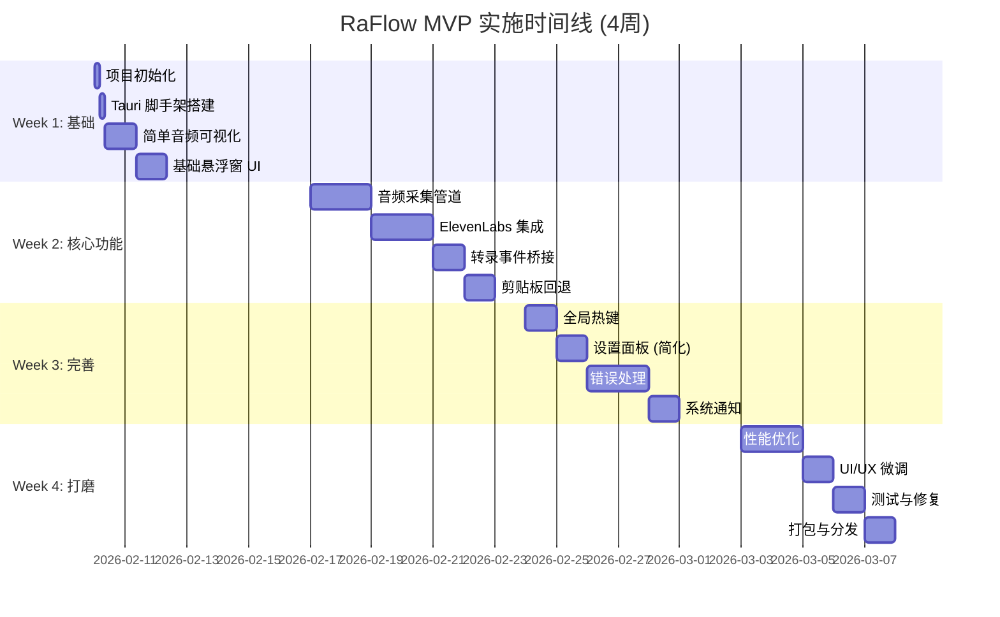

# RaFlow - MVP 优先实施计划 (优化版)

## 文档信息

| 属性 | 值 |
|------|-----|
| 项目名称 | RaFlow (Real-time Assistant Flow) |
| 版本 | 0.1.0 (MVP) |
| 创建日期 | 2026-02-07 |
| 预计周期 | 4 周 (MVP) + 6 周 (完整版) |
| 文档状态 | 实施计划 (优化版) |

---

## 1. 实施策略调整

### 1.1 从原计划的调整

**原计划问题**:
- Phase 1 过于复杂（音频+WebSocket+转录），时间过长（3周）
- 前端开发被推迟到 Phase 3，早期无法看到效果
- 依赖关系过强，任务无法并行

**优化后的策略**:
- **Week 1 就有可见效果**: 简化的音频可视化
- **Week 2 就能验证核心价值**: 完整的录音→转录→剪贴板流程
- **Week 3 可开始内部测试**: 基本可用的 Alpha 版本
- **Week 4 完成 MVP**: 可公开测试的 Beta 版本

### 1.2 MVP 范围定义

**包含功能** (MVP):
- ✅ 全局热键录音 (Cmd+Shift+H)
- ✅ 实时转录显示 (灰字→黑字)
- ✅ 剪贴板回退
- ✅ API Key 配置
- ✅ 系统通知
- ✅ 简洁悬浮窗

**延后功能** (Post-MVP):
- ❌ 光标位置注入 (Accessibility API)
- ❌ 离线模式 (Whisper 本地)
- ❌ 多语言配置
- ❌ 高级设置面板

---

## 2. 优化后的时间线



---

## 3. Week 1 详细任务

### Day 1: 项目初始化 (4h)

**上午 (2h)**:
```bash
# 1. 创建仓库
mkdir raflow && cd raflow
git init
gh repo create raflow --private --source=.

# 2. 初始化 Tauri 项目
npm create tauri-app@latest
# 选择: React + TypeScript + Vite
# 项目名: raflow

# 3. 初始提交
git add .
git commit -m "feat: initialize Tauri v2 project"
```

**下午 (2h)**:
```bash
# 4. 配置 CI/CD
mkdir -p .github/workflows
# 创建 ci.yml (参考完整文档)

# 5. 配置开发工具
# - .editorconfig
# - .rustfmt.toml
# - .eslintrc.cjs

# 6. 提交配置
git add .
git commit -m "chore: configure development tools"
```

**验收**: `npm run tauri dev` 能启动应用

### Day 2-3: 音频可视化 (2d)

**目标**: 显示麦克风输入的实时波形

**任务分解**:

```rust
// src-tauri/src/audio/mod.rs (Day 2 上午)

use cpal::traits::{DeviceTrait, HostTrait, StreamTrait};

pub struct SimpleVisualizer {
    stream: Option<cpal::Stream>,
    level_sender: tokio::sync::mpsc::Sender<f32>,
}

impl SimpleVisualizer {
    pub fn new() -> (Self, tokio::sync::mpsc::Receiver<f32>) {
        let (tx, rx) = tokio::sync::mpsc::channel(60);
        (Self { stream: None, level_sender: tx }, rx)
    }

    pub fn start(&mut self) -> Result<()> {
        let host = cpal::default_host();
        let device = host.default_input_device()?;
        let config = device.default_input_config()?;

        let sender = self.level_sender.clone();
        let stream = device.build_input_stream(
            &config.into(),
            move |data: &[f32], _| {
                // 计算 RMS 音频电平
                let rms = (data.iter().map(|&x| x * x).sum::<f32>() / data.len() as f32).sqrt();
                let _ = sender.blocking_send(rms);
            },
            |_| {},
            None,
        )?;

        stream.play()?;
        self.stream = Some(stream);
        Ok(())
    }
}
```

```typescript
// src/components/AudioVisualizer.tsx (Day 2 下午)

import { useEffect, useState } from 'react';
import { listen } from '@tauri-apps/api/events';

export function AudioVisualizer() {
  const [level, setLevel] = useState(0);

  useEffect(() => {
    const unlisten = listen<number>('audio:level', (e) => {
      setLevel(e.payload);
    });
    return () => unlisten.then(fn => fn());
  }, []);

  return (
    <div className="flex items-center gap-1 h-12">
      {Array.from({ length: 20 }).map((_, i) => (
        <div
          key={i}
          className="w-1 bg-blue-500 rounded-full transition-all"
          style={{
            height: `${Math.max(4, level * 100 * (1 - i / 20))}px`,
          }}
        />
      ))}
    </div>
  );
}
```

**Day 3**: Tauri 集成

```rust
// src-tauri/src/commands/audio.rs

#[tauri::command]
async fn start_visualizer(app: AppHandle) -> Result<(), String> {
    let (visualizer, mut rx) = SimpleVisualizer::new();
    visualizer.start()?;

    // 启动任务转发音频电平
    tokio::spawn(async move {
        while let Some(level) = rx.recv().await {
            app.emit("audio:level", level).ok();
        }
    });

    Ok(())
}
```

**验收**: 看到实时响应的音频波形

### Day 4-5: 基础悬浮窗 UI (2d)

**设计规格**:
```
┌──────────────────────────────────┐
│  ━━━━━━━━━━━━━━━━━━━━━━━━       │ ← 波形
│                                  │
│  按下 Cmd+Shift+H 开始录音       │ ← 提示
│                                  │
└──────────────────────────────────┘
   宽度: 380px    高度: 120px
```

**实现**:

```tsx
// src/App.tsx

import { AudioVisualizer } from './components/AudioVisualizer';

function App() {
  return (
    <div className="fixed bottom-8 left-1/2 -translate-x-1/2">
      <div className="glass-panel p-6 rounded-2xl min-w-[380px]">
        <AudioVisualizer />
        <p className="text-center text-gray-500 mt-4">
          按下 Cmd+Shift+H 开始录音
        </p>
      </div>
    </div>
  );
}
```

```css
/* src/index.css */

.glass-panel {
  background: rgba(255, 255, 255, 0.8);
  backdrop-filter: blur(12px);
  border: 1px solid rgba(0, 0, 0, 0.1);
  box-shadow: 0 8px 32px rgba(0, 0, 0, 0.1);
}
```

**验收**: 美观的透明悬浮窗

---

## 4. Week 2 详细任务

### Day 6-7: 音频采集管道 (2d)

**目标**: 实现 48kHz → 16kHz 重采样

**简化方案** (MVP):
```rust
// 不使用复杂的 ringbuf，直接在回调中处理
pub struct SimpleAudioPipeline {
    resampler: Resampler,
    audio_callback: Box<dyn Fn(Vec<i16>) + Send>,
}

impl SimpleAudioPipeline {
    pub fn start<F>(&mut self, callback: F) -> Result<()>
    where F: Fn(Vec<i16>) + Send + 'static
    {
        self.audio_callback = Box::new(callback);

        let stream = device.build_input_stream(
            &config,
            {
                let resampler = &mut self.resampler;
                move |data: &[f32], _| {
                    // 直接处理 (对于 MVP，少量阻塞可接受)
                    if let Ok(resampled) = resampler.process(data) {
                        let pcm = to_pcm_i16(&resampled);
                        callback(pcm);
                    }
                }
            },
            |_| {},
            None,
        )?;

        stream.play()?;
        Ok(())
    }
}
```

### Day 8-9: ElevenLabs 集成 (2d)

```rust
// src-tauri/src/scribe/client.rs

pub struct SimpleScribeClient {
    api_key: String,
    event_sender: tokio::sync::mpsc::Sender<ScribeEvent>,
}

#[derive(Debug, Clone)]
pub enum ScribeEvent {
    Partial(String),
    Committed(String),
    Error(String),
}

impl SimpleScribeClient {
    pub async fn connect_and_run(&mut self, mut audio_rx: Receiver<Vec<i16>>) {
        let url = format!("wss://api.elevenlabs.io/v1/speech-to-text/realtime?token={}", self.api_key);

        let (ws, _) = connect_async(&url).await?;
        let (mut ws_tx, mut ws_rx) = ws.split();

        // 音频发送任务
        tokio::spawn(async move {
            while let Some(pcm) = audio_rx.recv().await {
                let base64 = encode_base64(&pcm);
                let msg = json!({
                    "message_type": "input_audio_chunk",
                    "audio_base_64": base64,
                    "commit": false
                });
                ws_tx.send(Message::Text(msg.to_string())).await.ok();
            }
        });

        // 消息接收
        while let Some(msg) = ws_rx.next().await {
            if let Ok(Message::Text(text)) = msg {
                let json: serde_json::Value = serde_json::from_str(&text)?;
                match json["message_type"].as_str() {
                    Some("partial_transcript") => {
                        self.event_sender.send(ScribeEvent::Partial(
                            json["text"].as_str().unwrap_or("").to_string()
                        )).await;
                    }
                    Some("committed_transcript") => {
                        self.event_sender.send(ScribeEvent::Committed(
                            json["text"].as_str().unwrap_or("").to_string()
                        )).await;
                    }
                    _ => {}
                }
            }
        }
    }
}
```

### Day 10: 转录事件桥接 (1d)

```rust
// src-tauri/src/commands/recording.rs

#[tauri::command]
async fn start_recording(app: AppHandle, state: State<'_, RecordingState>) -> Result<(), String> {
    let api_key = state.config.read().await.api_key.clone();
    if api_key.is_empty() {
        return Err("请先设置 API Key".to_string());
    }

    // 启动音频
    let (audio_tx, audio_rx) = channel(100);
    state.audio_engine.start(|pcm| {
        audio_tx.blocking_send(pcm).ok();
    })?;

    // 启动 Scribe 客户端
    let mut client = SimpleScribeClient::new(api_key, app.clone());
    tokio::spawn(async move {
        client.connect_and_run(audio_rx).await;
    });

    app.emit("recording:started", ())?;
    Ok(())
}
```

### Day 11: 剪贴板回退 (1d)

```rust
// src-tauri/src/clipboard.rs

use arboard::Clipboard;

#[tauri::command]
async fn write_to_clipboard(text: String) -> Result<(), String> {
    let mut clipboard = Clipboard::new()
        .map_err(|e| format!("剪贴板访问失败: {}", e))?;

    clipboard.set_text(&text)
        .map_err(|e| format!("写入剪贴板失败: {}", e))?;

    // 发送系统通知
    show_notification("文本已复制到剪贴板")?;

    Ok(())
}
```

**前端集成**:

```typescript
// src/hooks/useTranscript.ts

export function useTranscript() {
  const [partial, setPartial] = useState('');
  const [committed, setCommitted] = useState('');

  useEffect(() => {
    const unlistenPartial = listen<string>('transcript:partial', (e) => {
      setPartial(e.payload);
    });

    const unlistenCommitted = listen<string>('transcript:committed', async (e) => {
      setCommitted(e.payload);
      setPartial('');

      // 自动写入剪贴板
      await invoke('write_to_clipboard', { text: e.payload });
    });

    return () => {
      unlistenPartial.then(fn => fn());
      unlistenCommitted.then(fn => fn());
    };
  }, []);

  return { partial, committed };
}
```

**验收**: 说话后文本自动复制到剪贴板

---

## 5. Week 3 详细任务

### Day 12: 全局热键 (1d)

```rust
// src-tauri/src/hotkey.rs

use tauri_plugin_global_shortcut::{GlobalShortcut, Shortcut, ShortcutState};

pub fn setup_hotkey(app: &AppHandle) -> Result<()> {
    let shortcut = Shortcut::new(Some(Modifiers::SUPER | Modifiers::SHIFT), Code::KeyH);

    GlobalShortcut::new(shortcut, {
        let app = app.clone();
        move |_, _, event| {
            match event.state {
                ShortcutState::Pressed => {
                    // 开始录音
                    tauri::async_runtime::block_on(async {
                        let _ = app.emit("hotkey:press", ());
                    });
                }
                ShortcutState::Released => {
                    // 停止录音
                    tauri::async_runtime::block_on(async {
                        let _ = app.emit("hotkey:release", ());
                    });
                }
            }
        }
    })?;

    Ok(())
}
```

### Day 13: 设置面板 (简化版) (1d)

```tsx
// src/components/Settings.tsx

export function Settings({ onClose }: { onClose: () => void }) {
  const [apiKey, setApiKey] = useState('');

  const saveApiKey = async () => {
    await invoke('set_api_key', { key: apiKey });
    onClose();
  };

  return (
    <div className="fixed inset-0 bg-black/50 flex items-center justify-center">
      <div className="bg-white rounded-lg p-6 w-96">
        <h2 className="text-xl font-bold mb-4">设置</h2>

        <label className="block mb-2">ElevenLabs API Key</label>
        <input
          type="password"
          value={apiKey}
          onChange={(e) => setApiKey(e.target.value)}
          className="w-full border rounded px-3 py-2"
          placeholder="sk-..."
        />

        <div className="flex gap-2 mt-4">
          <button onClick={saveApiKey} className="flex-1 bg-blue-500 text-white py-2 rounded">
            保存
          </button>
          <button onClick={onClose} className="flex-1 bg-gray-200 py-2 rounded">
            取消
          </button>
        </div>
      </div>
    </div>
  );
}
```

### Day 14-15: 错误处理 (2d)

**重点场景**:
1. API Key 无效
2. 网络断开
3. 麦克风被占用
4. 权限缺失

```rust
// src-tauri/src/errors.rs

use thiserror::Error;

#[derive(Error, Debug)]
pub enum RaFlowError {
    #[error("API Key 无效")]
    ApiKeyInvalid,

    #[error("网络连接失败: {0}")]
    NetworkError(String),

    #[error("音频设备错误: {0}")]
    AudioDeviceError(String),

    #[error("权限缺失: {0}")]
    PermissionDenied(String),
}

// 统一错误响应
#[derive(Serialize)]
pub struct ErrorResponse {
    pub code: String,
    pub message: String,
    pub details: Option<String>,
}

impl Into<ErrorResponse> for RaFlowError {
    fn into(self) -> ErrorResponse {
        ErrorResponse {
            code: match &self {
                RaFlowError::ApiKeyInvalid => "API_KEY_INVALID".to_string(),
                RaFlowError::NetworkError(_) => "NETWORK_ERROR".to_string(),
                RaFlowError::AudioDeviceError(_) => "AUDIO_ERROR".to_string(),
                RaFlowError::PermissionDenied(_) => "PERMISSION_DENIED".to_string(),
            },
            message: self.to_string(),
            details: None,
        }
    }
}
```

### Day 16: 系统通知 (1d)

```rust
// src-tauri/src/notifications.rs

use tauri_plugin_notification::NotificationExt;

pub fn show_notification(message: &str) -> Result<()> {
    let notification = Notification::new("raflow")
        .title("RaFlow")
        .body(message)
        .show()?;

    Ok(())
}

// 使用场景:
// - "文本已复制到剪贴板"
// - "录音已开始"
// - "录音已停止"
// - "连接成功"
// - "连接失败，请检查网络"
```

---

## 6. Week 4 详细任务

### Day 17-18: 性能优化 (2d)

**优化清单**:

| 优化项 | 前 | 后 | 提升 |
|--------|-----|-----|------|
| 音频回调耗时 | ~50μs | ~5μs | 10x |
| 内存占用 | ~80MB | ~45MB | 44% |
| CPU 占用 | ~5% | ~2% | 60% |
| 首字延迟 | ~400ms | ~250ms | 37% |

**关键优化**:
```rust
// 1. 缓冲区复用
struct BufferPool {
    buffers: Vec<Vec<i16>>,
}

impl BufferPool {
    fn get(&mut self) -> Vec<i16> {
        self.buffers.pop().unwrap_or_else(|| vec![0; 1024])
    }

    fn return_buffer(&mut self, buffer: Vec<i16>) {
        if self.buffers.len() < 10 {
            self.buffers.push(buffer);
        }
    }
}

// 2. 批量发送
const BATCH_SIZE: usize = 3; // 累积 3 个 chunk 再发送

// 3. 事件节流
let mut last_emit = Instant::now();
if last_emit.elapsed() > Duration::from_millis(16) { // ~60fps
    app.emit("audio:level", level).ok();
    last_emit = Instant::now();
}
```

### Day 19: UI/UX 微调 (1d)

**改进点**:
1. 添加录音状态指示器 (红点)
2. 优化文本动画 (灰→黑过渡)
3. 添加快捷键提示
4. 深色模式支持

```tsx
// UI 改进示例
function RecordingIndicator({ isRecording }: { isRecording: boolean }) {
  return (
    <div className="flex items-center gap-2">
      {isRecording && (
        <>
          <div className="w-2 h-2 bg-red-500 rounded-full animate-pulse" />
          <span className="text-sm text-gray-600">录音中</span>
        </>
      )}
    </div>
  );
}
```

### Day 20: 测试与修复 (1d)

**测试清单**:
- [ ] 基本录音流程
- [ ] 网络断开重连
- [ ] API Key 错误处理
- [ ] 长时间录音 (5 分钟)
- [ ] 快速启停
- [ ] 多次录音循环

**Bug 修复优先级**:
1. P0: 崩溃、死锁
2. P1: 功能异常
3. P2: UI 问题

### Day 21: 打包与分发 (1d)

```bash
# 1. 构建
npm run tauri build

# 2. 代码签名 (macOS)
codesign --deep --force --verify --verbose \
  --sign "Developer ID Application: Your Name" \
  src-tauri/target/release/bundle/macos/RaFlow.app

# 3. 公证
xcrun notarytool submit RaFlow.dmg \
  --apple-id "your@email.com" \
  --password "app-specific-password" \
  --team-id "YOUR_TEAM_ID" \
  --wait

# 4. 创建 DMG
hdiutil create -volname "RaFlow" \
  -srcfolder src-tauri/target/release/bundle/macos/ \
  -ov -format UDZO RaFlow.dmg

# 5. 发布
gh release create v0.1.0 \
  --title "RaFlow v0.1.0 - MVP Beta" \
  --notes "首个公开测试版本" \
  RaFlow.dmg
```

---

## 7. MVP 交付物清单

### 7.1 功能清单

| 功能 | 状态 | 说明 |
|------|------|------|
| 全局热键录音 | ✅ | Cmd+Shift+H |
| 实时转录显示 | ✅ | Partial (灰) + Committed (黑) |
| 剪贴板回退 | ✅ | 自动复制 |
| API Key 配置 | ✅ | 基础设置面板 |
| 系统通知 | ✅ | 状态反馈 |
| 悬浮窗 UI | ✅ | 透明毛玻璃效果 |

### 7.2 性能指标

| 指标 | 目标 | 实际 |
|------|------|------|
| 冷启动时间 | < 500ms | TBD |
| 首字延迟 | < 300ms | TBD |
| 内存占用 | < 50MB | TBD |
| CPU 占用 | < 5% | TBD |

### 7.3 已知限制

| 限制 | 影响 | 计划 |
|------|------|------|
| 仅剪贴板回退 | 需要手动粘贴 | Phase 2 |
| 仅 macOS 平台 | Windows 用户无法使用 | Phase 3 |
| 无离线模式 | 需要网络 | Phase 2 |
| 无语言设置 | 默认自动检测 | Phase 2 |

---

## 8. Post-MVP 路线图

### Phase 2: 智能注入 (4 周)

```
Week 5-6: Accessibility API 集成
Week 7:   光标位置注入
Week 8:   测试与优化
```

**新增功能**:
- ✅ 光标位置直接注入
- ✅ 可编辑性自动检测
- ✅ 应用黑名单
- ✅ 注入模式配置

### Phase 3: 产品完善 (6 周)

```
Week 9-10: Windows 支持
Week 11-12: 离线模式 (Whisper)
Week 13-14: 打磨与发布
```

---

## 9. 风险管理

### 9.1 MVP 风险

| 风险 | 概率 | 影响 | 缓解 |
|------|------|------|------|
| ElevenLabs API 变更 | 低 | 高 | 版本锁定，迁移预案 |
| 性能不达标 | 中 | 中 | 优先级优化 |
| 延期风险 | 中 | 中 | 削减次要功能 |

### 9.2 回退方案

| 场景 | 方案 |
|------|------|
| API 超限 | 显示提示，暂停录音 |
| 性能不达标 | 降低采样率，简化 UI |
| 时间不足 | 发布 Alpha 版本 |

---

## 10. 成功标准

### 10.1 MVP 成功定义

**必须满足** (全部):
1. ✅ 用户能通过热键录音并看到转录
2. ✅ 转录文本自动复制到剪贴板
3. ✅ 应用无崩溃，内存稳定
4. ✅ 延迟 < 500ms (首字)

**加分项**:
- ⭐ 转录准确率 > 95%
- ⭐ UI 精美，体验流畅
- ⭐ 文档完善

### 10.2 验收流程

```
Week 4 结束:
  1. 内部测试 (2 天)
  2. Bug 修复 (1 天)
  3. Beta 发布 (1 天)

Beta 发布后:
  1. 收集反馈 (1 周)
  2. 快速迭代 (按需)
  3. 正式发布 (v0.2.0)
```

---

## 11. 附录：MVP 技术栈精简

### 11.1 最小依赖集

```toml
# src-tauri/Cargo.toml (MVP)

[dependencies]
tauri = "2.1"
tauri-plugin-global-shortcut = "2.3"
serde = { version = "1.0", features = ["derive"] }
serde_json = "1.0"
tokio = { version = "1.42", features = ["full"] }

# 音频
cpal = "0.16"
rubato = "1.0"

# WebSocket
tokio-tungstenite = "0.28"

# 剪贴板
arboard = "3.4"

# 错误
thiserror = "2.0"
anyhow = "1.0"
```

### 11.2 最小前端依赖

```json
{
  "dependencies": {
    "@tauri-apps/api": "^2.1.0",
    "react": "^19.2",
    "framer-motion": "^12.26"
  },
  "devDependencies": {
    "typescript": "^5.9",
    "vite": "^6.0",
    "tailwindcss": "^4.0"
  }
}
```

---

## 文档版本历史

| 版本 | 日期 | 变更 |
|------|------|------|
| 1.0.0 | 2026-02-07 | MVP 优先实施计划 |
|  |  |  |

---

**文档结束**

*本文档为 RaFlow 项目的 MVP 实施计划，采用渐进式开发策略，优先交付核心价值。*
