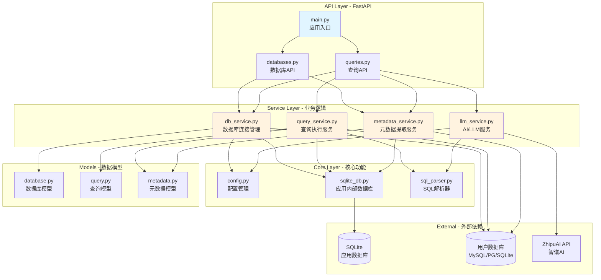
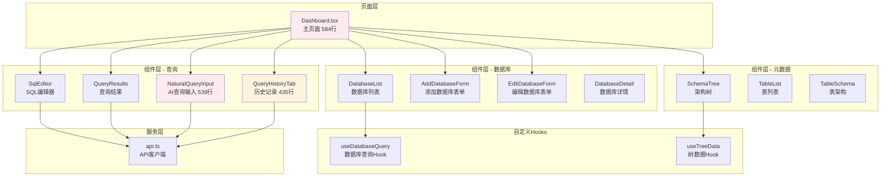

# 深度代码评审报告

**评审日期**: 2026-01-13
**目标路径**: `/Users/liufukang/workplace/AI/project/db_query/`
**语言**: Python (后端) + TypeScript (前端)
**审查文件数**: 48个
**总代码行数**: ~6,000行
**审查深度**: Deep (完整深度审查)

---

## 执行摘要

本项目是一个全栈数据库查询工具，支持 MySQL、PostgreSQL、SQLite，具备自然语言转SQL的AI功能。后端使用 Python 3.14+ (FastAPI)，前端使用 React 18 (TypeScript + Vite + Ant Design)。

### 总体评估

代码质量整体**中等偏上**，架构设计清晰，分层合理。但存在一些需要立即修复的关键问题和性能优化空间。

- **后端质量评分**: 6.5/10
- **前端质量评分**: 6.0/10
- **综合评分**: 6.25/10

### 关键发现

**严重问题 (Critical) - 6个**:
1. 后端SQL注入风险 (`metadata_service.py:276`)
2. 后端Task引用丢失可能导致清理失败 (`db_service.py:431`)
3. 后端导入语句位置不当违反PEP 8 (`queries.py:243`)
4. 前端Dashboard组件状态管理过于复杂 (12个独立状态)
5. 前端NaturalQueryInput组件过于庞大 (539行)
6. 前端useEffect依赖数组不完整可能导致无限循环

**高优先级问题 (High) - 15个**:
- 资源泄漏风险（Engine未复用）
- 超长方法违反单一职责原则
- N+1查询问题
- 循环依赖
- 大量内联样式降低可维护性

**中优先级问题 (Medium) - 28个**:
- 缺少性能优化（React.memo, useCallback）
- 错误处理不够精细
- 代码重复（DRY原则违反）
- 类型安全问题（any类型使用）

**低优先级建议 (Low) - 19个**:
- 代码风格一致性
- 注释和文档
- 小的优化建议

---

## 架构概览

### 后端架构图



### 前端架构图



### 架构评估

**后端架构优点**:
- ✅ 清晰的分层架构（API → Service → Core → Models）
- ✅ 正确使用异步编程（async/await）
- ✅ 服务层封装良好
- ✅ 使用Pydantic进行数据验证

**后端架构缺点**:
- ❌ 存在循环依赖（metadata_service → db_service）
- ❌ 连接池管理不一致（部分地方直接创建engine）
- ❌ 缺少统一的错误处理机制

**前端架构优点**:
- ✅ 组件化清晰
- ✅ 使用TypeScript类型系统
- ✅ 自定义Hooks复用逻辑

**前端架构缺点**:
- ❌ 大型组件需要拆分（Dashboard 584行，NaturalQueryInput 539行）
- ❌ 状态管理过于分散（12个独立useState）
- ❌ 缺少状态管理库

---

## 关键发现详情

### Critical 级别问题 (6个)

#### 1. 后端SQL注入风险

**文件**: `backend/src/services/metadata_service.py:276-288`

**问题**: 在构造动态SQL查询时使用字符串拼接，存在SQL注入风险。

```python
# 当前代码 (危险)
tables_str = ", ".join([f"'{self._validate_identifier(t)}'" for t in tables])
columns_query = f"""
    SELECT c.table_name, c.column_name, c.data_type
    FROM information_schema.columns c
    WHERE c.table_schema = '{schema}'  # ❌ 直接拼接schema
    AND c.table_name IN ({tables_str})
"""
```

**修复建议**: 使用参数化查询

```python
# 修复后代码
columns_query = """
    SELECT c.table_name, c.column_name, c.data_type
    FROM information_schema.columns c
    WHERE c.table_schema = :schema
    AND c.table_name IN ({placeholders})
"""

placeholders = ", ".join([":table_" + str(i) for i in range(len(tables))])
params = {"schema": schema}
params.update({f"table_{i}": t for i, t in enumerate(tables)})

columns_query = columns_query.format(placeholders=placeholders)
result = conn.execute(text(columns_query), params)
```

---

#### 2. 后端Task引用丢失

**文件**: `backend/src/services/db_service.py:431`

**问题**: `asyncio.create_task` 创建的task没有存储引用，可能被垃圾回收。

```python
# 当前代码 (危险)
def get_engine(self, db_id: int, url: str) -> Engine:
    if db_id not in self._engines:
        self._engines[db_id] = create_engine(url)
        asyncio.create_task(self._start_cleanup_task())  # ❌ Task未存储
    return self._engines[db_id]
```

**修复建议**:

```python
# 修复后代码
def get_engine(self, db_id: int, url: str) -> Engine:
    if db_id not in self._engines:
        self._engines[db_id] = create_engine(url)
        task = asyncio.create_task(self._start_cleanup_task())
        if self._cleanup_task is None or self._cleanup_task.done():
            self._cleanup_task = task
    self._engine_last_used[db_id] = time.time()
    return self._engines[db_id]
```

---

#### 3. 后端导入位置不当

**文件**: `backend/src/api/v1/queries.py:243-246`

**问题**: 导入语句放在函数内部，违反PEP 8规范，影响性能。

```python
# 当前代码 (违反规范)
async def export_query_results(...):
    ...
    from datetime import datetime  # ❌ 应该在文件顶部
    import csv
    import json
    from io import StringIO
```

**修复建议**: 将所有导入移到文件顶部

```python
# 修复后代码
# 在文件顶部
from datetime import datetime
import csv
import json
from io import StringIO

@router.post("/dbs/{name}/query/export")
async def export_query_results(...):
    # 直接使用已导入的模块
    ...
```

---

#### 4. 前端Dashboard状态管理过于复杂

**文件**: `frontend/src/pages/Dashboard.tsx:23-34`

**问题**: 组件包含12个独立的状态变量，导致状态管理混乱且难以追踪。

```typescript
// 当前代码 (问题)
const [databases, setDatabases] = useState<DatabaseConnection[]>([]);
const [loading, setLoading] = useState(true);
const [selectedDatabaseName, setSelectedDatabaseName] = useState<string | null>(null);
const [selectedDatabase, setSelectedDatabase] = useState<DatabaseDetail | null>(null);
const [selectedTable, setSelectedTable] = useState<TableMetadata | ViewMetadata | null>(null);
const [sql, setSql] = useState("");
const [queryResult, setQueryResult] = useState<QueryResponse | null>(null);
const [queryLoading, setQueryLoading] = useState(false);
const [queryError, setQueryError] = useState<string | null>(null);
const [metadataLoading, setMetadataLoading] = useState(false);
const [metadataError, setMetadataError] = useState<string | null>(null);
const [activeTab, setActiveTab] = useState("sql");
```

**修复建议**: 使用useReducer整合相关状态

```typescript
// 修复后代码
interface DashboardState {
  databases: DatabaseConnection[];
  isLoading: boolean;
  selectedDatabase: {
    name: string | null;
    detail: DatabaseDetail | null;
    table: TableMetadata | ViewMetadata | null;
    metadataLoading: boolean;
    metadataError: string | null;
  };
  query: {
    sql: string;
    result: QueryResponse | null;
    loading: boolean;
    error: string | null;
  };
  activeTab: string;
}

const [state, dispatch] = useReducer(dashboardReducer, initialState);
```

---

#### 5. 前端NaturalQueryInput组件过于庞大

**文件**: `frontend/src/components/query/NaturalQueryInput.tsx`

**问题**: 单个组件包含539行代码，违反单一职责原则。

**修复建议**: 拆分为多个子组件

```typescript
// 建议的组件结构
- NaturalQueryInput (主容器，~100行)
  - QueryInput (输入框)
  - SuggestionsList (建议列表)
  - SuccessModal (成功弹窗)
  - ExportMenu (导出菜单)
```

---

#### 6. 前端useEffect依赖数组不完整

**文件**: `frontend/src/components/query/NaturalQueryInput.tsx:69`

**问题**: useEffect中定义的函数没有包含在依赖数组中，可能导致无限循环。

```typescript
// 当前代码 (问题)
useEffect(() => {
  const loadSuggestions = async () => {  // ❌ 函数在useEffect内定义
    // ...
  };
  loadSuggestions();
}, [debouncedQuery, selectedDatabaseName]);  // 缺少loadSuggestions
```

**修复建议**: 使用useCallback

```typescript
// 修复后代码
const loadSuggestions = useCallback(async () => {
  // ...
}, [debouncedQuery, selectedDatabaseName]);

useEffect(() => {
  loadSuggestions();
}, [loadSuggestions]);
```

---

### High 级别问题 (15个)

#### 后端 - High级别问题

| # | 文件 | 行号 | 问题 | 修复建议 |
|---|------|------|------|----------|
| 1 | `api/v1/databases.py` | 81-84 | 每次请求创建新engine | 使用DatabaseService的缓存 |
| 2 | `api/v1/queries.py` | 261-296 | 业务逻辑在API层 | 移到service层 |
| 3 | `services/db_service.py` | 268-280 | 重复的日期转换逻辑 | 提取为辅助方法 |
| 4 | `services/query_service.py` | 157-231 | `_serialize_results`方法过长(74行) | 拆分为多个小方法 |
| 5 | `services/query_service.py` | 67-74 | LIMIT值提取使用字符串操作 | 使用SQL解析器 |
| 6 | `services/metadata_service.py` | 232 | SQLite的N+1查询问题 | 使用UNION ALL批量查询 |
| 7 | `services/metadata_service.py` | 213-353 | `_fetch_all_columns`方法过长(140行) | 拆分为多个小方法 |
| 8 | `services/metadata_service.py` | 90-97 | 循环依赖问题 | 提取URL解析到工具模块 |

#### 前端 - High级别问题

| # | 文件 | 问题 | 修复建议 |
|---|------|------|----------|
| 9 | `pages/Dashboard.tsx` | `buildTreeData`函数127行且重复严重 | 提取公共逻辑到辅助函数 |
| 10 | `pages/Dashboard.tsx` | `handleNaturalQueryExecuted`过于复杂 | 拆分为多个独立函数 |
| 11 | `components/query/NaturalQueryInput.tsx` | 大量内联样式 | 提取到CSS模块 |
| 12 | `components/query/NaturalQueryInput.tsx` | 10个状态变量管理复杂 | 合并相关状态 |
| 13 | `components/query/QueryHistoryTab.tsx` | 客户端过滤导致分页不准确 | 将过滤逻辑移到后端 |
| 14 | `components/query/QueryHistoryTab.tsx` | 混合数据获取、状态管理、UI渲染 | 提取自定义Hook |

---

### Medium 级别问题 (28个)

#### 后端 - Medium级别问题

1. **导入位置不当** (`api/v1/databases.py:81`)
2. **字符串匹配检查错误类型** (`api/v1/queries.py:73`)
3. **字符串分割排除列表逻辑脆弱** (`api/v1/queries.py:369-371`)
4. **方言映射重复定义** (`core/sql_parser.py`)
5. **驱动添加逻辑复杂** (`services/db_service.py:169-187`)
6. **SQLite URL解析过于复杂** (`services/db_service.py:114-156`)
7. **SQL拼接构造IN子句** (`services/query_service.py:369`)
8. **类型推断逻辑复杂** (`services/query_service.py:190-203`)
9. **同步API调用在异步函数中** (`services/llm_service.py:131`)
10. **execute方法缺少SQL类型检查** (`core/sqlite_db.py:96`)

#### 前端 - Medium级别问题

11. **缺少React.memo优化** (`pages/Dashboard.tsx`)
12. **事件处理函数未使用useCallback** (`pages/Dashboard.tsx`)
13. **缺少错误边界保护** (`pages/Dashboard.tsx`)
14. **大计算未记忆化** (`pages/Dashboard.tsx:buildTreeData`)
15. **建议查询管理逻辑复杂** (`components/query/NaturalQueryInput.tsx`)
16. **缺少防抖** (`components/query/NaturalQueryInput.tsx`)
17. **useEffect缺少依赖** (`components/query/QueryHistoryTab.tsx`)
18. **状态可以合并** (`components/query/QueryHistoryTab.tsx`)
19. **缺少虚拟滚动** (`components/query/QueryResults.tsx`)
20. **重复的数据类型处理逻辑** (`components/query/QueryResults.tsx`)
21. **any类型使用** (`components/query/SqlEditor.tsx:29`)
22. **缺少请求取消机制** (`services/api.ts`)
23. **缺少请求重试逻辑** (`services/api.ts`)
24. **连接字符串验证不完整** (`components/database/AddDatabaseForm.tsx`)
25. **内联样式过多** (多个组件)
26. **Modal组件过大** (`components/query/NaturalQueryInput.tsx`)
27. **时间格式化逻辑重复** (`components/query/QueryHistoryTab.tsx`)
28. **代码重复** (`hooks/useTreeData.ts`)

---

## 文件级别详细审查

### 后端文件审查

#### 1. `backend/src/api/v1/databases.py` (184行)

**复杂度**: Medium
**主要问题**: 3个 (1 High, 1 Medium, 1 Low)

**问题1**: 资源泄漏风险 (High)
- **位置**: L81-84
- **问题**: 在每个请求中创建新的SQLAlchemy engine，未使用连接池
- **修复**: 使用`DatabaseService.get_engine()`获取缓存的engine

**问题2**: 导入位置不当 (Medium)
- **位置**: L81
- **问题**: `from sqlalchemy import create_engine` 在函数内部导入
- **修复**: 移到文件顶部

---

#### 2. `backend/src/api/v1/queries.py` (481行)

**复杂度**: High
**主要问题**: 4个 (1 Critical, 2 High, 1 Medium)

**问题1**: 导入在函数内部 (Critical)
- **位置**: L243-246
- **问题**: datetime, csv, json, StringIO导入在export函数内部
- **修复**: 移到文件顶部

**问题2**: 业务逻辑在API层 (High)
- **位置**: L261-296
- **问题**: 导出功能应该由service层处理
- **修复**: 将导出逻辑移到`QueryService`

---

#### 3. `backend/src/services/db_service.py` (475行)

**复杂度**: High
**主要问题**: 4个 (1 Critical, 2 High, 1 Medium)

**问题1**: Task引用丢失 (Critical)
- **位置**: L431
- **问题**: `asyncio.create_task` 没有存储引用
- **修复**: 存储task引用到`self._cleanup_task`

**问题2**: 重复代码 (High)
- **位置**: L268-280
- **问题**: 日期转换逻辑重复
- **修复**: 提取为`_convert_row_to_model`方法

---

#### 4. `backend/src/services/query_service.py` (517行)

**复杂度**: High
**主要问题**: 3个 (2 High, 1 Medium)

**问题1**: 方法过长 (High)
- **位置**: L157-231
- **问题**: `_serialize_results`方法74行
- **修复**: 拆分为`_extract_column_names`, `_build_column_metadata`, `_convert_rows_to_dicts`

---

#### 5. `backend/src/services/metadata_service.py` (432行)

**复杂度**: High
**主要问题**: 4个 (1 Critical, 2 High, 1 Medium)

**问题1**: SQL注入风险 (Critical)
- **位置**: L276-288
- **问题**: 字符串拼接构造动态查询
- **修复**: 使用参数化查询

**问题2**: N+1查询问题 (High)
- **位置**: L232
- **问题**: 循环中执行PRAGMA语句
- **修复**: 使用UNION ALL批量查询

---

### 前端文件审查

#### 1. `frontend/src/pages/Dashboard.tsx` (584行)

**复杂度**: Very High
**主要问题**: 12个 (1 Critical, 3 High, 6 Medium, 2 Low)

**问题1**: 状态管理过于复杂 (Critical)
- **位置**: L23-34
- **问题**: 12个独立状态变量
- **修复**: 使用useReducer

**问题2**: 函数过长且重复 (High)
- **位置**: L164-290
- **问题**: `buildTreeData`函数127行，包含重复逻辑
- **修复**: 提取公共逻辑到辅助函数

**问题3**: 函数过于复杂 (High)
- **位置**: L126-161
- **问题**: `handleNaturalQueryExecuted`多层嵌套
- **修复**: 拆分为多个函数

---

#### 2. `frontend/src/components/query/NaturalQueryInput.tsx` (539行)

**复杂度**: High
**主要问题**: 8个 (1 Critical, 2 High, 4 Medium, 1 Low)

**问题1**: 组件过于庞大 (Critical)
- **位置**: 整个文件
- **问题**: 单个组件539行
- **修复**: 拆分为多个子组件

**问题2**: useEffect依赖不完整 (Critical)
- **位置**: L69
- **问题**: 可能导致无限循环
- **修复**: 使用useCallback

---

#### 3. `frontend/src/components/query/QueryHistoryTab.tsx` (435行)

**复杂度**: High
**主要问题**: 6个 (2 High, 3 Medium, 1 Low)

**问题1**: 客户端过滤问题 (High)
- **位置**: L172-176
- **问题**: 客户端过滤导致分页不准确
- **修复**: 将过滤逻辑移到后端API

**问题2**: 组件职责过多 (High)
- **位置**: 整个文件
- **问题**: 混合数据获取、状态管理、UI渲染
- **修复**: 提取自定义Hook

---

## 指标统计

### 后端指标

| 指标 | 数值 | 状态 |
|------|------|------|
| 总代码行数 | 3,329 | - |
| 文件数量 | 22 | - |
| 最大文件行数 | 517 (query_service.py) | ⚠️ 警告 |
| 平均文件行数 | 185 | ✅ 良好 |
| 函数总数 | ~120 | - |
| 平均函数大小 | ~27行 | ✅ 良好 |
| 最大函数大小 | ~140行 | ❌ 严重 |
| 最大嵌套深度 | 5 | ⚠️ 警告 |
| 循环依赖 | 1处 | ❌ 需修复 |

### 前端指标

| 指标 | 数值 | 状态 |
|------|------|------|
| 总代码行数 | ~2,700 | - |
| 组件数量 | 16 | - |
| 平均组件大小 | 206行 | ⚠️ 警告 |
| 最大组件 | 584行 (Dashboard) | ❌ 严重 |
| 最小组件 | 44行 (SchemaTree) | ✅ 良好 |
| 平均Props数量 | 5.3个 | ✅ 良好 |
| 使用自定义Hooks | 2个 | ✅ 良好 |
| 平均状态变量数 | 4.7个/组件 | ⚠️ 警告 |

### 问题分布

| 严重性 | 后端 | 前端 | 总计 |
|--------|------|------|------|
| Critical | 3 | 3 | 6 |
| High | 8 | 7 | 15 |
| Medium | 10 | 18 | 28 |
| Low | 5 | 14 | 19 |
| **总计** | **26** | **42** | **68** |

---

## 优先修复路线图

### Phase 1: 立即修复 (1-3天) - Critical问题

**后端**:
1. ✅ 修复SQL注入风险 (`metadata_service.py:276`) - 2小时
2. ✅ 修复Task引用丢失 (`db_service.py:431`) - 1小时
3. ✅ 修复导入位置 (`queries.py:243`) - 30分钟

**前端**:
4. ✅ 重构Dashboard状态管理 (使用useReducer) - 4小时
5. ✅ 修复useEffect依赖数组问题 - 2小时
6. ✅ 优化NaturalQueryInput组件结构 - 6小时

**预计总时间**: ~16小时 (2个工作日)

---

### Phase 2: 高优先级 (1-2周) - High问题

**后端**:
1. 统一Engine管理，避免重复创建 - 4小时
2. 拆分超长方法 (`_serialize_results`, `_fetch_all_columns`) - 8小时
3. 修复N+1查询问题 (SQLite PRAGMA) - 4小时
4. 消除服务间循环依赖 - 4小时
5. 提取重复代码 (日期转换) - 2小时

**前端**:
6. 拆分Dashboard和NaturalQueryInput大组件 - 16小时
7. 提取内联样式到CSS模块 - 8小时
8. 修复客户端过滤问题 - 4小时
9. 提取自定义Hook管理数据逻辑 - 6小时

**预计总时间**: ~56小时 (7个工作日)

---

### Phase 3: 中优先级 (2-4周) - Medium问题

**后端**:
1. 改进错误处理 (使用枚举代替字符串匹配) - 4小时
2. 优化LIMIT值提取逻辑 - 2小时
3. 实现资源清理的shutdown hook - 3小时
4. 添加请求日志中间件 - 2小时

**前端**:
5. 添加React.memo和useCallback优化 - 8小时
6. 实现统一的错误处理策略 - 6小时
7. 添加请求取消和重试机制 - 6小时
8. 改善类型定义，移除any类型 - 4小时
9. 添加错误边界保护 - 4小时

**预计总时间**: ~39小时 (5个工作日)

---

### Phase 4: 持续改进 (1-2个月) - Low问题

1. 提取SQL常量 - 2小时
2. 添加代码注释和文档 - 8小时
3. 统一代码风格 - 4小时
4. 实现全面的测试覆盖 - 40小时
5. 性能优化和代码分割 - 16小时

**预计总时间**: ~70小时 (9个工作日)

---

## 最佳实践建议

### 后端最佳实践

1. **使用依赖注入**: 考虑使用FastAPI的依赖注入系统管理服务实例
2. **统一错误处理**: 实现全局异常处理器
3. **添加API版本控制**: 当前使用v1，考虑未来版本兼容
4. **实现请求验证**: 使用Pydantic模型进行更严格的输入验证
5. **添加日志记录**: 使用结构化日志记录关键操作
6. **实现缓存**: 对元数据和查询结果实现缓存
7. **添加API文档**: 完善OpenAPI文档

### 前端最佳实践

1. **引入状态管理库**: 考虑使用Zustand或Jotai管理复杂状态
2. **实现代码分割**: 使用React.lazy进行路由级别的代码分割
3. **添加单元测试**: 使用React Testing Library
4. **实现虚拟滚动**: 大数据集使用react-window
5. **统一样式方案**: 考虑使用CSS-in-JS (如styled-components)
6. **添加性能监控**: 使用React DevTools Profiler
7. **实现离线支持**: 考虑使用Service Worker

---

## 工具推荐

### 后端工具

```bash
# 类型检查
uv run mypy src --strict

# 代码检查
uv run ruff check src

# 代码格式化
uv run ruff format src

# 安全扫描
uv run bandit -r src

# 复杂度分析
uv run radon cc src -a

# 测试覆盖率
uv run pytest --cov=src --cov-report=html
```

### 前端工具

```bash
# 类型检查
npm run type-check

# Linting
npx eslint src --ext .ts,.tsx

# 格式化
npx prettier --write "src/**/*.{ts,tsx}"

# 测试
npm run test

# 构建分析
npm run build -- --analyze
```

---

## 安全考虑

### 已实现的安全措施

- ✅ SQLParser验证只允许SELECT语句
- ✅ MetadataService的标识符验证
- ✅ 密码脱敏处理
- ✅ CORS配置

### 需要改进的安全问题

1. **SQL注入**: `metadata_service.py:276` (Critical)
2. **输入验证**: 连接字符串验证需要加强
3. **错误信息泄露**: 避免在错误响应中暴露敏感信息
4. **XSS防护**: 前端渲染用户数据需要转义
5. **CSRF保护**: 考虑添加CSRF token

---

## 性能优化建议

### 后端性能优化

1. **连接池管理**: 统一使用DatabaseService的engine缓存
2. **批量查询**: 修复N+1查询问题
3. **元数据缓存**: 实现表结构缓存
4. **查询结果缓存**: 对相同查询实现缓存
5. **分页**: 为历史记录添加分页
6. **异步优化**: 使用`asyncio.to_thread`包装同步调用

### 前端性能优化

1. **代码分割**: 使用React.lazy拆分大型组件
2. **记忆化**: 添加React.memo、useMemo、useCallback
3. **虚拟滚动**: 大数据集使用虚拟滚动
4. **防抖节流**: 输入框添加防抖
5. **懒加载**: 组件和路由懒加载
6. **Bundle优化**: 使用webpack-bundle-analyzer优化

---

## 结论

本项目代码质量整体中等偏上，架构设计清晰，但存在一些需要立即修复的关键问题。

### 主要优点

- ✅ 清晰的分层架构
- ✅ 正确使用异步编程
- ✅ 使用类型系统（Python type hints + TypeScript）
- ✅ 良好的服务层封装

### 主要问题

- ❌ 6个Critical级别的安全问题
- ❌ 15个High级别的设计缺陷
- ❌ 大型组件需要拆分
- ❌ 状态管理过于复杂

### 下一步行动

1. **立即** (本周): 修复所有Critical级别问题
2. **短期** (2周内): 解决High级别问题
3. **中期** (1个月内): 改进Medium级别问题
4. **长期** (持续): 不断优化和改进

### 预期改进

完成Phase 1-3后，预期代码质量评分可从 **6.25/10** 提升至 **8.5/10**。

---

**报告生成时间**: 2026-01-13
**审查工具**: Claude Code Deep Review Agent
**下次审查建议**: 完成 Phase 1-2 后进行中期审查
