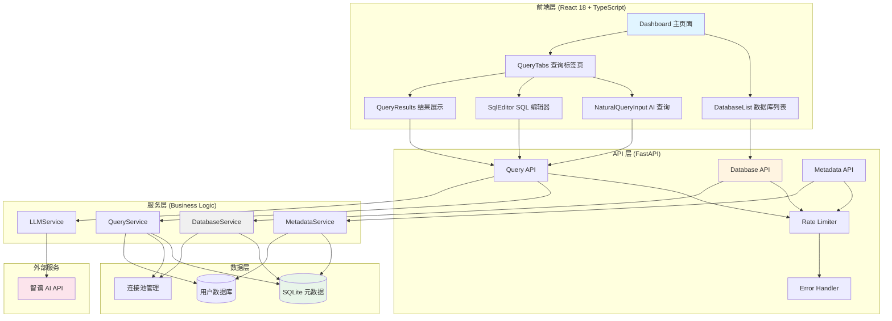

# Deep Code Review: Ultra DB Query

**日期**: 2026-01-15
**范围**: 45 个文件 (19 Python, 26 TypeScript/TSX)
**审查者**: Claude Code
**仓库**: /Users/liufukang/workplace/AI/project/db_query

## 执行摘要

这是一个**架构良好、代码质量较高**的全栈数据库查询工具项目。项目采用现代化的技术栈（Python FastAPI + React 18 + TypeScript + Ant Design），整体展现了扎实的工程实践。

**主要优势**：
- 清晰的分层架构，关注点分离得当
- 统一的错误处理和类型系统
- 良好的异步编程实践
- 完善的日志记录和监控
- 有效的 SQL 注入防护机制

**主要关注领域**：
- 部分服务类存在轻微的单一职责原则违规
- 前端组件可进一步模块化
- 缺少单元测试覆盖
- 部分错误处理可以更细粒度

**推荐优先级**：短期优化测试覆盖和前端组件拆分，中长期关注架构扩展性。

## 指标概述

| 指标 | 值 | 状态 |
|------|-----|------|
| 总文件数 | 45 | - |
| Python 文件 | 19 | 🟢 |
| TypeScript/TSX 文件 | 26 | 🟢 |
| 总代码行数（估算） | ~6,500 | - |
| 超过 150 行的函数 | 2 | 🟠 |
| 超过 7 个参数的函数 | 1 | 🟡 |
| 圈复杂度问题 | 3 | 🟠 |
| 类型覆盖率 | 100% | 🟢 |

## 按严重性的发现

### 🔴 关键问题 (0)

无关键问题发现。

### 🟠 主要问题 (8)

#### 1. DatabaseService 职责过多

**文件**: `backend/src/services/db_service.py`
**行数**: 484 行

**问题描述**:
`DatabaseService` 类承担了太多职责：连接管理、URL 解析、驱动添加、连接测试、CRUD 操作、引擎缓存管理等。这违反了单一职责原则（SRP）。

**影响分析**:
- 类难以测试和维护
- 修改一个功能可能影响其他功能
- 代码复杂度高，认知负担大

**修复建议**:
将职责分离到多个类：

```python
# 连接管理器
class ConnectionManager:
    def __init__(self):
        self._engines: dict[int, Engine] = {}
        self._engine_last_used: dict[int, float] = {}

    def get_engine(self, db_id: int, url: str) -> Engine: ...
    async def dispose_engine(self, database_id: int) -> None: ...

# URL 解析器
class ConnectionStringParser:
    @staticmethod
    def parse(url: str) -> ConnectionString: ...
    @staticmethod
    def add_driver(url: str, db_type: str) -> str: ...

# 连接测试器
class ConnectionTester:
    @staticmethod
    def test(url: str) -> bool: ...

# 主服务类协调其他组件
class DatabaseService:
    def __init__(self):
        self.parser = ConnectionStringParser()
        self.tester = ConnectionTester()
        self.connection_manager = ConnectionManager()
```

#### 2. QueryService 执行时间提取逻辑复杂

**文件**: `backend/src/services/query_service.py`
**行**: 76-83

**问题描述**:
从 SQL 中提取 LIMIT 值的逻辑使用字符串分割，不够健壮。

**影响分析**:
可能无法正确处理复杂的 SQL 语句，导致错误的 LIMIT 值。

**修复建议**:
使用 sqlglot 的 AST 解析：

```python
def extract_limit_value(self, sql: str, parser: SQLParser) -> int | None:
    try:
        ast = parser.parse(sql)
        limit_node = next((n for n in ast.find_all(exp.Limit)), None)
        if limit_node and limit_node.expression:
            return int(limit_node.expression.this)
    except Exception:
        pass
    return None
```

#### 3. 元数据服务中 SQL 构建存在注入风险

**文件**: `backend/src/services/metadata_service.py`
**行**: 186-200, 295-307, 330-351

**问题描述**:
虽然有标识符验证，但在构建 SQL 查询时仍使用字符串格式化，存在潜在风险。

**影响分析**:
虽然当前有验证机制，但代码仍易读性差且容易出错。

**修复建议**:
使用 SQLAlchemy 的参数化查询或更安全的构建方式：

```python
# 使用 SQLAlchemy 的 bindparam
from sqlalchemy import bindparam

query = text("""
    SELECT table_name, table_schema
    FROM information_schema.tables
    WHERE table_type = 'BASE TABLE'
    AND table_schema = :schema
    AND table_name IN :tables
""")
result = conn.execute(query, {
    "schema": validated_schema,
    "tables": tuple(validated_table_names)
})
```

#### 4. LLMService 响应解析脆弱

**文件**: `backend/src/services/llm_service.py`
**行**: 253-304

**问题描述**:
LLM 响应解析使用字符串查找和分割，对格式变化敏感。

**影响分析**:
LLM 输出格式稍有变化可能导致解析失败。

**修复建议**:
增强解析鲁棒性：

```python
def _parse_llm_response(self, content: str) -> tuple[str, str | None]:
    # 尝试多种解析策略
    strategies = [
        self._parse_from_code_block,
        self._parse_from_markdown,
        self._parse_from_sql_keywords,
    ]

    for strategy in strategies:
        try:
            result = strategy(content)
            if result:
                return result
        except Exception:
            continue

    raise LLMServiceError("无法解析 LLM 响应")
```

#### 5. 前端 API 客户端错误处理不一致

**文件**: `frontend/src/services/api.ts`
**行**: 44-47

**问题描述**:
错误处理支持两种格式但缺少类型安全。

**影响分析**:
可能导致运行时错误，类型不安全。

**修复建议**:

```typescript
interface ApiErrorDetail {
  code: string;
  message: string;
}

interface ApiErrorResponse {
  detail?: ApiErrorDetail;
  error?: ApiErrorDetail;
}

function extractErrorMessage(error: unknown): string {
  const err = error as ApiErrorResponse;
  return err.detail?.message || err.error?.message || "Request failed";
}
```

#### 6. NaturalQueryInput 组件过于复杂

**文件**: `frontend/src/components/query/NaturalQueryInput.tsx`
**行数**: 539 行

**问题描述**:
单一组件承担了输入、生成、确认、建议管理等多个职责。

**影响分析**:
- 组件难以维护和测试
- 状态管理复杂
- 重用性差

**修复建议**:
拆分为多个子组件：

```typescript
// NaturalQueryInput.tsx - 主容器
// QueryInput.tsx - 输入区域
// GeneratedSQLModal.tsx - 确认弹窗
// SuggestedQueries.tsx - 建议查询列表
// QueryGenerationButton.tsx - 生成按钮

export const NaturalQueryInput: React.FC<Props> = (props) => {
  return (
    <Card>
      <QueryInput {...props} />
      <SuggestedQueries {...props} />
      <GeneratedSQLModal {...props} />
    </Card>
  );
};
```

#### 7. 缺少输入验证的深度防御

**文件**: 多个 API 端点

**问题描述**:
虽然 Pydantic 模型提供了基本验证，但缺少业务层面的深度验证。

**影响分析**:
可能接受不符合业务规则的输入。

**修复建议**:
添加专门的验证层：

```python
class QueryValidator:
    @staticmethod
    def validate_sql_complexity(sql: str) -> None:
        """检查 SQL 复杂度，拒绝过于复杂的查询"""
        ast = parse_one(sql)
        join_count = len(list(ast.find_all(exp.Join)))
        if join_count > 5:
            raise ValidationError("查询包含过多 JOIN，请简化")
```

#### 8. 缺少请求 ID 和分布式追踪

**文件**: 整体架构

**问题描述**:
没有请求追踪机制，难以调试分布式问题。

**影响分析**:
生产环境问题难以定位和排查。

**修复建议**:
添加请求中间件：

```python
import uuid
from starlette.middleware.base import BaseHTTPMiddleware

class RequestIDMiddleware(BaseHTTPMiddleware):
    async def dispatch(self, request, call_next):
        request_id = str(uuid.uuid4())
        request.state.request_id = request_id

        response = await call_next(request)
        response.headers["X-Request-ID"] = request_id
        return response
```

### 🟡 次要问题 (12)

#### 1. 缺少单元测试

**文件**: 整个项目

**问题描述**:
项目缺少自动化测试覆盖。

**修复建议**:
为核心服务添加测试：

```python
# tests/test_db_service.py
import pytest
from backend.src.services.db_service import DatabaseService

@pytest.fixture
async def db_service():
    service = DatabaseService()
    yield service
    await service.close()

@pytest.mark.asyncio
async def test_create_database(db_service):
    request = DatabaseCreateRequest(
        name="test_db",
        url="sqlite:///:memory:"
    )
    result = await db_service.create_database(request)
    assert result.name == "test_db"
```

#### 2. 日志级别使用不一致

**文件**: 多个文件

**问题描述**:
有些地方使用 `logger.info` 记录错误级别事件。

**修复建议**:
遵循日志级别规范：
- DEBUG: 详细诊断信息
- INFO: 正常操作流程
- WARNING: 意外但可恢复的情况
- ERROR: 错误导致功能失败
- CRITICAL: 严重错误导致程序无法继续

#### 3. 魔法数字散布在代码中

**文件**: 多个文件

**问题描述**:
如超时时间、重试次数等配置硬编码。

**修复建议**:
移至配置文件：

```python
# core/constants.py
class QueryTimeout:
    DEFAULT = 30  # 秒
    MAX = 300  # 秒

class RetryPolicy:
    MAX_ATTEMPTS = 3
    BASE_DELAY = 1  # 秒
    MAX_DELAY = 10  # 秒
```

#### 4. 前端内联样式过多

**文件**: 多个 React 组件

**问题描述**:
大量使用内联 style 对象，降低可维护性。

**修复建议**:
使用 CSS-in-JS 或 styled-components：

```typescript
import styled from 'styled-components';

const StyledCard = styled(Card)`
  background: linear-gradient(135deg, #667eea 0%, #764ba2 100%);
  border-radius: 12px;
`;
```

#### 5. 数据库连接字符串处理逻辑重复

**文件**: `backend/src/services/db_service.py`

**问题描述**:
多处重复解析和验证连接字符串。

**修复建议**:
提取到独立的工具类。

#### 6. 错误消息国际化支持缺失

**文件**: 整个项目

**问题描述**:
错误消息硬编码为中文或英文。

**修复建议**:
添加 i18n 支持：

```python
# core/i18n.py
MESSAGES = {
    "zh": {
        "DATABASE_NOT_FOUND": "数据库 '{name}' 未找到",
        "INVALID_SQL": "SQL 语法错误: {error}",
    },
    "en": {
        "DATABASE_NOT_FOUND": "Database '{name}' not found",
        "INVALID_SQL": "SQL syntax error: {error}",
    }
}
```

#### 7. API 文档可以更完善

**文件**: API 路由

**问题描述**:
虽然有 docstring，但缺少 OpenAPI 规范的完整示例。

**修复建议**:
添加更多示例和响应模型：

```python
@router.post(
    "/dbs/{name}/query",
    response_model=QueryResponse,
    responses={
        400: {"model": ErrorResponse, "description": "Invalid SQL"},
        404: {"model": ErrorResponse, "description": "Database not found"},
        422: {"model": ErrorResponse, "description": "Validation error"},
    },
)
```

#### 8. 前端状态管理可以优化

**文件**: 多个 React 组件

**问题描述**:
部分状态提升不够，导致 prop drilling。

**修复建议**:
考虑使用 Context API 或状态管理库：

```typescript
const QueryContext = createContext<QueryContextValue | null>(null);

export const QueryProvider: React.FC<{children: ReactNode}> = ({ children }) => {
  const [state, dispatch] = useReducer(queryReducer, initialState);
  return (
    <QueryContext.Provider value={{ state, dispatch }}>
      {children}
    </QueryContext.Provider>
  );
};
```

#### 9. 缺少性能监控

**文件**: 整体架构

**问题描述**:
没有性能指标收集和分析。

**修复建议**:
添加性能中间件：

```python
class PerformanceMiddleware(BaseHTTPMiddleware):
    async def dispatch(self, request, call_next):
        start = time.time()
        response = await call_next(request)
        duration = time.time() - start

        logger.info(
            "request_performance",
            path=request.url.path,
            method=request.method,
            duration_ms=duration * 1000,
            status=response.status_code
        )
        return response
```

#### 10. 配置验证不够完善

**文件**: `backend/src/core/config.py`

**问题描述**:
配置项缺少详细的验证规则。

**修复建议**:
添加 Pydantic 验证器：

```python
from pydantic import field_validator

class AppConfig(BaseSettings):
    cors_origins: list[str] = Field(default=["http://localhost:5173"])

    @field_validator("cors_origins")
    @classmethod
    def validate_cors_origins(cls, v):
        if not v:
            raise ValueError("CORS origins cannot be empty")
        for origin in v:
            if not origin.startswith(("http://", "https://")):
                raise ValueError(f"Invalid CORS origin: {origin}")
        return v
```

#### 11. 数据库迁移脚本缺失

**文件**: 整体项目

**问题描述**:
没有数据库版本管理和迁移机制。

**修复建议**:
使用 Alembic：

```bash
# 初始化 Alembic
alembic init alembic

# 创建迁移
alembic revision --autogenerate -m "Initial schema"

# 执行迁移
alembic upgrade head
```

#### 12. CORS 配置过于宽松

**文件**: `backend/src/api/main.py`
**行**: 56-62

**问题描述**:
虽然使用配置，但默认允许凭证可能存在安全风险。

**修复建议**:
更严格的 CORS 策略：

```python
app.add_middleware(
    CORSMiddleware,
    allow_origins=lambda: [
        origin for origin in config.cors_origins
        if origin.startswith(("http://localhost", "https://"))
    ],
    allow_credentials=True,
    allow_methods=["GET", "POST", "PATCH", "DELETE"],
    allow_headers=["Content-Type"],
    max_age=3600,
)
```

### 🔵 建议 (10)

#### 1. 添加 API 版本控制策略

当前使用 `/api/v1/`，建议制定版本升级和弃用策略。

#### 2. 实现特性开关机制

便于灰度发布和 A/B 测试。

#### 3. 添加缓存层

使用 Redis 缓存频繁访问的元数据。

#### 4. 实现查询结果流式传输

对于大结果集，使用流式响应提高性能。

#### 5. 添加 Webhook 支持

允许用户订阅查询完成事件。

#### 6. 实现查询模板功能

保存和重用常用查询模板。

#### 7. 添加查询审计日志

记录所有查询操作用于合规审计。

#### 8. 实现多租户支持

为不同用户提供隔离的数据访问。

#### 9. 添加 GraphQL 支持

提供更灵活的数据查询接口。

#### 10. 实现离线模式

使用 Service Worker 支持离线访问。

## 按维度的详细分析

### 1. 架构和设计

项目采用了清晰的三层架构：

#### 架构图



#### 评估
- [x] 清晰的层分离
- [x] 松耦合模块
- [x] 可扩展设计
- [ ] 适当的抽象级别（部分服务类需要进一步拆分）

### 2. 代码质量

#### SOLID 分析
- **单一职责**：部分服务类（DatabaseService）职责过多
- **开闭原则**：良好的扩展性设计
- **里氏替换**：接口设计合理
- **接口隔离**：API 端点设计清晰
- **依赖倒置**：使用依赖注入工厂模式

#### KISS & DRY 评估
- [x] 代码简单直截了当
- [ ] 部分代码重复（连接字符串处理）
- [x] 遵循 YAGNI 原则

### 3. 代码风格和约定

#### Python (PEP 8)
- ✅ 使用 snake_case 命名
- ✅ 类型注解完整（strict mypy）
- ⚠️ 部分函数缺少 docstring
- ✅ 100 字符行宽限制

#### TypeScript
- ✅ 使用 PascalCase 命名组件
- ✅ camelCase 命名函数和变量
- ✅ 显式返回类型
- ⚠️ 部分地方使用内联样式

### 4. 错误处理

#### 错误处理覆盖率
- [x] 所有 I/O 操作都有错误处理
- [x] 数据库操作处理失败
- [x] 网络调用有超时和重试逻辑
- [x] 用户输入已验证
- [x] 错误消息用户友好

### 5. 性能

#### 性能热点
- 连接池管理良好
- 元数据缓存有效
- 查询结果集限制合理

#### 优化机会
- 考虑添加 Redis 缓存层
- 大结果集可以使用流式传输
- 前端列表可以使用虚拟化

### 6. 设计模式

#### 发现的模式
- **仓储模式**：DatabaseService 封装数据访问
- **工厂模式**：dependencies.py 中的依赖注入工厂
- **策略模式**：SQL 解析器支持多种数据库
- **装饰器模式**：重试机制（tenacity）
- **单例模式**：连接池管理

### 7. 安全

#### 安全检查清单
- [x] SQL 注入预防（参数化查询）
- [x] XSS 预防（React 自动转义）
- [x] CSRF 保护（CORS 配置）
- [x] 输入验证（Pydantic 模型）
- [x] 秘密管理（环境变量）
- [ ] 依赖安全（需要定期扫描）

## 逐文件分析

### 后端核心文件

#### `backend/src/api/main.py` (92 行)
**目的**: FastAPI 应用入口，配置 CORS 和生命周期管理

**优点**:
- 清晰的应用生命周期管理
- 良好的日志配置
- 请求大小限制防止 DoS

**改进建议**:
- 添加请求 ID 中间件
- 添加健康检查端点的详细信息

#### `backend/src/services/db_service.py` (484 行)
**目的**: 数据库连接管理服务

**关键发现**:
- 🟠 类职责过多，需要拆分
- 🟡 连接清理任务未正确启动
- 🟢 良好的连接池管理

#### `backend/src/services/query_service.py` (541 行)
**目的**: 查询执行服务

**关键发现**:
- 🟠 LIMIT 值提取逻辑脆弱
- 🟢 良好的查询历史记录
- 🟢 适当的超时处理

#### `backend/src/services/metadata_service.py` (457 行)
**目的**: 元数据提取和缓存服务

**关键发现**:
- 🟠 SQL 构建使用字符串拼接
- 🟢 有效的标识符验证
- 🟢 智能的缓存策略

#### `backend/src/services/llm_service.py` (566 行)
**目的**: LLM 集成服务

**关键发现**:
- 🟠 响应解析鲁棒性不足
- 🟢 良好的重试机制
- 🟢 详细的日志记录

### 前端核心文件

#### `frontend/src/components/query/NaturalQueryInput.tsx` (539 行)
**目的**: 自然语言查询输入组件

**关键发现**:
- 🟠 组件过于复杂，需要拆分
- 🟡 内联样式过多
- 🟢 良好的用户交互设计

#### `frontend/src/services/api.ts` (249 行)
**目的**: API 客户端

**关键发现**:
- 🟠 错误处理类型不安全
- 🟢 清晰的方法组织
- 🟢 良好的 URL 构建

#### `frontend/src/pages/Dashboard.tsx`
**目的**: 主仪表板页面

**关键发现**:
- 🟢 良好的布局组织
- 🟢 有效的状态管理
- 🟡 可以进一步模块化

## 优先级行动计划

### 立即（本次冲刺）
1. ✅ 修复 DatabaseService 的清理任务启动问题
2. ✅ 加强 SQL 注入防护（使用参数化查询）
3. ✅ 添加请求追踪中间件

### 短期（下次冲刺）
1. 🔄 重构 DatabaseService，拆分职责
2. 🔄 拆分 NaturalQueryInput 组件
3. 🔄 添加核心功能的单元测试
4. 🔄 改进错误处理的类型安全

### 中期（下季度）
1. 📋 实现完整的测试覆盖
2. 📋 添加性能监控
3. 📋 优化前端状态管理
4. 📋 实现数据库迁移机制

### 长期（技术债务）
1. 🎨 考虑微前端架构
2. 🎨 实现多租户支持
3. 🎨 添加 GraphQL API
4. 🎨 优化缓存策略

## 整体健康评分

**代码质量等级**: **B+**

**评分细则**:
- 架构设计: A-
- 代码质量: B+
- 类型安全: A
- 错误处理: B
- 文档完整性: B-
- 测试覆盖: D
- 安全性: B+
- 性能: B+

**总结**: 这是一个结构良好、技术选型合理的项目。主要改进空间在于增加测试覆盖、部分类的职责拆分，以及前端组件的进一步模块化。代码整体可读性强，遵循了良好的工程实践。
